# HashiCorp Configuration Language (HCL) Basics

This document details the structure of HashiCorp Configuration Language (HCL), the foundational syntax of Terraform, and maps out the standard workflow to provision your first resource.

---

## 1. HCL Syntax Structure

An HCL file consists of two primary elements: **Blocks** and **Arguments**.


* **Block:** Defined using curly braces `{}`. It represents an object or component of your infrastructure (e.g., a resource to be built).
* **Arguments:** Written inside blocks as `key = value` pairs. Arguments supply the specific configuration data required by that block.

### Anatomy of a Resource Block

Consider a basic example of managing a file on your local operating system (`local.tf`):


```hcl
resource "local_file" "pet" {
  filename = "/root/pets.txt"
  content  = "We love pets."
}

```

Breaking down this code line-by-line:


| Part               | What is it?        | Who decides it? | Can you change it?                                                                                |
| ------------------ | ------------------ | --------------- | ------------------------------------------------------------------------------------------------- |
| `resource`         | **Block Type**     | Terraform       | ❌ No. Must be one of Terraform's block types (`resource`, `variable`, `output`, `provider`, etc.) |
| `"local_file"`     | **Resource Type**  | Provider        | ❌ No. Must be a valid resource type provided by the installed provider.                           |
| `"pet"`            | **Resource Name**  | You             | ✅ Yes. Any meaningful name (e.g., `pet`, `notes`, `my_file`).   A user-defined logical name that helps Terraform identify this specific resource within your configuration and allows you to reference it elsewhere in your Terraform code.                                  |
| `filename`         | **Argument Name**  | Provider        | ❌ No. Must be a supported argument for `local_file`.                                              |
| `"/root/pets.txt"` | **Argument Value** | You             | ✅ Yes. Any valid file path.                                                                       |
| `content`          | **Argument Name**  | Provider        | ❌ No. Must be a supported argument for `local_file`.                                              |
| `"We love pets."`  | **Argument Value** | You             | ✅ Yes. Any text you want to write to the file.                                                    |

### Easy rule to remember

* **Terraform decides** → Block types (`resource`, `variable`, `output`, etc.)
* **Provider decides** → Resource types (`local_file`, `aws_instance`) and argument names (`filename`, `content`)
* **You decide** → Resource names (`pet`) and argument values (`/root/pets.txt`, `"We love pets."`)

This **Terraform → Provider → You** rule works for almost every Terraform configuration, making it a good mental model to remember.

### How is `pet` used later?

Terraform references a resource using this format:

```text
<Resource Type>.<Resource Name>
```

In this example:

```text
local_file.pet
```

Here:

* `local_file` → tells Terraform **which type of resource** you're referring to.
* `pet` → identifies **which specific `local_file` resource** you mean.

For example, if you had two files:

```hcl
resource "local_file" "pet" {
  ...
}

resource "local_file" "notes" {
  ...
}
```

You would refer to them as:

```text
local_file.pet
local_file.notes
```

#### Create EC2
-  Creates an AWS EC2 virtual machine named webserver using the specified Amazon Machine Image (AMI) and launches it as a t2.micro instance.
-  
```hcl
resource "aws_instance" "webserver" {
  ami           = "ami-0c2f25c1f66a1ff4d"
  instance_type = "t2.micro"
}
```

- Creates an AWS S3 bucket named webserver-bucket-org-2207 and sets its access control list (ACL) to private, meaning only the bucket owner has access by default.

```hcl
resource "aws_s3_bucket" "data" {
  bucket = "webserver-bucket-org-2207"
  acl    = "private"
}
```

---

## 2. The Core 4-Step Terraform Workflow

To translate your written code into actual infrastructure, you must follow a standard sequential execution workflow.

### Step 1: Write

Create a dedicated project directory (e.g., `/root/terraform-local-file`) and write your infrastructure code inside a file ending with the `.tf` extension (e.g., `local.tf`).

### Step 2: Initialize (`terraform init`)

Run this command within your project directory to prepare the environment.

* **Mechanism:** Terraform scans your `.tf` files, identifies the providers declared (e.g., the `local` provider), and automatically downloads the necessary binary plugin/driver into your workspace.

### Step 3: Plan (`terraform plan`)

Generates a dry-run execution blueprint showing what changes Terraform intends to perform.

* **Mechanism:** It compares your code against reality. It highlights resources to be added with a green plus (`+`) symbol.
* *Note: This step is entirely informational and does not modify real-world infrastructure.*

### Step 4: Apply (`terraform apply`)

Executes the planned changes on the target platform.

* **Mechanism:** It presents the execution plan one final time and pauses for user confirmation (`yes`). Once confirmed, Terraform executes the API actions to create, update, or delete the resources.

### FAQ: When Do You Run `plan` vs. `apply`?

A common point of confusion for beginners is whether these two commands are interchangeable. They are not — `plan` is a **preview**, and `apply` is the **execution**.

* Run `terraform plan` **as often as you like** — it's read-only and never changes anything. To compute its diff, it compares three things, all tied to the **same project folder** (the directory where you ran `terraform init`, e.g. `/root/terraform-local-file`):

  | Source | Where it lives | What it represents |
  | --- | --- | --- |
  | Your code | The `*.tf` files in the project folder (e.g., `local.tf`) | **Desired state** — what you wrote and want to exist |
  | State file | `terraform.tfstate`, written into that same project folder by `terraform init`/`apply` | **Last known state** — what Terraform believes it already created |
  | Real infrastructure | Not a file — queried live via the Provider API (e.g., checking whether `/root/pets.txt` actually exists on disk) | **Actual state** — what's really out there right now |

  Use it after every edit, in pull request reviews, or in a CI pipeline to catch drift before anyone applies.
* Run `terraform apply` **only when you're ready to make the change for real**. Under the hood, `apply` re-runs the same plan logic, shows you the identical diff, and pauses for a `yes` confirmation before it touches any real infrastructure — unless you skip the prompt with `-auto-approve` or feed it a previously saved plan file.

```mermaid
%%{init: {'theme': 'dark', 'flowchart': {'htmlLabels': true}}}%%
sequenceDiagram
    participant U as User
    participant T as Terraform CLI
    participant S as State File (terraform.tfstate)
    participant P as Provider API

    rect rgb(20, 45, 75)
    Note over U,P: terraform plan (dry run)
    U->>T: terraform plan
    T->>S: Read current state
    T->>P: Query real infrastructure
    P-->>T: Current resource attributes
    T-->>U: Show diff (+ create / ~ update / - destroy)
    Note right of T: Read-only — nothing changes
    end

    rect rgb(20, 55, 40)
    Note over U,P: terraform apply (execute)
    U->>T: terraform apply
    T-->>U: Re-display the plan, prompt for "yes"
    U->>T: yes
    T->>P: Create / Update / Delete resources
    P-->>T: Confirm changes
    T->>S: Write new resource state
    end
```



> **Golden rule:** If you only want to know *what would happen*, use `plan`. If you want it to *actually happen*, use `apply`. Always read the `plan` diff carefully before typing `yes` at an `apply` prompt.

### Example: Running All 3 Commands Twice

The real value of `plan` becomes obvious once you run the workflow a **second time** without changing any code. Terraform is **idempotent** — re-running the same configuration against infrastructure that already matches it should change nothing. Using the `local_file.pet` example from earlier:

**1st run — resource doesn't exist yet**

```bash
$ terraform init
Initializing the backend...
Initializing provider plugins...
- Finding latest version of hashicorp/local...
- Installing hashicorp/local v2.5.1...

Terraform has been successfully initialized!

$ terraform plan
Terraform will perform the following actions:

  # local_file.pet will be created
  + resource "local_file" "pet" {
      + content  = "We love pets."
      + filename = "/root/pets.txt"
      + id       = (known after apply)
    }

Plan: 1 to add, 0 to change, 0 to destroy.

$ terraform apply
  # local_file.pet will be created
  + resource "local_file" "pet" { ... }

Plan: 1 to add, 0 to change, 0 to destroy.

Do you want to perform these actions?
  Enter a value: yes

local_file.pet: Creating...
local_file.pet: Creation complete after 0s [id=...]

Apply complete! Resources: 1 added, 0 changed, 0 destroyed.
```

**2nd run — same code, nothing changed**

```bash
$ terraform init
Terraform has been successfully initialized!
# Provider already downloaded — effectively a no-op

$ terraform plan
local_file.pet: Refreshing state... [id=...]

No changes. Your infrastructure matches the configuration.

$ terraform apply
local_file.pet: Refreshing state... [id=...]

No changes. Your infrastructure matches the configuration.

Apply complete! Resources: 0 added, 0 changed, 0 destroyed.
```

| Command | 1st run | 2nd run (no code change) |
| --- | --- | --- |
| `terraform init` | Downloads the `local` provider plugin | No-op — plugin already present |
| `terraform plan` | Shows `1 to add` (resource doesn't exist yet) | Shows `No changes` (state already matches code) |
| `terraform apply` | Creates `pets.txt`, prompts for `yes` | Nothing to do — exits immediately, no prompt |

> This is why `plan` is safe to run repeatedly: Terraform always compares desired state (your code) against real state before deciding what, if anything, needs to happen.

### What Does "Refreshing state..." Actually Do?

Notice the `local_file.pet: Refreshing state... [id=...]` line in both runs above. Before computing any diff, `plan` (and `apply`) performs an implicit **refresh** step: it re-reads the *real* resource — in this case, the actual bytes currently sitting in `/root/pets.txt` on disk — and updates its in-memory view of "current state" to match reality, before comparing that against your `.tf` code. This is what lets Terraform catch **drift**: changes made to the real resource *outside* of Terraform.

**3rd run — someone edits `pets.txt` directly, filename unchanged**

Say a teammate bypasses Terraform entirely and overwrites the file's content — the resource's **address** (`local_file.pet`) and **filename** argument haven't changed, only what's actually written to disk:

```bash
$ echo "I hate pets." > /root/pets.txt
```

Your `.tf` code still says `content = "We love pets."` — nobody touched it. Now run the workflow again:

```bash
$ terraform init
Terraform has been successfully initialized!
# No-op — providers unchanged

$ terraform plan
local_file.pet: Refreshing state... [id=...]

Note: Objects have changed outside of Terraform

Terraform detected the following changes made outside of Terraform since the
last "terraform apply":

  # local_file.pet has changed
  ~ resource "local_file" "pet" {
        id       = "..."
      ~ content  = "I hate pets." -> "We love pets."
    }

Unless you have made equivalent changes to your configuration, or ignored the
relevant attributes using ignore_changes, the following plan may include
actions to undo or respond to these changes.

  # local_file.pet must be replaced
-/+ resource "local_file" "pet" {
      ~ content  = "I hate pets." -> "We love pets." # forces replacement
      ~ id       = "..." -> (known after apply)
        filename = "/root/pets.txt"
    }

Plan: 1 to add, 0 to change, 1 to destroy.

$ terraform apply
  # local_file.pet must be replaced
-/+ resource "local_file" "pet" { ... }

Plan: 1 to add, 0 to change, 1 to destroy.

Do you want to perform these actions?
  Enter a value: yes

local_file.pet: Destroying... [id=...]
local_file.pet: Destruction complete after 0s
local_file.pet: Creating...
local_file.pet: Creation complete after 0s [id=...]

Apply complete! Resources: 1 added, 0 changed, 1 destroyed.
```

**Why this is a replace, not a plain update:** Terraform still identifies this as the same tracked resource — the `local_file.pet` **address** and the `filename` argument didn't change. But `local_file` has no in-place update path at all: the provider only implements create and delete, so **every** argument — including `content` — is force-new. Any change to it, whether from your own edit or from someone else's drift, destroys the old file and creates a brand-new one (with a brand-new `id`, since the ID is derived from the file). Terraform always treats your **`.tf` code as the source of truth**: on `apply`, it deletes `/root/pets.txt` and rewrites it with `"We love pets."`, discarding the manual edit. If you actually *wanted* to keep `"I hate pets."`, you'd need to update `content` in the `.tf` file itself — otherwise Terraform will keep "correcting" the drift (via replace) on every future apply.
>
> Not every Terraform resource behaves this way — many cloud resources support genuine in-place updates for most arguments. `local_file` is a simple, deliberately minimal resource that only supports create/delete.

---

## 3. Post-Deployment Verification

After running an apply, you can inspect your environment using native OS utilities or Terraform tools:

* **OS Validation:** Using terminal commands to confirm physical creation (e.g., running `cat /root/pets.txt`).
* **`terraform show`:** This command inspects Terraform’s underlying state tracking database to print out the complete, actual runtime attributes of all deployed resources.

---

## 4. Documentation as a Source of Truth

Terraform supports hundreds of cloud and service providers (AWS, Azure, GCP, GitHub, Datadog). It is impossible to memorize every resource type or every argument.

The **Official Terraform Documentation** is your ultimate reference manual:

* **Required vs. Optional:** The documentation lists exactly which arguments are mandatory (e.g., for `local_file`, `filename` is required) and which are optional (e.g., `content`).

---

### Topic Summary: HCL Basics & Workflow

Terraform relies on HashiCorp Configuration Language (HCL) written in `.tf` files, where infrastructure components are structured into declarative blocks. A `resource` block specifies a provider type (e.g., `local_file` or `aws_instance`), a local name, and configuration arguments. Deploying this code requires following the core four-step pipeline: **Write** the code, **Init** the directory to download provider plugins, **Plan** to preview the execution diff, and **Apply** to confirm and perform the actual deployments. Deployed attributes can be reviewed using `terraform show`.

### Knowledge Check Q&A

**Q: In the block declaration `resource "aws_instance" "webserver"`, what do the second and third strings represent?**
**A:** The second string (`aws_instance`) represents the fixed resource type defined by the AWS cloud provider plugin. The third string (`webserver`) is a logical, user-defined name used to identify this specific instance within the Terraform code.

**Q: Does running `terraform plan` make changes to your infrastructure?**
**A:** No. `terraform plan` is a read-only command. It purely analyzes your code, determines the required actions, and displays an execution preview. No changes are applied until you run `terraform apply`.

**Q: What happens behind the scenes during the `terraform init` phase?**
**A:** Terraform analyzes your configuration files to find the resource providers you used. It then contacts the HashiCorp registry to download the appropriate provider plugins into your local directory so it can communicate with those specific platform APIs.

**Q: How can you find out which configuration arguments are optional or mandatory for a specific resource type?**
**A:** By consulting the official provider documentation at `registry.terraform.io`. It explicitly categorizes all acceptable arguments for every resource type as either required or optional.

**Q: When should you run `terraform plan` versus `terraform apply`?**
**A:** Run `terraform plan` any time you want a safe, read-only preview of what Terraform intends to change — after every edit, in code review, or in CI to catch drift. Run `terraform apply` only when you're ready to make the change for real; it re-runs the plan internally, shows the same diff, and pauses for a `yes` confirmation before touching any infrastructure (unless you pass `-auto-approve` or a saved plan file).
