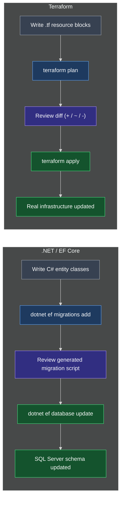

# Terraform for .NET Developers: A C#, ASP.NET & SQL Server Comparison

This document maps Terraform's core concepts — `.tf` files, providers, state, `plan`, and `apply` — onto equivalent ideas from C#, ASP.NET, and SQL Server / Entity Framework Core, so a .NET developer can build an accurate mental model quickly.

---

## 1. The Core Mindset Shift: Declarative vs. Imperative

Most C# code you write is **imperative** — you tell the computer the exact steps to take:

```csharp
foreach (var customer in customers)
{
    if (customer.IsActive)
    {
        results.Add(customer);
    }
}
```

HCL is **declarative** — much closer to a SQL `SELECT` statement. You describe the **end result you want**, not the steps to get there:

```sql
SELECT * FROM Customers WHERE IsActive = 1
```

```hcl
resource "aws_instance" "webserver" {
  ami           = "ami-0c2f25c1f66a1ff4d"
  instance_type = "t2.micro"
}
```

Neither the `SELECT` nor the `resource` block says *how* to fetch rows or provision a virtual machine — the SQL Server query engine and the Terraform provider each work out the "how" on their own. This is the single biggest adjustment for a C# developer: there's no `for` loop in HCL deciding what to create first — Terraform infers ordering from **dependencies between resources** (see the `depends_on` and reference-expression lessons later in this course).

---

## 2. Concept-by-Concept Comparison

| Terraform | .NET / SQL Server equivalent | Why it fits |
| --- | --- | --- |
| `.tf` file | An EF Core **entity/model class** | Declares *what should exist* (desired schema) — not the steps to build it |
| HCL (the language) | C# (the language) | The syntax you author your desired state in |
| **Provider** (`aws`, `local`, `azurerm`) | A NuGet package / SDK (AWS SDK for .NET) or an ADO.NET driver (`System.Data.SqlClient`) | The plugin that knows how to talk to one specific platform's API |
| `terraform init` | `dotnet restore` | Downloads the dependencies (providers) your project references |
| `resource "local_file" "pet" { ... }` | An EF Core entity class / a row about to be inserted via `DbSet<T>` | Type + logical name + properties, just like a class instance |
| **`terraform.tfstate`** | EF Core's **change-tracker snapshot** — but persisted to a JSON file on disk instead of living in memory | Terraform's record of what it last created, so the next run can diff instead of re-scanning everything |
| `terraform plan` | `dotnet ef migrations add` (the **schema migration** step) + reviewing the generated script (or an SSDT schema compare) | Computes the diff between desired state and real state — nothing executes yet |
| `terraform apply` | `dotnet ef database update` (applying that migration) | Executes the diff for real, against the real target |
| Terraform Registry (`registry.terraform.io`) | nuget.org | Central hub where providers/modules are published and versioned |
| Terraform **module** | A shared class library / NuGet package you author | Reusable, parameterized building block referenced from multiple projects |
| `variables.tf` | `appsettings.json` / constructor parameters | Externalized inputs so the same code runs across environments |
| `outputs.tf` | A method's `return` value / a public property | Exposes a computed value for something else downstream to consume |
| **Drift** | Someone editing rows directly in SSMS, bypassing your EF Core code | Reality no longer matches what your code says should be true |
| State locking | A SQL transaction / an EF Core concurrency token | Stops two people from running `apply` at the same time and corrupting the same state |

> **A note on "migration":** In EF Core, a **migration** is the generated C# file (`Up()`/`Down()`) that changes your database's **schema** — creating or altering tables and columns. That's a different thing from **data seeding** (inserting lookup/reference rows via `HasData()` or a seed script) — seeding is *not* what "migration" means here. When this document says `terraform plan`/`apply` are the "migration" equivalent, it means the **schema-migration** sense specifically: computing and then executing a structural diff. Terraform has no built-in concept of seed data — a `.tf` file describes infrastructure *shape*, not rows of reference data. It also has no separate, checked-in migration *file*: unlike EF Core, Terraform computes a fresh diff from your current `.tf` code every single time you run `plan`, rather than replaying a history of previously generated migration scripts.

---

## 3. Side-by-Side Workflow

The Terraform workflow (**Write → Plan → Apply**) mirrors the EF Core migration workflow (**Model → Migration → Update**) step for step:



| Step | .NET / EF Core | Terraform |
| --- | --- | --- |
| 1. Author desired state | C# entity classes | `.tf` resource blocks |
| 2. Compute the diff | `dotnet ef migrations add` | `terraform plan` |
| 3. Review before executing | Read the generated migration `.cs` file | Read the `+`/`~`/`-` diff |
| 4. Execute for real | `dotnet ef database update` | `terraform apply` |
| 5. Result | SQL Server schema matches your model | Real infrastructure matches your code |

---

## 4. Where the Analogy Breaks Down

Analogies help you get started, but they're not exact. Keep these differences in mind so they don't mislead you later:

* **`tfstate` isn't just a schema map — it's the source of truth for existence.** EF Core's change tracker is rebuilt every time your app starts; if you lost it, your database still has all its data. If you lose `terraform.tfstate` with no backup, Terraform no longer knows which real-world resources it's responsible for, even though those resources still exist. There's no `dotnet ef` equivalent to "losing your state file."
* **Terraform manages heterogeneous infrastructure, not rows in one database.** A single Terraform run might create an AWS EC2 instance, a DNS record, and a local file — completely different "tables" governed by completely different providers, unlike EF Core's `DbSet<T>` collections all living in one SQL Server database.
* **There's no automatic "down migration."** EF Core generates a rollback for every migration. Terraform's rollback is simply reapplying an *older version of your `.tf` code* — there's no separate rollback script; `terraform destroy` removes resources but doesn't "undo" to a prior version by itself.
* **Providers are broader than ADO.NET drivers.** An ADO.NET driver only talks to one database engine. A Terraform provider can expose hundreds of distinct "resource types" (EC2 instances, S3 buckets, IAM roles) under one plugin — closer to an entire cloud SDK than a single database driver.
* **Terraform has no "migration file" and no seeding.** EF Core keeps a versioned history of generated migration scripts in your project, and separately supports seeding lookup/reference data via `HasData()`. Terraform does neither: there's no checked-in migration artifact (each `plan` recomputes the diff live from your current `.tf` code), and there's no built-in mechanism for seeding row-level data — Terraform manages infrastructure *shape*, not data inside it.

---

### Topic Summary: Terraform for .NET Developers

Terraform's declarative model is best understood next to a SQL `SELECT` rather than imperative C# — you describe desired state, and the provider (like an ADO.NET driver or cloud SDK) figures out how to reach it. `.tf` files parallel EF Core entity/model classes (the desired schema), `terraform plan` parallels generating and reviewing an EF Core **schema migration**, and `terraform apply` parallels running `dotnet ef database update`. Note that "migration" here means schema migration, not data seeding — Terraform has no equivalent to `HasData()` and manages infrastructure shape, not row-level data. The biggest new concept is `terraform.tfstate`: unlike EF Core's in-memory change tracker, it's a persisted JSON file that is Terraform's only record of what it manages between separate CLI runs — losing it has no clean .NET equivalent.

---

## Knowledge Check

Answer each question on your own first, then read the explanation below it.

---

### 1 · Declarative vs. imperative

**Why is HCL compared to a SQL `SELECT` statement rather than a C# `for` loop?**

> Both HCL and `SELECT` are **declarative** — you describe the desired *result*, and the engine (Terraform's provider, or the SQL Server query engine) decides *how* to produce it. A C# `for` loop is **imperative** — you specify the exact steps yourself.

---

### 2 · What `.tf` files correspond to

**What's the closest .NET/EF Core equivalent to a `.tf` file?**

> An **EF Core entity/model class** — it declares the desired schema, the same way a `.tf` resource block declares desired infrastructure. This is different from a **migration** (the generated script that actually performs a schema change) — that role belongs to `terraform plan`/`apply`, not to the `.tf` file itself.

---

### 3 · The role of a Provider

**Is a Terraform provider more like a single ADO.NET driver or more like a cloud SDK? Why?**

> More like a **cloud SDK**. A single ADO.NET driver only talks to one database engine, while one Terraform provider (e.g., `aws`) can expose hundreds of distinct resource types — EC2 instances, S3 buckets, IAM roles — across an entire platform.

---

### 4 · `terraform.tfstate` vs. the EF Core change tracker

**How does `terraform.tfstate` differ from EF Core's change tracker, even though both track "what's currently there"?**

> EF Core's change tracker lives **in memory** and is rebuilt every app start — losing it doesn't affect your database. `terraform.tfstate` is **persisted to disk** between separate CLI runs; if you lose it without a backup, Terraform loses track of which real resources it's responsible for, even though those resources still exist.

---

### 5 · `plan` vs. `migrations add`

**Which EF Core command is closest to `terraform plan`, and what do both have in common?**

> `dotnet ef migrations add` (plus reviewing the generated script). Both **compute and display a diff** between desired state and actual state **without executing anything** against the real target.

---

### 6 · `apply` vs. `database update`

**What do `terraform apply` and `dotnet ef database update` have in common?**

> Both **execute** the previously computed diff against the real target for real — `apply` against live infrastructure, `database update` against the actual SQL Server database.

---

### 7 · Rollback behavior

**Does Terraform generate an automatic "down migration" the way EF Core does?**

> **No.** EF Core generates a rollback script per migration. Terraform has no separate rollback artifact — reverting means reapplying an **older version of your `.tf` code**, or explicitly running `terraform destroy`.

---

### 8 · Terraform Registry vs. NuGet

**What is the NuGet equivalent for Terraform providers and modules?**

> The **Terraform Registry** (`registry.terraform.io`) — a central, versioned hub for publishing and consuming providers and modules, the same role nuget.org plays for .NET packages.

---

### 9 · "Migration" — schema change or seed data?

**When this document says Terraform's `plan`/`apply` are like an EF Core "migration," does that include seeding lookup data?**

> **No.** EF Core's migration mechanism (`dotnet ef migrations add`/`database update`) changes database **schema** — tables, columns, indexes. Seeding lookup/reference data (`HasData()` or a seed script) is a **separate** EF Core concept. Terraform has no built-in equivalent to seeding — it manages infrastructure *shape*, not row-level data inside it.

---
