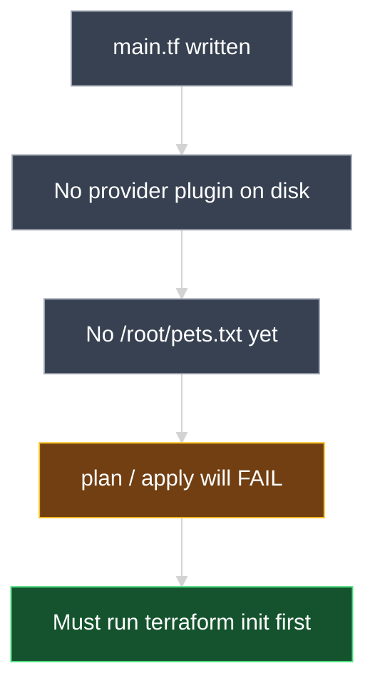
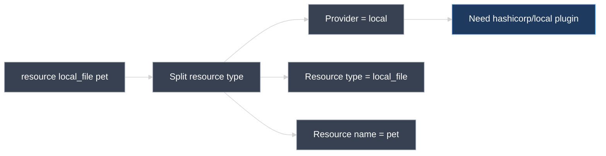
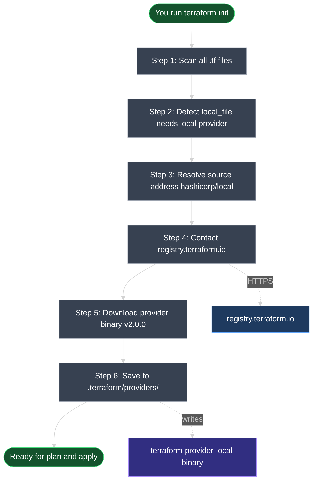
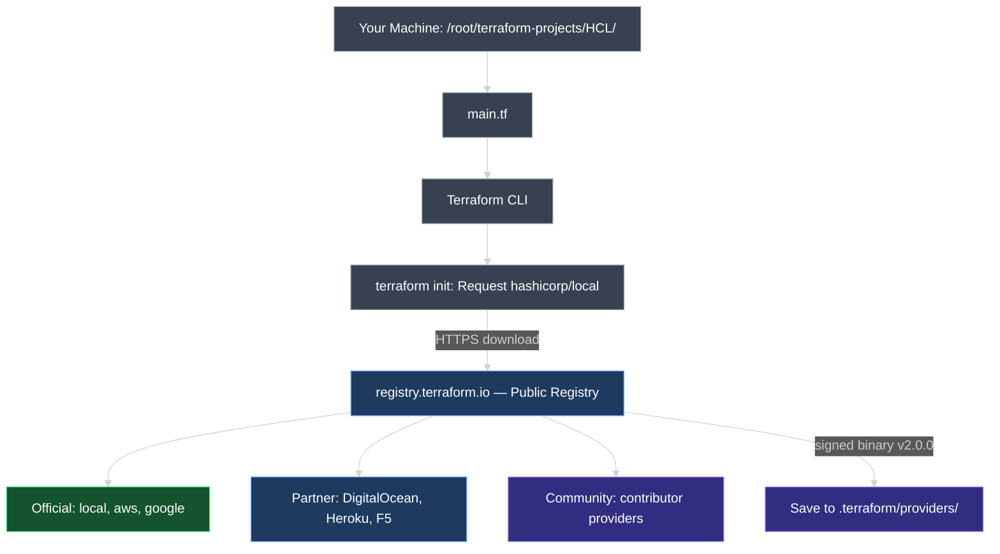
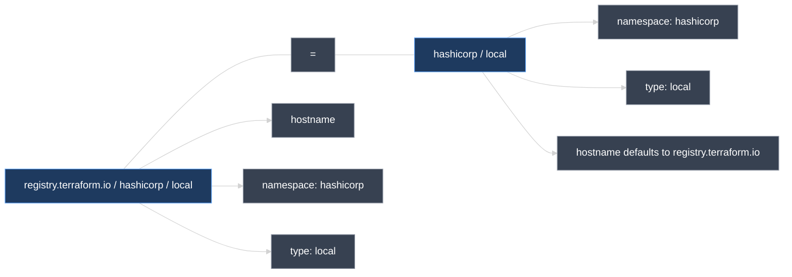
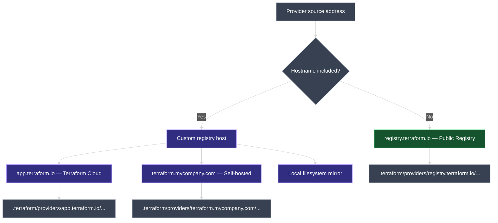
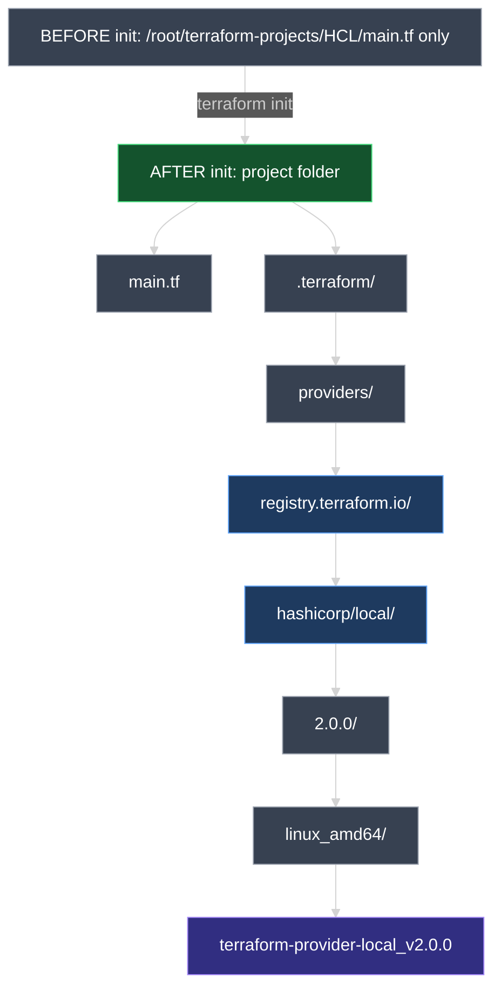
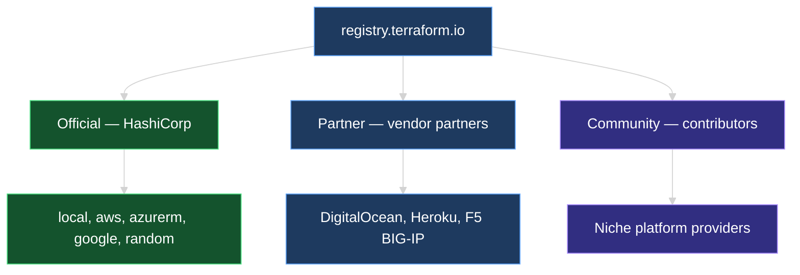

# Terraform Providers: What `terraform init` Does Internally

This document walks through the full journey of a provider plugin—from the code you write in a `.tf` file, to the download from the Terraform Registry, to the folder on your machine where the binary is stored. We use the **`local_file`** example end to end so every step is concrete.

> **Diagrams:** All visuals use **Mermaid** styled for dark-mode preview. Install *Markdown Preview Mermaid Support* in Cursor/VS Code, or view on GitHub.

---

## 1. Starting Point: Your Configuration File

Imagine you are in this project directory:

```text
/root/terraform-projects/HCL/
└── main.tf
```

Inside `main.tf` you have written:

```hcl
resource "local_file" "pet" {
  filename = "/root/pets.txt"
  content  = "We love pets."
}
```



At this point you have **only** written configuration code. Terraform does not yet know how to talk to the `local` provider.

---

## 2. How Your Code Tells Terraform Which Provider to Download

Terraform reads your resource block and extracts two critical pieces of information:

| Part in your code | Value | What Terraform learns |
| --- | --- | --- |
| Resource type | `local_file` | The word before `_` → provider name = **`local`** |
| Resource name | `pet` | Your logical label for this resource (not used during init) |



> **Rule:** The provider name is always the prefix before the first `_` in the resource type.
> `local_file` → **`local`** · `aws_instance` → **`aws`** · `aws_s3_bucket` → **`aws`**

---

## 3. What Happens Internally During `terraform init`



### The journey in plain English

| Step | What happens | Touches real infrastructure? |
| --- | --- | --- |
| **1. Scan** | Terraform reads every `.tf` file in the working directory | No |
| **2. Detect** | Finds `local_file` → needs the **`local`** provider | No |
| **3. Resolve address** | Builds source address: `hashicorp/local` | No |
| **4. Contact registry** | Connects to `registry.terraform.io` over the internet | No |
| **5. Download** | Fetches the compiled provider binary (e.g., `v2.0.0`) | No |
| **6. Install locally** | Saves the binary into the hidden `.terraform/` folder | No |

> **`terraform init` never creates, changes, or deletes infrastructure.** It only prepares your working directory. You can run it as many times as you want safely.

---

## 4. Where Terraform Downloads From



### The source address — how Terraform knows what to download

The identifier `hashicorp/local` (shown in init output) is called the **source address**.



| Segment | In `hashicorp/local` | Meaning |
| --- | --- | --- |
| **Hostname** *(optional)* | *(omitted)* | Defaults to `registry.terraform.io` |
| **Namespace** | `hashicorp` | Organization that publishes the provider |
| **Type** | `local` | Provider name |

### Can Terraform download from registries other than HashiCorp's?

**Yes.** `registry.terraform.io` is only the **default** registry — not the only one Terraform can use.



| Registry | Example hostname | Typical use |
| --- | --- | --- |
| **Public Terraform Registry** | `registry.terraform.io` *(default)* | Official, partner, and community providers — what this course uses |
| **Terraform Cloud / Enterprise private registry** | `app.terraform.io` | Company-internal providers and modules not published publicly |
| **Self-hosted private registry** | e.g. `terraform.mycompany.com` | On-prem or air-gapped environments |
| **Local filesystem mirror** | Configured in CLI settings | Offline installs or pre-cached provider binaries |

**Examples:**

```text
hashicorp/local                              → registry.terraform.io/hashicorp/local
terraform.mycompany.com/acme/internal        → private company registry (not HashiCorp)
```

> For beginners and this course, every example uses the **public HashiCorp registry** (`registry.terraform.io`). Private registries are an enterprise pattern you will encounter later in real-world teams.

---

## 5. Where Terraform Puts the Downloaded Plugin



### What each path segment means

| Path segment | What it is |
| --- | --- |
| `.terraform/` | Hidden working directory Terraform creates during init |
| `providers/` | All downloaded provider binaries live here |
| `registry.terraform.io/` | Which registry the plugin was downloaded from |
| `hashicorp/local/` | Namespace + provider type (the source address) |
| `2.0.0/` | Exact version that was installed |
| `terraform-provider-local_...` | The actual executable binary Terraform calls at runtime |

### Terminal output you will see

```text
Initializing the backend...

Initializing provider plugins...
- Finding latest version of hashicorp/local...
- Installing hashicorp/local v2.0.0...
- Installed hashicorp/local v2.0.0 (signed by HashiCorp)

Terraform has been successfully initialized!
```

| Line in output | What it tells you |
| --- | --- |
| `Finding latest version of hashicorp/local` | Terraform queried the registry for the newest compatible version |
| `Installing hashicorp/local v2.0.0` | Version **2.0.0** of the local provider is being downloaded |
| `signed by HashiCorp` | The binary is cryptographically verified — it is authentic |
| `successfully initialized` | Plugin is on disk; you can now run `plan` and `apply` |

---

## 6. Full End-to-End: From Code to File on Disk

```mermaid
%%{init: {'theme': 'dark'}}%%
sequenceDiagram
    autonumber
    actor You
    participant TF as Terraform CLI
    participant Reg as registry.terraform.io
    participant Plg as local Provider Plugin
    participant FS as Filesystem

    rect rgb(20, 50, 35)
    Note over You,FS: Phase 1 — terraform init
    You->>TF: terraform init
    TF->>TF: Read main.tf
    TF->>Reg: GET hashicorp/local
    Reg-->>TF: binary v2.0.0
    TF->>Plg: Install to .terraform/providers/
    TF-->>You: Initialized
    end

    rect rgb(20, 45, 75)
    Note over You,FS: Phase 2 — terraform plan
    You->>TF: terraform plan
    TF->>Plg: Plan local_file.pet
    Plg-->>TF: + create local_file.pet
    TF-->>You: Preview only
    end

    rect rgb(20, 55, 40)
    Note over You,FS: Phase 3 — terraform apply
    You->>TF: terraform apply
    TF->>Plg: Create local_file.pet
    Plg->>FS: Write /root/pets.txt
    FS-->>Plg: File created
    Plg-->>TF: Success
    TF-->>You: Apply complete
    end
```



### Key takeaway

| Command | What it does | Touches infrastructure? |
| --- | --- | --- |
| `terraform init` | Downloads the provider plugin (the tool) | No |
| `terraform plan` | Previews what will change | No |
| `terraform apply` | Provider writes `/root/pets.txt` | **Yes** |

The **provider plugin** is the bridge between your HCL code and the real world. Without it (before init), Terraform has configuration but no ability to act.

---

## 7. Three Tiers of Providers in the Registry



The **`local`** provider used in our example is an **official** HashiCorp provider.

---

## 8. Provider Versioning (Preview)

By default, `terraform init` installs the **latest available version** of a provider (e.g., `v2.0.0`).

Providers are updated regularly to add features and fix bugs. New versions can sometimes introduce **breaking changes** to your existing `.tf` code.

Later in this course you will learn how to **pin a specific provider version** so your configuration does not unexpectedly pull in a newer, incompatible release.

---

### Topic Summary: Terraform Providers

When you write `resource "local_file" "pet"`, Terraform detects that it needs the **`local`** provider. Running **`terraform init`** scans your `.tf` files, resolves the source address (`hashicorp/local`), downloads the signed provider binary from **`registry.terraform.io`** (the default public registry), and stores it in the hidden **`.terraform/providers/`** directory on your machine. Terraform can also download from **other registries** when a custom hostname is specified in the source address (e.g., a company private registry). Init is safe to re-run and never touches real infrastructure. Only after init can Terraform load the provider plugin to execute `plan` and `apply`. The source address format is `[hostname/]namespace/type`. Providers in the public registry are classified as Official, Partner, or Community based on who maintains them.

### Knowledge Check Q&A

**Q: You have written `main.tf` but have not run any commands yet. Can Terraform create `/root/pets.txt`?**

**A:** No. Without running `terraform init` first, the `local` provider plugin is not installed. Terraform cannot execute any resource until init downloads the required provider.

**Q: When you run `terraform init`, where does Terraform download the provider from?**

**A:** From the **Terraform Registry** at `registry.terraform.io`. For the `local` provider, it downloads `hashicorp/local` (equivalent to `registry.terraform.io/hashicorp/local`).

**Q: After `terraform init`, where is the provider binary stored on your machine?**

**A:** Inside the hidden `.terraform/providers/` directory in your project folder, under a path like `.terraform/providers/registry.terraform.io/hashicorp/local/<version>/<platform>/`.

**Q: How does Terraform know it needs the `local` provider from the resource block `resource "local_file" "pet"`?**

**A:** It reads the resource type `local_file` and extracts the provider name from the prefix before the underscore — `local`.

**Q: Does running `terraform init` create or modify any real infrastructure?**

**A:** No. `terraform init` only downloads provider plugins and prepares the working directory. It is safe to run multiple times.

**Q: What is a provider source address, and what are its parts?**

**A:** It is the identifier Terraform uses to find a plugin in the registry. Format: `[<hostname>/]<namespace>/<type>`. Example: `hashicorp/local` where `hashicorp` is the namespace and `local` is the provider type.

**Q: What are the three tiers of providers in the Terraform Registry?**

**A:** **Official** (HashiCorp-maintained), **Partner** (vendor-maintained through HashiCorp's partner program), and **Community** (maintained by individual contributors).

**Q: What version of a provider does Terraform install by default during init?**

**A:** The **latest available version** that satisfies the configuration, unless you explicitly constrain the version in your code.

**Q: Will Terraform only download providers from HashiCorp's public registry?**

**A:** No. `registry.terraform.io` is the **default** when no hostname is given (e.g., `hashicorp/local`). If the source address includes a different hostname — such as a Terraform Enterprise private registry or a self-hosted company registry — Terraform downloads from that host instead.

**Q: Why does the `.terraform/providers/` folder contain `registry.terraform.io` in the path?**

**A:** That folder segment records **which registry** the plugin was downloaded from. A provider from a private registry would show that registry's hostname in the path instead (e.g., `terraform.mycompany.com/...`).

**Q: In this course, which registry do we use?**

**A:** The public **Terraform Registry** at `registry.terraform.io`. All shorthand addresses like `hashicorp/local` resolve there by default.
