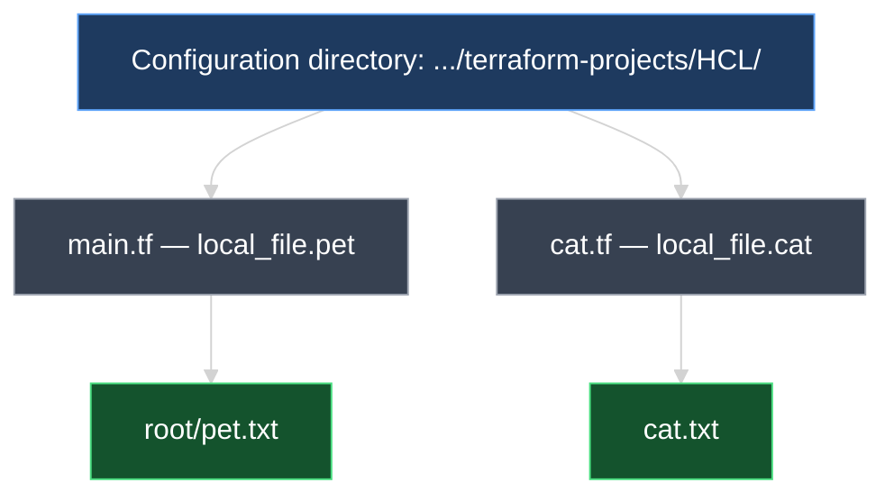
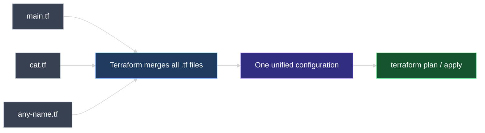
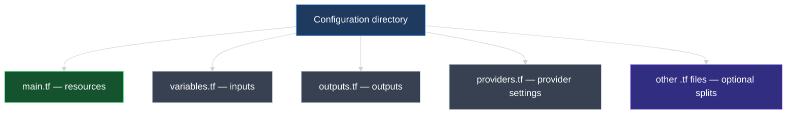

# Terraform Configuration Directory and File Naming Conventions

This document explains what a Terraform **configuration directory** is, how Terraform treats multiple `.tf` files inside it, and the standard file naming conventions used to organize infrastructure code.

> **Diagrams:** All visuals use **Mermaid** styled for dark-mode preview. Install *Markdown Preview Mermaid Support* in Cursor/VS Code, or view on GitHub.

---

## 1. What Is a Configuration Directory?

A **configuration directory** is the folder where you keep your Terraform code. When you run `terraform init`, `plan`, or `apply`, you run those commands **inside** this directory.

### Course example vs. our lab

| | Course (video) | Our lab |
| --- | --- | --- |
| **Directory** | `terraform-local-file/` | `03_GettingStarted/02_HCL_Basics_Lab/terraform-projects/HCL/` |
| **First config file** | `local.tf` | `main.tf` |

Both are valid. The directory name and file name are **your choice** — Terraform only requires that config files end in `.tf`.

**In the course video**, the setup looks like:

```text
terraform-local-file/
└── local.tf
```

**In our lab**, we use:

```text
03_GettingStarted/02_HCL_Basics_Lab/terraform-projects/HCL/
└── main.tf
```

Inside our `main.tf`:

```hcl
resource "local_file" "pet" {
  filename = "root/pet.txt"
  content  = "I love pet!"
}
```

> **Key idea:** The directory is the **project workspace**. The `.tf` files inside it are the **configuration**. Terraform always works at the directory level — not at a single file level.

---

## 2. Multiple Configuration Files in One Directory

The configuration directory is **not limited to one file**. You can add as many `.tf` files as you need.

### Example: Adding `cat.tf`

The course adds a second file alongside the first config file. In the video that file is next to `local.tf`; in our lab it sits next to `main.tf`:

```text
03_GettingStarted/02_HCL_Basics_Lab/terraform-projects/HCL/
├── main.tf
└── cat.tf
```

Inside `cat.tf` (same `local_file` resource type as in the course):

```hcl
resource "local_file" "cat" {
  filename = "cat.txt"
  content  = "I love cats!"
}
```

When you run `terraform apply`, Terraform will create **both** output files:

| Resource | Config file | Output file (course) | Output file (our lab) |
| --- | --- | --- | --- |
| `local_file.pet` | `main.tf` / `local.tf` | varies | `root/pet.txt` |
| `local_file.cat` | `cat.tf` | `cat.txt` | `cat.txt` |



### The golden rule for file discovery

> **Terraform automatically reads every file ending in `.tf` inside the configuration directory** and merges them together as one single configuration in memory.

It does **not** matter what you name the file (as long as it ends in `.tf`). Terraform does not execute files one by one — it loads **all of them** before planning or applying.



---

## 3. One File vs. Many Files

There are two valid ways to organize your resources.

### Option A — Multiple files (split by topic)

```text
HCL/
├── main.tf      → pet resource
└── cat.tf       → cat resource
```

**Best for:** Separating unrelated resources, keeping files short, and making code easier to navigate as the project grows.

### Option B — Single file (all resources together)

You can place **all resource blocks** in one file. A single `.tf` file can contain as many configuration blocks as you need.

```hcl
# main.tf — everything in one file

resource "local_file" "pet" {
  filename = "root/pet.txt"
  content  = "I love pet!"
}

resource "local_file" "cat" {
  filename = "cat.txt"
  content  = "I love cats!"
}
```

**Best for:** Small projects, labs, and quick experiments.

| Approach | Files | Terraform behavior |
| --- | --- | --- |
| **Multiple files** | `main.tf` + `cat.tf` + others | Merges all `.tf` files into one config |
| **Single file** | `main.tf` only | Same result — one config from one file |

> **Terraform does not care** whether you use 1 file or 10 files. The end result is identical as long as all files are in the same configuration directory.

---

## 4. Standard File Naming Conventions

While Terraform accepts **any** `.tf` filename, the community follows common naming patterns to keep projects organized.

```text
03_GettingStarted/02_HCL_Basics_Lab/terraform-projects/HCL/
├── main.tf         ← primary resources (most common entry point)
├── variables.tf    ← input variable definitions (covered later)
├── outputs.tf      ← output value definitions (covered later)
├── providers.tf    ← provider configuration blocks (covered later)
└── cat.tf          ← optional: split resources by topic
```



| File | Typical purpose | Covered in this course |
| --- | --- | --- |
| **`main.tf`** | Primary resource definitions — the default file most projects start with | Yes (now) |
| **`variables.tf`** | Declares input variables to make configuration reusable | Later |
| **`outputs.tf`** | Declares output values to expose information after apply | Later |
| **`providers.tf`** | Configures provider settings (version, region, credentials) | Later |
| **Any other `.tf`** | Optional splits — e.g., `network.tf`, `cat.tf`, `storage.tf` | As needed |

### Why `main.tf` is the most common name

`main.tf` is a **convention**, not a Terraform requirement. Teams use it as the obvious starting point — the file you open first. Because Terraform merges all `.tf` files anyway, the name `main.tf` simply signals: *"this is where the core infrastructure lives."*

---

## 5. What Terraform Ignores

Not every file in the directory is configuration. Terraform only loads files with the **`.tf`** extension.

| File / folder | Loaded by Terraform? |
| --- | --- |
| `main.tf`, `cat.tf`, `variables.tf` | Yes |
| `terraform.tfstate` | No (state file — managed by Terraform, not read as config) |
| `.terraform/` | No (provider plugins and internal metadata) |
| `.terraform.lock.hcl` | No (dependency lock file) |
| `root/pet.txt` | No (resource output created by apply) |
| `README.md`, `.gitignore` | No |

---

## 6. Hands-On Labs — Next Steps

Head over to the hands-on lab and try the following in `03_GettingStarted/02_HCL_Basics_Lab/terraform-projects/HCL/`:

1. Keep your existing `main.tf` with `local_file.pet`.
2. Create `cat.tf` with a second `local_file` resource (creates `cat.txt` when applied).
3. Run `terraform plan` — you should see `+ create` for `local_file.cat`.
4. Run `terraform apply` — confirm both output files exist.

Then experiment: move both resources into a single `main.tf` and delete `cat.tf`. Run `terraform plan` again — Terraform should report **no changes**, proving that file layout does not affect the desired state.

> **Up next:** Continue in the lab to explore **working with providers** (see `04_Core_Terraform_Basics/01_Terraform_Provider.md`).

---

### Topic Summary: Configuration Directory

A Terraform **configuration directory** is the project folder where all your `.tf` files live. Terraform automatically discovers and **merges every `.tf` file** in that directory into one unified configuration before running `plan` or `apply`. You can split resources across multiple files (`main.tf`, `cat.tf`) or combine them into a single `main.tf` — both approaches work identically. Standard naming conventions (`main.tf`, `variables.tf`, `outputs.tf`, `providers.tf`) help teams stay organized, but only the `.tf` extension is required.

### Knowledge Check Q&A

**Q: What is a Terraform configuration directory?**

**A:** It is the project folder containing your `.tf` files. All Terraform commands (`init`, `plan`, `apply`) are run from this directory, and Terraform loads every `.tf` file inside it.

**Q: If you add a new file called `cat.tf` to the configuration directory, does Terraform automatically use it?**

**A:** Yes. Terraform reads **all** files ending in `.tf` within the configuration directory and merges them into a single configuration. No extra registration is needed.

**Q: Does it matter to Terraform whether you use one file or multiple files?**

**A:** No. Terraform merges all `.tf` files in the directory regardless of count. One file with ten resource blocks produces the same result as ten files with one block each.

**Q: What is the most common naming convention for the primary configuration file?**

**A:** **`main.tf`** — it is a community convention for the file that contains the core resource definitions, not a Terraform requirement.

**Q: What are `variables.tf`, `outputs.tf`, and `providers.tf` used for?**

**A:** They are standard naming conventions for organizing specific block types: input variables, output values, and provider configuration settings. They are covered in later sections of the course.

**Q: Will Terraform read a file named `config.txt` or `main.tfvars` as configuration?**

**A:** No. Terraform only loads files with the **`.tf`** extension as configuration. Other files like `.tfvars` and `.tfstate` serve different purposes.

**Q: In the course video, what file and directory names are used for the first configuration?**

**A:** The course uses `local.tf` inside a directory called `terraform-local-file/`. In our lab we use `main.tf` inside `.../terraform-projects/HCL/`. Both are valid — only the `.tf` extension is required.

**Q: In our lab, if `main.tf` creates `root/pet.txt` and `cat.tf` creates `cat.txt`, how many files does `terraform apply` create?**

**A:** Two files — `root/pet.txt` and `cat.txt` — because both resource blocks are merged from their respective `.tf` files into one configuration.

**Q: Can two `.tf` files in the same directory define a resource with the same type and name (e.g., two `local_file.pet` blocks)?**

**A:** No. That would create a duplicate resource definition and Terraform will report a configuration error. Each resource address (`type.name`) must be unique across all `.tf` files in the directory.
