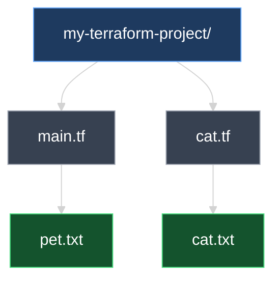
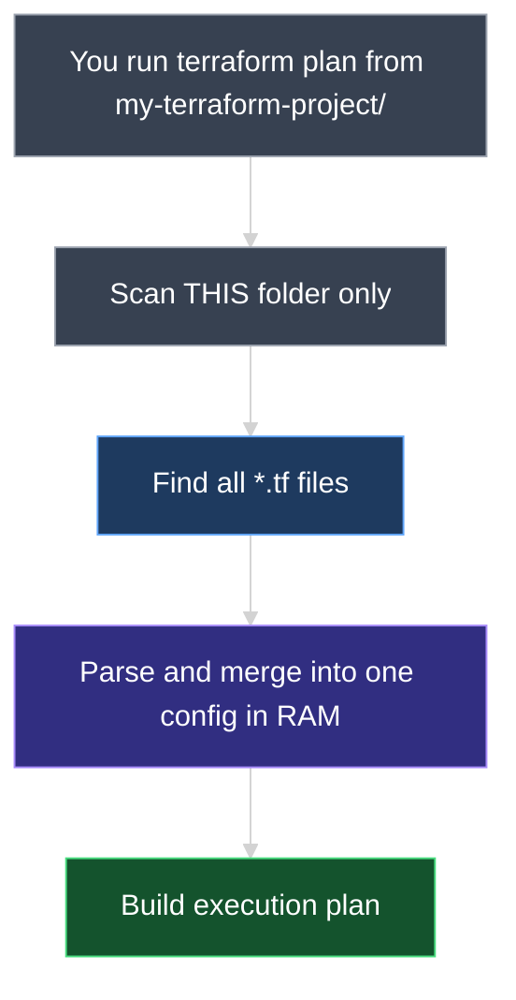
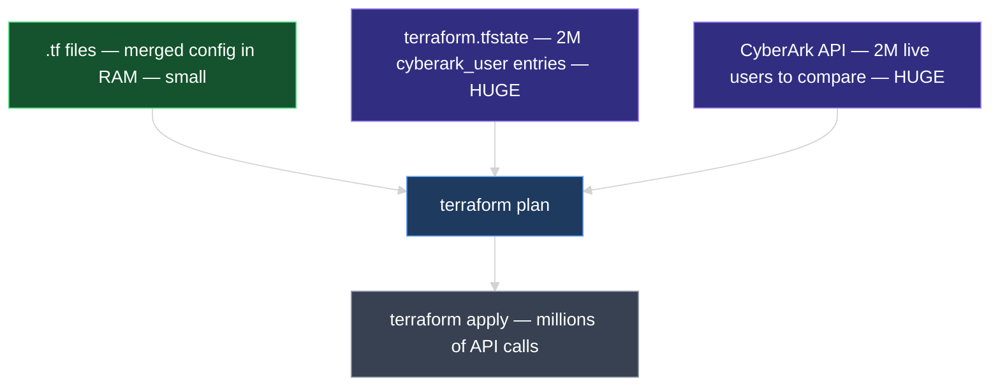
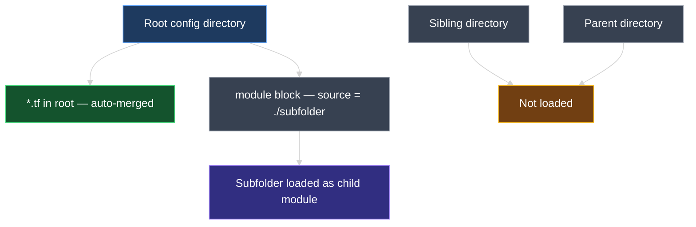
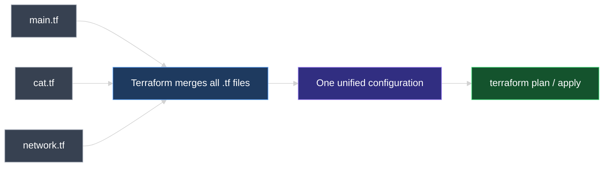
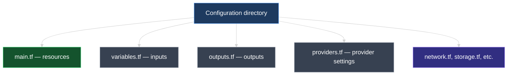

# Terraform Configuration Directory and File Naming Conventions

This document explains what a Terraform **configuration directory** is, how Terraform treats multiple `.tf` files inside it, and the **industry-standard naming conventions** teams use to organize infrastructure code.

---

## 1. What Is a Configuration Directory?

A **configuration directory** (also called the **root module directory**) is the project folder that contains your Terraform code. Every Terraform command — `init`, `plan`, `apply` — is run from this directory.

```text
my-terraform-project/        ← configuration directory (you choose the folder name)
└── main.tf                  ← configuration file(s)
```

Inside `main.tf`:

```hcl
resource "local_file" "pet" {
  filename = "pet.txt"
  content  = "I love pets!"
}
```

> **Key idea:** Terraform works at the **directory** level, not the file level. The folder is the project workspace; `.tf` files inside it are the configuration.

### What Terraform requires vs. what teams conventionally use

| | Required by Terraform? | Industry practice |
| --- | --- | --- |
| **Directory name** | Any name you choose | Descriptive name matching the project, e.g. `web-app-infra/`, `networking/` |
| **Config file name** | Must end in `.tf` | **`main.tf`** for primary resources |
| **Number of files** | One or more `.tf` files | Split by purpose as the project grows |

Terraform does **not** require a file named `main.tf` or a folder named `terraform-local-file`. Those names are **conventions** that make projects easier for teams to read and navigate.

---

## 2. Multiple Configuration Files in One Directory

A configuration directory is **not limited to one file**. You can add as many `.tf` files as needed.

### Example: adding `cat.tf`

```text
my-terraform-project/
├── main.tf
└── cat.tf
```

**`main.tf`**

```hcl
resource "local_file" "pet" {
  filename = "pet.txt"
  content  = "I love pets!"
}
```

**`cat.tf`**

```hcl
resource "local_file" "cat" {
  filename = "cat.txt"
  content  = "I love cats!"
}
```

After `terraform apply`, both files are created in the configuration directory:

| Terraform resource | Defined in | File created on disk |
| --- | --- | --- |
| `local_file.pet` | `main.tf` | `pet.txt` |
| `local_file.cat` | `cat.tf` | `cat.txt` |



### The golden rule

> **Terraform reads every file ending in `.tf` in the configuration directory and merges them into one configuration in memory.**

File names like `local.tf` or `cat.tf` work fine — but **`main.tf`** is the standard name for your primary file because that is what engineers expect to open first.

### Where exactly does Terraform load from?

When you run `terraform plan` or `terraform apply` from `my-terraform-project/`, Terraform loads configuration **only from that directory**:

```text
my-terraform-project/                 ← YOU RUN COMMANDS HERE
├── main.tf                           ← LOADED (merged into memory)
├── cat.tf                            ← LOADED (merged into memory)
├── variables.tf                      ← LOADED (merged into memory)
├── pet.txt                           ← NOT loaded (created by apply)
├── terraform.tfstate                 ← NOT loaded as config (state is separate)
├── .terraform/                       ← NOT loaded (provider plugins on disk)
└── modules/                          ← NOT loaded automatically (only when referenced)
    └── vpc/
        └── main.tf                   ← loaded only via a module block in root .tf files
```

| Location | Loaded into configuration? |
| --- | --- |
| Any `*.tf` file **directly inside** the configuration directory | **Yes** — merged together |
| Files in **subfolders** (e.g. `modules/vpc/main.tf`) | **No** — unless you explicitly call `module "vpc" { ... }` |
| `.tf` files in **parent or sibling** folders | **No** — Terraform does not search outside the working directory |
| `.tfvars`, `.tfstate`, `.terraform/`, `README.md` | **No** |



### How much memory does Terraform use at `plan` and `apply`?

Parsing `.tf` files into a merged configuration uses **very little memory** — even many files are typically only a few MB in RAM. That is **not** what makes large migrations expensive.

What actually drives memory, time, and disk during `terraform plan` and `terraform apply` is **how many resources Terraform is managing** — every user, group, app, or object tracked in **state** and compared during the plan.

#### Small lab vs. large migration

| Scenario | Resources managed | What Terraform holds in memory during plan/apply |
| --- | --- | --- |
| **Lab** (`main.tf` + `cat.tf`) | 2 `local_file` resources | Tiny — state and plan graph are negligible |
| **Okta → CyberArk migration** | 3 million users in Okta (source), 2 million `cyberark_user` in CyberArk (target) | **Massive** — state must track millions of resource IDs, attributes, and dependencies |

#### Okta → CyberArk example

Imagine an identity migration where:

* **Okta** has **3 million users** (source data — read via API or data sources)
* **CyberArk** already has **2 million users** Terraform manages (target — `cyberark_user` resources in state)
* You run `terraform apply` to sync the remaining users

On that `apply`, Terraform must:

1. **Load state** — millions of `cyberark_user` entries with API IDs, emails, group mappings
2. **Build a plan** — compare every desired user in `.tf` against every live user in CyberArk
3. **Execute changes** — API calls to create/update users that are missing or drifted



| What | Grows with… | Okta → CyberArk at millions of users |
| --- | --- | --- |
| **Merged `.tf` config in RAM** | Number/size of `.tf` files | Small — even generated files parse quickly |
| **State file (`terraform.tfstate`)** | Every resource Terraform manages | **GB-scale** — one entry per `cyberark_user` |
| **Plan/apply memory** | Resources in state + API refresh | **GB-scale RAM**, long runtimes, often needs remote state + parallel limits |
| **Number of `.tf` files** | File count only | **Does not matter** if total resource count is the same |

> **Key takeaway:** Two `.tf` files with 2 resources vs. one `.tf` file with 2 resources — same memory. But **2 million `cyberark_user` resources in state** vs. **2 `local_file` resources** — completely different scale. Enterprise migrations use techniques like **batching**, **remote state**, **`-target`**, and **splitting workspaces** precisely because of this.

---

### Subdirectories and folders outside the configuration directory

#### Can you put `.tf` files in a subdirectory?

**Not as part of the root configuration automatically.** Terraform does **not** scan subfolders for extra `.tf` files to merge into the root module.

```text
my-terraform-project/
├── main.tf                    ← LOADED (root module)
└── users/
    └── cyberark_users.tf      ← NOT loaded automatically
```

To use code in a subdirectory, you must declare a **child module**:

```hcl
# main.tf
module "users" {
  source = "./users"           ← tells Terraform to load ./users/ as a separate module
}
```

Terraform then loads `users/` as its **own** configuration scope — not merged flat into root.

#### Can you run Terraform from a parent folder or include a sibling directory?

**No.** Terraform only uses the directory where you run the command.

```text
projects/
├── okta-export/               ← sibling folder — NOT loaded
│   └── users.tf
└── cyberark-migration/        ← configuration directory — run commands HERE
    ├── main.tf
    └── modules/
        └── users/
            └── main.tf        ← loaded only via module "users" { source = "./modules/users" }
```

| Pattern | Allowed? | How it works |
| --- | --- | --- |
| `.tf` files in **root config directory** | **Yes** | Auto-merged into one configuration |
| `.tf` files in **subdirectory** without `module` block | **No** | Ignored by root module |
| `.tf` files in **subdirectory** with `module` block | **Yes** | Loaded as a **child module** (separate scope) |
| `.tf` files in **parent or sibling** folder | **No** | Never discovered — wrong working directory |
| `module` source pointing to **another repo/path** | **Yes** | `source = "../other-project"` or `source = "git::https://..."` — explicit only |





---

## 3. One File vs. Many Files

Both approaches are valid. Terraform produces the same result either way.

### Option A — multiple files (standard as projects grow)

```text
my-terraform-project/
├── main.tf       ← pet resource
├── cat.tf        ← cat resource
├── variables.tf  ← inputs (later)
└── outputs.tf    ← outputs (later)
```

**Best for:** Team collaboration, larger codebases, and splitting resources by topic (networking, compute, storage).

### Option B — single file (fine for small projects)

All resource blocks can live in one file:

```hcl
# main.tf

resource "local_file" "pet" {
  filename = "pet.txt"
  content  = "I love pets!"
}

resource "local_file" "cat" {
  filename = "cat.txt"
  content  = "I love cats!"
}
```

**Best for:** Learning, proofs of concept, and very small deployments.

| Approach | When teams use it |
| --- | --- |
| **One `main.tf`** | Tutorials, labs, tiny projects |
| **Multiple `.tf` files** | Real-world projects once code no longer fits comfortably in one file |

> **Terraform does not care** whether you use 1 file or 20. It always merges all `.tf` files in the directory into a single configuration.

---

## 4. Industry-Standard File Naming Conventions

These names are **not required** — they are widely adopted patterns that make repositories predictable for any engineer who clones the project.

```text
my-terraform-project/
├── main.tf         ← core resources (industry default entry point)
├── variables.tf    ← input variables
├── outputs.tf      ← output values
├── providers.tf    ← provider configuration
├── versions.tf     ← Terraform & provider version constraints (common in production)
└── network.tf      ← optional: split resources by domain
```



| File | Purpose | Covered later in this course? |
| --- | --- | --- |
| **`main.tf`** | Primary infrastructure resources | Yes |
| **`variables.tf`** | Declares input variables for reusable, parameterized config | Yes |
| **`outputs.tf`** | Declares values to display after apply (IPs, URLs, IDs) | Yes |
| **`providers.tf`** | Configures providers (cloud region, credentials, aliases) | Yes |
| **`versions.tf`** | Pins Terraform and provider versions for reproducible builds | Yes |
| **Domain files** (`network.tf`, `cat.tf`, …) | Optional splits when `main.tf` gets too large | As needed |

### Why `main.tf` became the standard

* **Predictability** — Any engineer opening a Terraform repo knows where the core resources live.
* **Separation of concerns** — Resources in `main.tf`, inputs in `variables.tf`, outputs in `outputs.tf`.
* **Scalability** — Start with one file; split into domain files as the project grows.

The name `main.tf` has no special meaning to the Terraform engine — it is purely a **human convention**, like `index.js` in Node.js or `main.go` in Go.

---

## 5. What Terraform Ignores

Only files ending in **`.tf`** are loaded as configuration.

| File / folder | Loaded as config? |
| --- | --- |
| `main.tf`, `cat.tf`, `variables.tf` | Yes |
| `terraform.tfstate` | No — state file (tracks what exists) |
| `.terraform/` | No — downloaded provider plugins |
| `.terraform.lock.hcl` | No — provider version lock file |
| `pet.txt`, `cat.txt` | No — files created by resources after apply |
| `README.md`, `.gitignore` | No |

---

## 6. Hands-On Lab

In your configuration directory:

1. Start with `main.tf` containing one `local_file` resource.
2. Add `cat.tf` with a second `local_file` resource.
3. Run `terraform plan` — expect `+ create` for the new resource.
4. Run `terraform apply` — confirm both output files exist.
5. Move both resources into `main.tf` and delete `cat.tf`. Run `terraform plan` again — expect **no changes**.

Step 5 proves that **file layout does not change infrastructure** — only the resource blocks matter.

---

### Topic Summary: Configuration Directory

A Terraform **configuration directory** is the root folder where you run all Terraform commands. Terraform loads **only** `*.tf` files **directly inside that folder** and merges them in memory. Subdirectories require an explicit **`module` block**; parent and sibling folders are never loaded. Memory at `plan`/`apply` is driven by **how many resources are in state** — not by file count — so migrations managing millions of users (e.g., Okta → CyberArk) are vastly more expensive than a two-file lab.

### Knowledge Check Q&A

**Q: What is a Terraform configuration directory?**

**A:** It is the **project folder where you run Terraform commands** (`init`, `plan`, `apply`). Terraform scans **only that directory** — not parent folders, not sibling folders — and loads **every `*.tf` file directly inside it**. All loaded files are parsed and **merged into one single configuration held in memory** before Terraform builds the execution plan.

**Q: Where does Terraform load `.tf` files from — and where does it NOT load from?**

**A:** It loads from the **current working directory** (the configuration directory) only. Files like `main.tf`, `cat.tf`, and `variables.tf` in that folder are merged together. It does **not** load `.tf` files from subfolders unless you reference them with a `module` block. It does **not** load `terraform.tfstate`, `.terraform/`, `.tfvars`, or non-`.tf` files as configuration.

**Q: How much memory does Terraform use during `plan` and `apply`?**

**A:** Two different things matter. **Parsing `.tf` files** into a merged configuration uses very little RAM — a few MB even for many files. What actually drives memory at scale is **how many resources Terraform manages in state**. In an Okta → CyberArk migration with **3 million Okta users** (source) and **2 million `cyberark_user` resources** in CyberArk (target), Terraform must load millions of state entries and compare each against the live API during `plan` — that can reach **gigabytes of RAM**, multi-hour runtimes, and **GB-sized state files**. A lab with 2 `local_file` resources is trivial by comparison. Splitting resources across 1 file vs. 10 files does not change this — **resource count in state** does.

**Q: Can you put `.tf` files in a subdirectory and have Terraform load them automatically?**

**A:** **No.** Terraform only auto-merges `*.tf` files **directly inside** the configuration directory. A file at `users/cyberark_users.tf` is **ignored** unless you add a `module` block such as `module "users" { source = "./users" }`, which loads that subfolder as a **child module** — not as a flat merge into root.

**Q: Can Terraform load `.tf` files from a parent folder or a sibling directory?**

**A:** **No.** Terraform only reads configuration from the **directory where you run the command**. A sibling folder like `okta-export/users.tf` is never discovered. To use code from another path, you must explicitly reference it via a `module` block with `source = "../other-folder"` or a Git/registry URL.

**Q: What is the difference between a merged `.tf` file and a child module subdirectory?**

**A:** All `*.tf` files in the **root directory** are **merged into one configuration** — they share the same scope. A **subdirectory loaded via `module`** is a **separate module** with its own scope, inputs (`variables`), and outputs. Root `main.tf` and `cat.tf` merge together; `./modules/users/` only loads when `module "users" { source = "./modules/users" }` is declared.

**Q: If you add `cat.tf` to the directory, does Terraform automatically use it?**

**A:** Yes. Any file ending in `.tf` in the configuration directory is automatically merged into the configuration. No registration step is needed.

**Q: Is `main.tf` required by Terraform?**

**A:** No. Terraform only requires the `.tf` extension. `main.tf` is an **industry convention** so teams have a predictable entry point for core resources.

**Q: What are `variables.tf`, `outputs.tf`, and `providers.tf` used for?**

**A:** Standard filenames for separating concerns — input variables, output values, and provider settings. Covered in later sections of this course.

**Q: Does Terraform care whether you use one file or multiple files?**

**A:** No. One file with ten resource blocks equals ten files with one block each, as long as they are in the same configuration directory.

**Q: If `main.tf` defines `local_file.pet` and `cat.tf` defines `local_file.cat`, how many resources does Terraform manage?**

**A:** Two resources — both files are merged into one configuration, so Terraform manages `local_file.pet` and `local_file.cat`.

**Q: Can two `.tf` files define the same resource name (e.g., two `local_file.pet` blocks)?**

**A:** No. Each resource address (`type.name`) must be unique across all `.tf` files in the directory. Duplicates cause a configuration error.

**Q: Will Terraform load a file named `settings.tfvars` as configuration?**

**A:** No. Only `.tf` files are configuration. `.tfvars` files supply variable **values**, not resource definitions.
