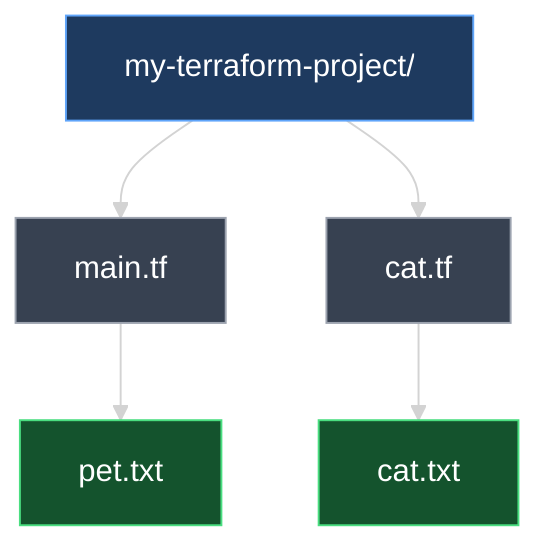
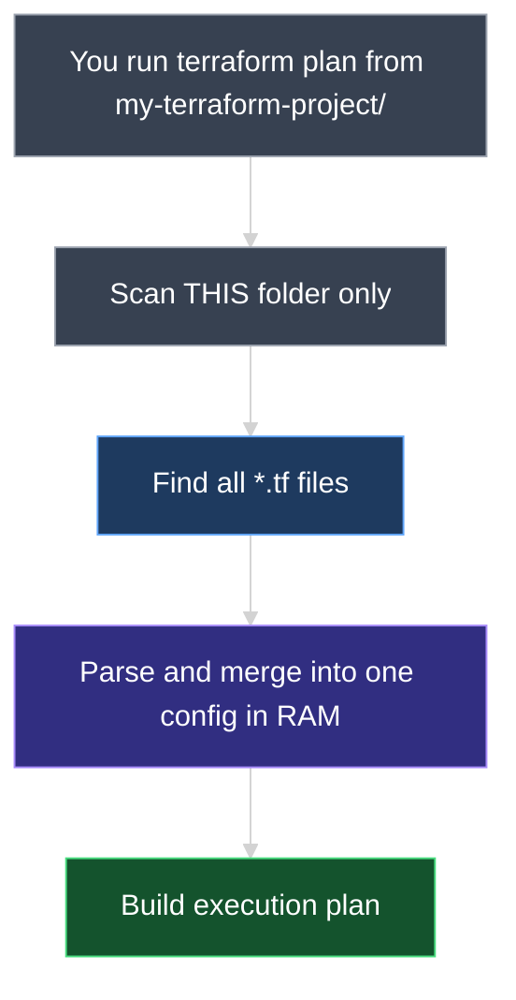
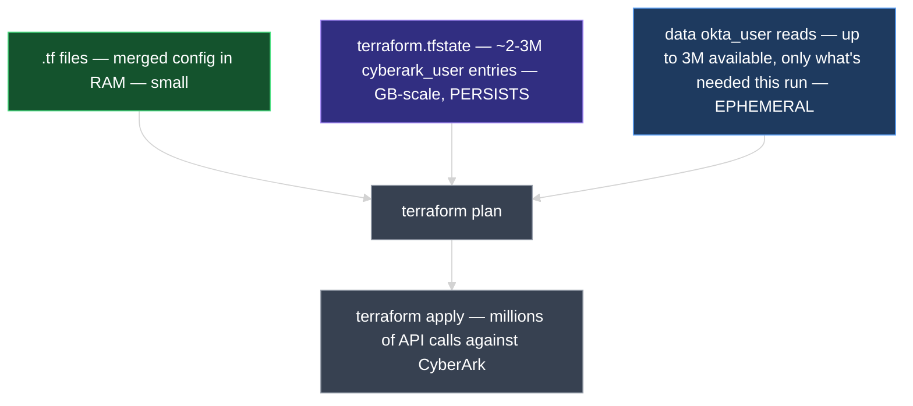
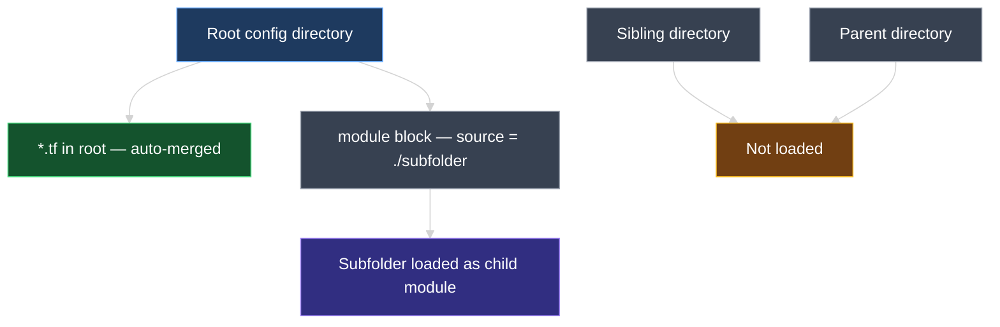
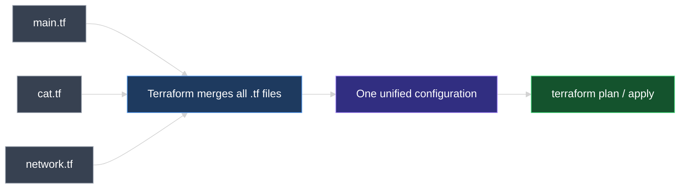
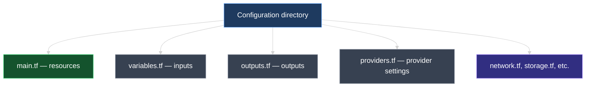

# Terraform Configuration Directory and File Naming Conventions

This document explains what a Terraform **configuration directory** is, how Terraform treats multiple `.tf` files inside it, and the **industry-standard naming conventions** teams use to organize infrastructure code.

---

## 1. What Is a Configuration Directory?

A **configuration directory** (also called the **root module directory**) is the project folder that contains your Terraform code. Every Terraform command — `init`, `plan`, `apply` — is run from this directory.

```text
my-terraform-project/        ← configuration directory (you choose the folder name)
└── main.tf                  ← configuration file(s)
```

Inside `main.tf`:

```hcl
resource "local_file" "pet" {
  filename = "pet.txt"
  content  = "I love pets!"
}
```

> **Key idea:** Terraform works at the **directory** level, not the file level. The folder is the project workspace; `.tf` files inside it are the configuration.

### What Terraform requires vs. what teams conventionally use

| | Required by Terraform? | Industry practice |
| --- | --- | --- |
| **Directory name** | Any name you choose | Descriptive name matching the project, e.g. `web-app-infra/`, `networking/` |
| **Config file name** | Must end in `.tf` | **`main.tf`** for primary resources |
| **Number of files** | One or more `.tf` files | Split by purpose as the project grows |

Terraform does **not** require a file named `main.tf` or a folder named `terraform-local-file`. Those names are **conventions** that make projects easier for teams to read and navigate.

---

## 2. Multiple Configuration Files in One Directory

A configuration directory is **not limited to one file**. You can add as many `.tf` files as needed.

### Example: adding `cat.tf`

```text
my-terraform-project/
├── main.tf
└── cat.tf
```

**`main.tf`**

```hcl
resource "local_file" "pet" {
  filename = "pet.txt"
  content  = "I love pets!"
}
```

**`cat.tf`**

```hcl
resource "local_file" "cat" {
  filename = "cat.txt"
  content  = "I love cats!"
}
```

After `terraform apply`, both files are created in the configuration directory:

| Terraform resource | Defined in | File created on disk |
| --- | --- | --- |
| `local_file.pet` | `main.tf` | `pet.txt` |
| `local_file.cat` | `cat.tf` | `cat.txt` |



### The golden rule

> **Terraform reads every file ending in `.tf` in the configuration directory and merges them into one configuration in memory.**

File names like `local.tf` or `cat.tf` work fine — but **`main.tf`** is the standard name for your primary file because that is what engineers expect to open first.

### Where exactly does Terraform load from?

When you run `terraform plan` or `terraform apply` from `my-terraform-project/`, Terraform loads configuration **only from that directory**:

```text
my-terraform-project/                 ← YOU RUN COMMANDS HERE
├── main.tf                           ← LOADED (merged into memory)
├── cat.tf                            ← LOADED (merged into memory)
├── variables.tf                      ← LOADED (merged into memory)
├── pet.txt                           ← NOT loaded (created by apply)
├── terraform.tfstate                 ← NOT loaded as config (state is separate)
├── .terraform/                       ← NOT loaded (provider plugins on disk)
└── modules/                          ← NOT loaded automatically (only when referenced)
    └── vpc/
        └── main.tf                   ← loaded only via a module block in root .tf files
```

| Location | Loaded into configuration? |
| --- | --- |
| Any `*.tf` file **directly inside** the configuration directory | **Yes** — merged together |
| Files in **subfolders** (e.g. `modules/vpc/main.tf`) | **No** — unless you explicitly call `module "vpc" { ... }` |
| `.tf` files in **parent or sibling** folders | **No** — Terraform does not search outside the working directory |
| `.tfvars`, `.tfstate`, `.terraform/`, `README.md` | **No** |



### How Much Memory Does Terraform Use at `plan` and `apply`?

Two very different things get lumped together under "memory usage" — parsing your code, and tracking your infrastructure. Only one of them scales with real-world size.

1. **Parsing `.tf` files → negligible.** Reading and merging `.tf` files into one configuration is fast and small — even hundreds of files rarely exceed a few MB in RAM. **File count is never the cost driver.**
2. **Tracking resources in state → this is what actually scales.** Memory, time, and disk during `plan`/`apply` are driven by **how many `resource` blocks Terraform manages** — every one is tracked with its full set of attributes in `terraform.tfstate`.

> **Rule of thumb:** 2 resources spread across 10 files cost the same as 2 resources crammed into 1 file. But 2 resources vs. 2 million resources — even inside the exact same file — is a completely different scale of memory, time, and API load.

#### `resource` vs. `data` — only one of them grows persistent state

A common point of confusion in a migration: does *every* record you read count toward Terraform's memory cost, or only the ones Terraform actually manages?

| | `resource` block | `data` block |
| --- | --- | --- |
| **Example** | `cyberark_user` — the **target**; Terraform creates/updates it | `okta_user` — the **source**; Terraform only reads it |
| **Persists in `terraform.tfstate` long-term?** | **Yes** — every one you add stays in state forever, growing the file | No — re-fetched fresh each run; not accumulated run over run |
| **Drives long-term state size?** | **Yes** | **No** — only adds to that single run's peak memory while the read happens |

Applied to an Okta → CyberArk migration:

* **Okta** (3 million users) is read via `data "okta_user"` blocks. Terraform queries whatever it needs from the Okta API on that run — but these users are **not** what makes `terraform.tfstate` grow. Okta is only ever a source to read from, never something Terraform manages.
* **CyberArk** (2 million `cyberark_user` resources, growing toward 3 million) are `resource` blocks Terraform **manages**. Every one of them lives permanently in `terraform.tfstate` — and that count is what actually drives memory, plan time, and disk usage.

#### Small lab vs. large migration

| Scenario | `resource` blocks tracked in state | What Terraform holds in memory during `plan`/`apply` |
| --- | --- | --- |
| **Lab** (`main.tf` + `cat.tf`) | 2 `local_file` resources | Negligible — state and plan graph are tiny |
| **Okta → CyberArk migration** | ~2–3 million `cyberark_user` resources (Okta's 3M is read-only, never stored long-term) | **Massive** — state holds millions of resource IDs, attributes, and dependency edges |

#### What happens during that `apply`

1. **Load state** — read millions of `cyberark_user` entries (IDs, emails, group mappings) from `terraform.tfstate` into memory.
2. **Refresh** — call the CyberArk API to confirm each of those managed resources still matches reality.
3. **Read data sources** — call the Okta API for whichever users this run needs; ephemeral, not stored long-term.
4. **Build a plan** — diff desired `.tf` state against refreshed state for every managed resource.
5. **Execute changes** — API calls to create or update whatever's missing or drifted.



#### What actually grows, and with what

| What | Grows with… | Okta → CyberArk at millions of users |
| --- | --- | --- |
| **Merged `.tf` config in RAM** | Number/size of `.tf` files | Small — parses in milliseconds regardless of file count |
| **`terraform.tfstate` size** | Number of **managed** (`resource`) entries only | **GB-scale** — one entry per `cyberark_user`, **not** per Okta user |
| **Plan/apply peak memory** | Managed resources in state + in-flight data-source/API reads | **GB-scale RAM**, long runtimes — often needs remote state + parallelism limits |
| **Number of `.tf` files** | File count only | **Does not matter** if total resource count is the same |

> **Key takeaway:** File count never matters. Only `resource` blocks accumulate permanently in state — a `data` block reads live and moves on without growing state. Two to three million managed resources, whether split across 1 file or 500, is what forces enterprise migrations toward **batching**, **remote state**, **`-target`**, and **split workspaces**.

---

### Subdirectories and folders outside the configuration directory

#### Can you put `.tf` files in a subdirectory?

**Not as part of the root configuration automatically.** Terraform does **not** scan subfolders for extra `.tf` files to merge into the root module.

```text
my-terraform-project/
├── main.tf                    ← LOADED (root module)
└── users/
    └── cyberark_users.tf      ← NOT loaded automatically
```

To use code in a subdirectory, you must declare a **child module**:

```hcl
# main.tf
module "users" {
  source = "./users"           ← tells Terraform to load ./users/ as a separate module
}
```

Terraform then loads `users/` as its **own** configuration scope — not merged flat into root.

#### Can you run Terraform from a parent folder or include a sibling directory?

**No.** Terraform only uses the directory where you run the command.

```text
projects/
├── okta-export/               ← sibling folder — NOT loaded
│   └── users.tf
└── cyberark-migration/        ← configuration directory — run commands HERE
    ├── main.tf
    └── modules/
        └── users/
            └── main.tf        ← loaded only via module "users" { source = "./modules/users" }
```

| Pattern | Allowed? | How it works |
| --- | --- | --- |
| `.tf` files in **root config directory** | **Yes** | Auto-merged into one configuration |
| `.tf` files in **subdirectory** without `module` block | **No** | Ignored by root module |
| `.tf` files in **subdirectory** with `module` block | **Yes** | Loaded as a **child module** (separate scope) |
| `.tf` files in **parent or sibling** folder | **No** | Never discovered — wrong working directory |
| `module` source pointing to **another repo/path** | **Yes** | `source = "../other-project"` or `source = "git::https://..."` — explicit only |





---

## 3. One File vs. Many Files

Both approaches are valid. Terraform produces the same result either way.

### Option A — multiple files (standard as projects grow)

```text
my-terraform-project/
├── main.tf       ← pet resource
├── cat.tf        ← cat resource
├── variables.tf  ← inputs (later)
└── outputs.tf    ← outputs (later)
```

**Best for:** Team collaboration, larger codebases, and splitting resources by topic (networking, compute, storage).

### Option B — single file (fine for small projects)

All resource blocks can live in one file:

```hcl
# main.tf

resource "local_file" "pet" {
  filename = "pet.txt"
  content  = "I love pets!"
}

resource "local_file" "cat" {
  filename = "cat.txt"
  content  = "I love cats!"
}
```

**Best for:** Learning, proofs of concept, and very small deployments.

| Approach | When teams use it |
| --- | --- |
| **One `main.tf`** | Tutorials, labs, tiny projects |
| **Multiple `.tf` files** | Real-world projects once code no longer fits comfortably in one file |

> **Terraform does not care** whether you use 1 file or 20. It always merges all `.tf` files in the directory into a single configuration.

---

## 4. Industry-Standard File Naming Conventions

These names are **not required** — they are widely adopted patterns that make repositories predictable for any engineer who clones the project.

```text
my-terraform-project/
├── main.tf         ← core resources (industry default entry point)
├── variables.tf    ← input variables
├── outputs.tf      ← output values
├── providers.tf    ← provider configuration
├── versions.tf     ← Terraform & provider version constraints (common in production)
└── network.tf      ← optional: split resources by domain
```



| File | Purpose | Covered later in this course? |
| --- | --- | --- |
| **`main.tf`** | Primary infrastructure resources | Yes |
| **`variables.tf`** | Declares input variables for reusable, parameterized config | Yes |
| **`outputs.tf`** | Declares values to display after apply (IPs, URLs, IDs) | Yes |
| **`providers.tf`** | Configures providers (cloud region, credentials, aliases) | Yes |
| **`versions.tf`** | Pins Terraform and provider versions for reproducible builds | Yes |
| **Domain files** (`network.tf`, `cat.tf`, …) | Optional splits when `main.tf` gets too large | As needed |

### Why `main.tf` became the standard

* **Predictability** — Any engineer opening a Terraform repo knows where the core resources live.
* **Separation of concerns** — Resources in `main.tf`, inputs in `variables.tf`, outputs in `outputs.tf`.
* **Scalability** — Start with one file; split into domain files as the project grows.

The name `main.tf` has no special meaning to the Terraform engine — it is purely a **human convention**, like `index.js` in Node.js or `main.go` in Go.

---

## 5. What Terraform Ignores

Only files ending in **`.tf`** are loaded as configuration.

| File / folder | Loaded as config? |
| --- | --- |
| `main.tf`, `cat.tf`, `variables.tf` | Yes |
| `terraform.tfstate` | No — state file (tracks what exists) |
| `.terraform/` | No — downloaded provider plugins |
| `.terraform.lock.hcl` | No — provider version lock file |
| `pet.txt`, `cat.txt` | No — files created by resources after apply |
| `README.md`, `.gitignore` | No |

---

## 6. Hands-On Lab

In your configuration directory:

1. Start with `main.tf` containing one `local_file` resource.
2. Add `cat.tf` with a second `local_file` resource.
3. Run `terraform plan` — expect `+ create` for the new resource.
4. Run `terraform apply` — confirm both output files exist.
5. Move both resources into `main.tf` and delete `cat.tf`. Run `terraform plan` again — expect **no changes**.

Step 5 proves that **file layout does not change infrastructure** — only the resource blocks matter.

---

### Topic Summary: Configuration Directory

A Terraform **configuration directory** is the root folder where you run all Terraform commands. Terraform loads **only** `*.tf` files **directly inside that folder** and merges them in memory. Subdirectories require an explicit **`module` block**; parent and sibling folders are never loaded. Memory at `plan`/`apply` is driven by **how many resources are in state** — not by file count — so migrations managing millions of users (e.g., Okta → CyberArk) are vastly more expensive than a two-file lab.

---

## Knowledge Check

Answer each question on your own first, then read the explanation below it.

---

### 1 · Definition

**What is a Terraform configuration directory?**

> The **project folder where you run Terraform commands** (`init`, `plan`, `apply`). Terraform scans **only that directory**, loads every **`*.tf` file directly inside it**, and merges them into **one configuration in memory**.

---

### 2 · Load boundaries

**Where does Terraform load `.tf` files from — and where does it NOT?**

> **Loads:** the current working directory only — `main.tf`, `variables.tf`, `cat.tf`, etc. merge together.  
> **Does not load:** subfolders (without a `module` block), parent/sibling folders, `.terraform/`, `.tfstate`, or `.tfvars` as configuration.

---

### 3 · Memory at scale

**How much memory does Terraform use during `plan` and `apply`?**

> Parsing `.tf` files uses very little RAM. What drives memory at scale is **how many `resource` blocks are tracked in state** — e.g. millions of `cyberark_user` resources in an Okta → CyberArk migration can mean gigabytes of RAM and multi-hour plans. A two-resource lab is trivial by comparison.

---

### 3a · `resource` vs. `data` memory cost

**In an Okta → CyberArk migration, do the 3 million Okta users add to Terraform's long-term memory and state size the same way the 2 million `cyberark_user` resources do?**

> **No.** Okta users are read through **`data "okta_user"` blocks** — Terraform queries whatever it needs from the Okta API on that run, but this is **not** persisted in `terraform.tfstate` run over run. Only **`resource` blocks** (`cyberark_user`) accumulate permanently in state — that count, not the data-source read volume, is what drives long-term state size and `plan`/`apply` memory.

---

### 4 · Subdirectories

**Can you put `.tf` files in a subdirectory and have Terraform load them automatically?**

> **No.** Only files **directly inside** the root configuration directory auto-merge. Subfolders need an explicit **`module`** block: `module "users" { source = "./users" }`.

---

### 5 · Parent and sibling folders

**Can Terraform load `.tf` files from a parent folder or a sibling directory?**

> **No.** Only the directory where you run the command. To use another path, reference it with a **`module`** block and `source = "../other-folder"` or a Git/registry URL.

---

### 6 · Merge vs module

**What is the difference between merged `.tf` files and a child module subdirectory?**

> **Root `.tf` files** merge into **one shared scope**. A **subdirectory loaded via `module`** is a **separate module** with its own variables, outputs, and scope.

---

### 7 · Adding `cat.tf`

**If you add `cat.tf` to the directory, does Terraform automatically use it?**

> **Yes.** Any **`.tf`** file in the configuration directory is merged automatically — no registration step.

---

### 8 · Is `main.tf` required?

**Is `main.tf` required by Terraform?**

> **No.** Only the **`.tf` extension** matters. `main.tf` is an **industry convention** for a predictable entry point.

---

### 9 · Standard filenames

**What are `variables.tf`, `outputs.tf`, and `providers.tf` used for?**

> Standard names for separating **inputs**, **outputs**, and **provider settings** — organizational convention, not engine requirements.

---

### 10 · One file vs many

**Does Terraform care whether you use one file or multiple files?**

> **No.** Ten resources in one file equals ten files with one resource each — same merged configuration, as long as they share the same directory.

---

### 11 · Resources across files

**If `main.tf` defines `local_file.pet` and `cat.tf` defines `local_file.cat`, how many resources does Terraform manage?**

> **Two** — both files merge into one configuration, so Terraform manages **`local_file.pet`** and **`local_file.cat`**.

---

### 12 · Duplicate resource names

**Can two `.tf` files define the same resource name (e.g. two `local_file.pet` blocks)?**

> **No.** Each resource address (`type.name`) must be **unique** across all merged files. Duplicates cause a configuration error.

---

### 13 · `.tfvars` vs `.tf`

**Will Terraform load a file named `settings.tfvars` as configuration?**

> **No.** Only **`.tf`** files are configuration. **`.tfvars`** files supply variable **values**, not resource definitions.

