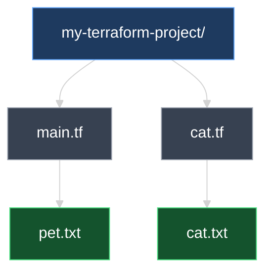
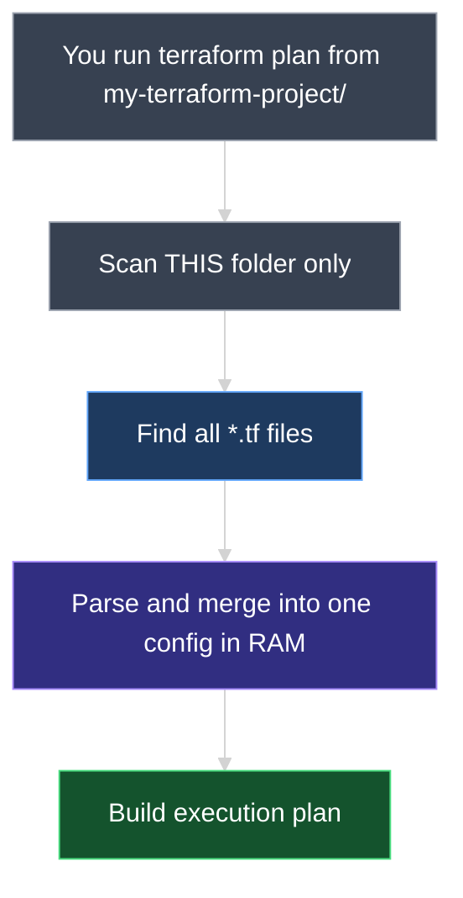
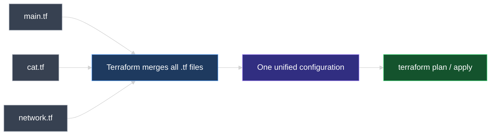
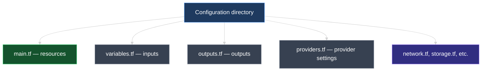

# Terraform Configuration Directory and File Naming Conventions

This document explains what a Terraform **configuration directory** is, how Terraform treats multiple `.tf` files inside it, and the **industry-standard naming conventions** teams use to organize infrastructure code.

---

## 1. What Is a Configuration Directory?

A **configuration directory** (also called the **root module directory**) is the project folder that contains your Terraform code. Every Terraform command — `init`, `plan`, `apply` — is run from this directory.

```text
my-terraform-project/        ← configuration directory (you choose the folder name)
└── main.tf                  ← configuration file(s)
```

Inside `main.tf`:

```hcl
resource "local_file" "pet" {
  filename = "pet.txt"
  content  = "I love pets!"
}
```

> **Key idea:** Terraform works at the **directory** level, not the file level. The folder is the project workspace; `.tf` files inside it are the configuration.

### What Terraform requires vs. what teams conventionally use

| | Required by Terraform? | Industry practice |
| --- | --- | --- |
| **Directory name** | Any name you choose | Descriptive name matching the project, e.g. `web-app-infra/`, `networking/` |
| **Config file name** | Must end in `.tf` | **`main.tf`** for primary resources |
| **Number of files** | One or more `.tf` files | Split by purpose as the project grows |

Terraform does **not** require a file named `main.tf` or a folder named `terraform-local-file`. Those names are **conventions** that make projects easier for teams to read and navigate.

---

## 2. Multiple Configuration Files in One Directory

A configuration directory is **not limited to one file**. You can add as many `.tf` files as needed.

### Example: adding `cat.tf`

```text
my-terraform-project/
├── main.tf
└── cat.tf
```

**`main.tf`**

```hcl
resource "local_file" "pet" {
  filename = "pet.txt"
  content  = "I love pets!"
}
```

**`cat.tf`**

```hcl
resource "local_file" "cat" {
  filename = "cat.txt"
  content  = "I love cats!"
}
```

After `terraform apply`, both files are created in the configuration directory:

| Terraform resource | Defined in | File created on disk |
| --- | --- | --- |
| `local_file.pet` | `main.tf` | `pet.txt` |
| `local_file.cat` | `cat.tf` | `cat.txt` |



### The golden rule

> **Terraform reads every file ending in `.tf` in the configuration directory and merges them into one configuration in memory.**

File names like `local.tf` or `cat.tf` work fine — but **`main.tf`** is the standard name for your primary file because that is what engineers expect to open first.

### Where exactly does Terraform load from?

When you run `terraform plan` or `terraform apply` from `my-terraform-project/`, Terraform loads configuration **only from that directory**:

```text
my-terraform-project/                 ← YOU RUN COMMANDS HERE
├── main.tf                           ← LOADED (merged into memory)
├── cat.tf                            ← LOADED (merged into memory)
├── variables.tf                      ← LOADED (merged into memory)
├── pet.txt                           ← NOT loaded (created by apply)
├── terraform.tfstate                 ← NOT loaded as config (state is separate)
├── .terraform/                       ← NOT loaded (provider plugins on disk)
└── modules/                          ← NOT loaded automatically (only when referenced)
    └── vpc/
        └── main.tf                   ← loaded only via a module block in root .tf files
```

| Location | Loaded into configuration? |
| --- | --- |
| Any `*.tf` file **directly inside** the configuration directory | **Yes** — merged together |
| Files in **subfolders** (e.g. `modules/vpc/main.tf`) | **No** — unless you explicitly call `module "vpc" { ... }` |
| `.tf` files in **parent or sibling** folders | **No** — Terraform does not search outside the working directory |
| `.tfvars`, `.tfstate`, `.terraform/`, `README.md` | **No** |



### How much memory does the merged configuration use?

Terraform does **not** execute `.tf` files one at a time from disk. It **reads all of them, parses the HCL, and holds the combined result in RAM** as a single configuration object before planning or applying.

Memory usage depends on **how large and complex** that merged configuration is:

| Project size | Typical `.tf` files on disk | Config in RAM (approx.) | Full `terraform` process (approx.) |
| --- | --- | --- | --- |
| **Lab / learning** (2–5 resources, 1–3 files) | A few KB | **< 1 MB** | **50–150 MB** (includes provider plugins) |
| **Small team project** (50–100 resources) | Tens to hundreds of KB | **1–10 MB** | **100–300 MB** |
| **Large enterprise** (1000+ resources, many modules) | Several MB | **50–500+ MB** | **500 MB – 2+ GB** |

**What drives memory up:**
* More **resource blocks** and **data sources**
* More **variables**, **outputs**, and **expressions**
* More **child modules** (each module config is also loaded into memory)
* Larger **provider** plugins loaded during `init`

**What does *not* significantly affect config memory:**
* Splitting the same resources across 1 file vs. 10 files — the merged result is identical, so memory is effectively the same
* The size of `terraform.tfstate` on disk (state is loaded separately and can add its own memory cost)

For our `main.tf` + `cat.tf` lab example with two `local_file` resources, the merged configuration in memory is **tiny** — far less than 1 MB. Most of the RAM you see used by the `terraform` process goes to the **provider binary** and runtime, not to parsing two small `.tf` files.



---

## 3. One File vs. Many Files

Both approaches are valid. Terraform produces the same result either way.

### Option A — multiple files (standard as projects grow)

```text
my-terraform-project/
├── main.tf       ← pet resource
├── cat.tf        ← cat resource
├── variables.tf  ← inputs (later)
└── outputs.tf    ← outputs (later)
```

**Best for:** Team collaboration, larger codebases, and splitting resources by topic (networking, compute, storage).

### Option B — single file (fine for small projects)

All resource blocks can live in one file:

```hcl
# main.tf

resource "local_file" "pet" {
  filename = "pet.txt"
  content  = "I love pets!"
}

resource "local_file" "cat" {
  filename = "cat.txt"
  content  = "I love cats!"
}
```

**Best for:** Learning, proofs of concept, and very small deployments.

| Approach | When teams use it |
| --- | --- |
| **One `main.tf`** | Tutorials, labs, tiny projects |
| **Multiple `.tf` files** | Real-world projects once code no longer fits comfortably in one file |

> **Terraform does not care** whether you use 1 file or 20. It always merges all `.tf` files in the directory into a single configuration.

---

## 4. Industry-Standard File Naming Conventions

These names are **not required** — they are widely adopted patterns that make repositories predictable for any engineer who clones the project.

```text
my-terraform-project/
├── main.tf         ← core resources (industry default entry point)
├── variables.tf    ← input variables
├── outputs.tf      ← output values
├── providers.tf    ← provider configuration
├── versions.tf     ← Terraform & provider version constraints (common in production)
└── network.tf      ← optional: split resources by domain
```



| File | Purpose | Covered later in this course? |
| --- | --- | --- |
| **`main.tf`** | Primary infrastructure resources | Yes |
| **`variables.tf`** | Declares input variables for reusable, parameterized config | Yes |
| **`outputs.tf`** | Declares values to display after apply (IPs, URLs, IDs) | Yes |
| **`providers.tf`** | Configures providers (cloud region, credentials, aliases) | Yes |
| **`versions.tf`** | Pins Terraform and provider versions for reproducible builds | Yes |
| **Domain files** (`network.tf`, `cat.tf`, …) | Optional splits when `main.tf` gets too large | As needed |

### Why `main.tf` became the standard

* **Predictability** — Any engineer opening a Terraform repo knows where the core resources live.
* **Separation of concerns** — Resources in `main.tf`, inputs in `variables.tf`, outputs in `outputs.tf`.
* **Scalability** — Start with one file; split into domain files as the project grows.

The name `main.tf` has no special meaning to the Terraform engine — it is purely a **human convention**, like `index.js` in Node.js or `main.go` in Go.

---

## 5. What Terraform Ignores

Only files ending in **`.tf`** are loaded as configuration.

| File / folder | Loaded as config? |
| --- | --- |
| `main.tf`, `cat.tf`, `variables.tf` | Yes |
| `terraform.tfstate` | No — state file (tracks what exists) |
| `.terraform/` | No — downloaded provider plugins |
| `.terraform.lock.hcl` | No — provider version lock file |
| `pet.txt`, `cat.txt` | No — files created by resources after apply |
| `README.md`, `.gitignore` | No |

---

## 6. Hands-On Lab

In your configuration directory:

1. Start with `main.tf` containing one `local_file` resource.
2. Add `cat.tf` with a second `local_file` resource.
3. Run `terraform plan` — expect `+ create` for the new resource.
4. Run `terraform apply` — confirm both output files exist.
5. Move both resources into `main.tf` and delete `cat.tf`. Run `terraform plan` again — expect **no changes**.

Step 5 proves that **file layout does not change infrastructure** — only the resource blocks matter.

---

### Topic Summary: Configuration Directory

A Terraform **configuration directory** is the root folder where you run all Terraform commands. Terraform loads **only** the `*.tf` files **directly inside that folder**, merges them into **one in-memory configuration**, then runs `plan` or `apply`. Subfolders are not scanned unless referenced as modules. For small labs, config memory is under 1 MB; the full Terraform process typically uses 50–150 MB mostly for provider plugins. Industry practice uses **`main.tf`** plus `variables.tf`, `outputs.tf`, and `providers.tf` for organization.

### Knowledge Check Q&A

**Q: What is a Terraform configuration directory?**

**A:** It is the **project folder where you run Terraform commands** (`init`, `plan`, `apply`). Terraform scans **only that directory** — not parent folders, not sibling folders — and loads **every `*.tf` file directly inside it**. All loaded files are parsed and **merged into one single configuration held in memory** before Terraform builds the execution plan.

**Q: Where does Terraform load `.tf` files from — and where does it NOT load from?**

**A:** It loads from the **current working directory** (the configuration directory) only. Files like `main.tf`, `cat.tf`, and `variables.tf` in that folder are merged together. It does **not** load `.tf` files from subfolders unless you reference them with a `module` block. It does **not** load `terraform.tfstate`, `.terraform/`, `.tfvars`, or non-`.tf` files as configuration.

**Q: How much memory does the merged configuration use?**

**A:** It depends on project size. For a small lab (2 resources, 2 `.tf` files), the merged config in RAM is **less than 1 MB**. The full `terraform` process typically uses **50–150 MB** because provider plugins and runtime overhead use most of the memory — not the `.tf` files themselves. Large projects with thousands of resources can use **hundreds of MB to gigabytes**. Splitting the same resources across 1 file or 10 files does **not** meaningfully change memory — the merged result is identical.

**Q: If you add `cat.tf` to the directory, does Terraform automatically use it?**

**A:** Yes. Any file ending in `.tf` in the configuration directory is automatically merged into the configuration. No registration step is needed.

**Q: Is `main.tf` required by Terraform?**

**A:** No. Terraform only requires the `.tf` extension. `main.tf` is an **industry convention** so teams have a predictable entry point for core resources.

**Q: What are `variables.tf`, `outputs.tf`, and `providers.tf` used for?**

**A:** Standard filenames for separating concerns — input variables, output values, and provider settings. Covered in later sections of this course.

**Q: Does Terraform care whether you use one file or multiple files?**

**A:** No. One file with ten resource blocks equals ten files with one block each, as long as they are in the same configuration directory.

**Q: If `main.tf` defines `local_file.pet` and `cat.tf` defines `local_file.cat`, how many resources does Terraform manage?**

**A:** Two resources — both files are merged into one configuration, so Terraform manages `local_file.pet` and `local_file.cat`.

**Q: Can two `.tf` files define the same resource name (e.g., two `local_file.pet` blocks)?**

**A:** No. Each resource address (`type.name`) must be unique across all `.tf` files in the directory. Duplicates cause a configuration error.

**Q: Will Terraform load a file named `settings.tfvars` as configuration?**

**A:** No. Only `.tf` files are configuration. `.tfvars` files supply variable **values**, not resource definitions.
