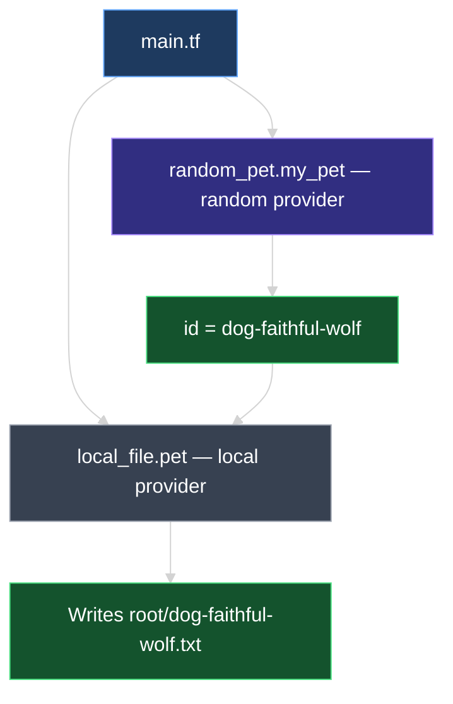
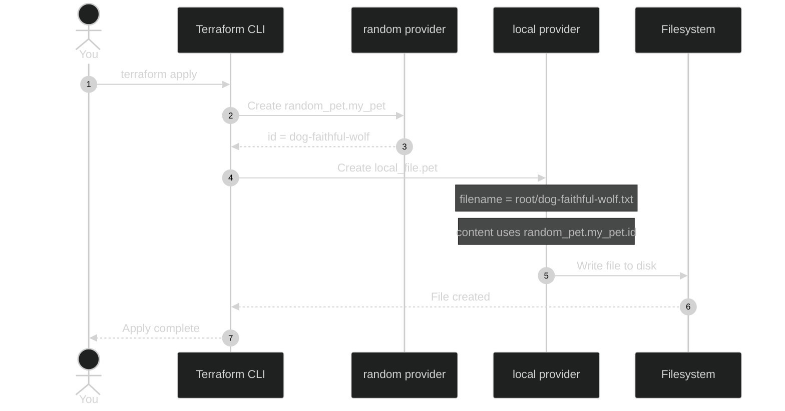

# Multiple Providers and Resources in One Configuration

This document explains how to use **more than one provider** in the same Terraform configuration — adding the **`random`** provider alongside **`local`**, creating a `random_pet` resource, and why you must run **`terraform init`** again when a new provider is introduced.

---

## 1. From One Provider to Many

Until now, our configuration used a single provider — **`local`** — to create a file on disk:

```hcl
resource "local_file" "pet" {
  filename = "root/pet.txt"
  content  = "I love pet!"
}
```

Terraform fully supports **multiple providers in the same configuration directory**. Each resource type declares which provider it needs through its name prefix.

| Resource type | Provider | What it manages |
| --- | --- | --- |
| `local_file` | `local` | Files on your local filesystem |
| `random_pet` | `random` | Randomly generated values (pet names, IDs, passwords) |



---

## 2. The `random` Provider and `random_pet` Resource

The **`random`** provider creates **logical resources** — random IDs, integers, passwords, and pet names. These do not provision cloud infrastructure or physical hardware. They generate values that Terraform stores in **state** and can reference from other resources.

### Breaking down `random_pet`

```hcl
resource "random_pet" "my_pet" {
  prefix    = "dog"
  separator = "-"
  length    = 2
}
```

| Part | Value | Meaning |
| --- | --- | --- |
| Block type | `resource` | Terraform block type (fixed) |
| Resource type | `random_pet` | Provider = **`random`** · Resource = **`pet`** |
| Resource name | `my_pet` | Your logical label for this resource |
| `prefix` | `"dog"` | Text added before the generated name |
| `separator` | `"-"` | Character between prefix and generated words |
| `length` | `2` | Number of random words in the generated name |

> **Rule:** `random_pet` → provider is **`random`** (before `_`), resource type is **`pet`** (after `_`).

### Example output after apply

The `random_pet` resource exposes an **`id`** attribute containing the generated name:

```text
random_pet.my_pet: Creation complete after 0s [id=dog-faithful-wolf]
```

The name is random — it does not have to include "dog" every time; `prefix` only prepends your chosen text. In course materials, a dog icon may be used as a visual shorthand for "pet" — the provider can generate any pet-style name.

### Referencing `id` from another resource

The real value of `random_pet` is the **`id`** attribute — you pass it into other resources using a **reference**:

```text
random_pet.my_pet.id
 │              │    │
 │              │    └── attribute exported after apply (the generated name)
 │              └── your resource name
 └── resource type prefix (provider = random)
```

**Example — use `id` in `local_file` content and filename:**

```hcl
resource "random_pet" "my_pet" {
  prefix    = "dog"
  separator = "-"
  length    = 2
}

resource "local_file" "pet" {
  filename = "root/${random_pet.my_pet.id}.txt"
  content  = "My pet is called ${random_pet.my_pet.id}"
}
```

| Reference in `local_file` | Resolves to (example) |
| --- | --- |
| `filename = "root/${random_pet.my_pet.id}.txt"` | `root/dog-faithful-wolf.txt` |
| `content = "My pet is called ${random_pet.my_pet.id}"` | `My pet is called dog-faithful-wolf` |

Terraform automatically knows **`local_file.pet` depends on `random_pet.my_pet`** — the pet name must be generated before the file is written.


---

## 3. Complete `main.tf` — Two Providers Linked by `id`

The full configuration wires the **random** provider into the **local** provider via `random_pet.my_pet.id`:

```hcl
resource "random_pet" "my_pet" {
  prefix    = "dog"
  separator = "-"
  length    = 2
}

resource "local_file" "pet" {
  filename = "root/${random_pet.my_pet.id}.txt"
  content  = "My pet is called ${random_pet.my_pet.id}"
}
```

**If you already applied an older `local_file.pet` with a fixed filename (`root/pet.txt`),** adding the `random_pet` block and updating the reference will cause Terraform to **replace** the file resource with the new name. That is expected — the resource now depends on a dynamic `id`.

Your configuration directory now depends on **two providers**:

```text
03_GettingStarted/02_HCL_Basics_Lab/terraform-projects/HCL/
├── main.tf
└── .terraform/providers/
    ├── .../hashicorp/local/...
    └── .../hashicorp/random/...    ← new after init
```

> Use the [Terraform Registry documentation](https://registry.terraform.io/providers/hashicorp/random/latest/docs/resources/pet) to look up required vs. optional arguments for any resource type.

---

## 4. Run `terraform init` Again (Mandatory)

Whenever you add a resource type from a **new provider**, you **must run `terraform init` again** so Terraform downloads that provider's plugin.

```bash
terraform init
```

### Expected output

```text
Initializing provider plugins...
- Reusing previous version of hashicorp/local from the dependency lock file
- Finding latest version of hashicorp/random...
- Installing hashicorp/random v3.x.x...
- Installed hashicorp/random v3.x.x (signed by HashiCorp)
```

| Provider | What init does |
| --- | --- |
| **`hashicorp/local`** | Already installed — **reused** from previous init |
| **`hashicorp/random`** | Not used before — **newly installed** |


> **`terraform init` is safe to re-run** at any time. It never modifies deployed infrastructure.

---

## 5. Plan and Apply

### `terraform plan`

```bash
terraform plan
```

| Resource | Expected plan result |
| --- | --- |
| `random_pet.my_pet` | **`+ create`** — new resource block |
| `local_file.pet` | **`+ create`** or **`-/+ replace`** — filename/content now use `${random_pet.my_pet.id}` |

If `local_file.pet` already exists with a static path, plan may show **destroy and recreate** because the filename changed from `root/pet.txt` to `root/dog-faithful-wolf.txt`:

```diff
+ resource "random_pet" "my_pet" {
+     length    = 2
+     prefix    = "dog"
+     separator = "-"
+   }

-/+ resource "local_file" "pet" {
      ~ content  = "I love pet!" -> "My pet is called dog-faithful-wolf"
      ~ filename = "root/pet.txt" -> "root/dog-faithful-wolf.txt"
    }
```

> The `~` symbol means **update in-place** where possible; `-/+` means **destroy and recreate** when a force-new attribute changes. For `local_file`, that's every argument — `filename` **and** `content` are both force-new, since the provider has no in-place update path (see `07_Resource_Attributes_and_References.md`).

### `terraform apply`

```bash
terraform apply
```

| Resource | What happens |
| --- | --- |
| `random_pet.my_pet` | **Created first** — generates `id` (e.g., `dog-faithful-wolf`) |
| `local_file.pet` | **Created/updated** — writes file using that `id` in path and content |

```text
random_pet.my_pet: Creating...
random_pet.my_pet: Creation complete after 0s [id=dog-faithful-wolf]
local_file.pet: Creating...
local_file.pet: Creation complete after 0s [id=...]

Apply complete! Resources: 2 added, 0 changed, 0 destroyed.
```

### Verify the `id` on disk and in state

**File on disk** (`root/dog-faithful-wolf.txt`):

```text
My pet is called dog-faithful-wolf
```

**Inspect state with `terraform show`:**

```bash
terraform show
```

```hcl
# random_pet.my_pet:
resource "random_pet" "my_pet" {
    id        = "dog-faithful-wolf"
    length    = 2
    prefix    = "dog"
    separator = "-"
}

# local_file.pet:
resource "local_file" "pet" {
    content  = "My pet is called dog-faithful-wolf"
    filename = "root/dog-faithful-wolf.txt"
    # ...
}
```

The same `dog-faithful-wolf` value appears in **`random_pet.my_pet.id`**, the **file content**, the **filename**, and **state** — one generated value, used everywhere you reference it.

### Logical provider vs. physical provider

| Provider | Type | Creates on disk / cloud? |
| --- | --- | --- |
| **`local`** | Physical / OS-level | **Yes** — writes `root/<pet-id>.txt` using the `id` value |
| **`random`** | Logical | **No file of its own** — generates `id`; other resources **reference** it |



---

## 6. Hands-On Lab

In your configuration directory:

1. Replace `main.tf` with the full example that references `random_pet.my_pet.id` in both `filename` and `content`.
2. Run `terraform init` — confirm `local` is reused and `random` is installed.
3. Run `terraform plan` — confirm `random_pet.my_pet` is created and `local_file.pet` is created or replaced.
4. Run `terraform apply` — note the `id` in the apply output.
5. Open the generated file under `root/` — confirm the pet name appears in the filename and file body.
6. Run `terraform show` — locate `random_pet.my_pet.id` and verify it matches the file on disk.
7. Run `terraform plan` again — both resources should show **no changes**.

---

### Topic Summary: Multiple Providers

A single Terraform configuration can use **multiple providers** at once. The `random_pet` resource generates an **`id`** attribute (e.g., `dog-faithful-wolf`) that you **reference** in other resources using `random_pet.my_pet.id` — for example in `local_file` filename and content. Adding a new provider requires **`terraform init` again**; existing plugins are reused. The `random` provider is **logical** (no physical resource); the `local` provider writes the generated name to disk.

---

## Knowledge Check

Answer each question on your own first, then read the explanation below it.

---

### 1 · Multiple providers

**Can one Terraform configuration use more than one provider?**

> **Yes.** You can mix resources from different providers — e.g. `local_file` and `random_pet` — in the same directory. Each resource type's prefix (`local_`, `random_`) tells Terraform which provider plugin to use.

---

### 2 · Provider from resource type

**In `resource "random_pet" "my_pet"`, which part identifies the provider?**

> The prefix **before the underscore** in the resource type — **`random`** in `random_pet`. The part after the underscore (`pet`) is the resource type within that provider.

---

### 3 · Re-running init

**Why must you run `terraform init` again after adding `random_pet`?**

> `random_pet` needs the **`random`** provider plugin, which was not installed when you only had `local_file`. Init detects the new provider requirement and downloads it.

---

### 4 · Reusing an installed provider

**What does `terraform init` do with the `local` provider if it was already installed?**

> It **reuses** the existing plugin from `.terraform/providers/` — no re-download unless the version constraint changed.

---

### 5 · Plan after linking resources

**After adding `random_pet` and wiring `local_file` to `${random_pet.my_pet.id}`, what does `terraform plan` show?**

> **`random_pet.my_pet`** — **`+ create`** (new resource).  
> **`local_file.pet`** — **update or replace** if `filename`/`content` changed from static values to the dynamic `id`.

---

### 6 · Referencing `id`

**How do you use the `id` from `random_pet` in another resource?**

> Reference **`random_pet.my_pet.id`** in any argument that accepts an expression — e.g. `content = "My pet is called ${random_pet.my_pet.id}"`. Terraform creates the pet first, then passes the `id` into `local_file`.

---

### 7 · What `id` contains

**What does `random_pet.my_pet.id` contain after apply?**

> The **generated pet name** string — e.g. `dog-faithful-wolf` — built from your `prefix`, `separator`, `length`, and random words.

---

### 8 · Verifying the value

**How can you verify the `id` value after apply?**

> Three ways: read **`[id=...]`** in apply output; run **`terraform show`**; or open the file on disk if you referenced `id` in `content` or `filename`.

---

### 9 · Logical providers

**What is a "logical" provider like `random`?**

> A provider that generates **computed values** (names, IDs, passwords) stored in Terraform **state** — not real-world infrastructure like VMs, databases, or cloud networks.

---

### 10 · `random_pet` arguments

**What do `prefix`, `separator`, and `length` do on `random_pet`?**

> **`prefix`** — text prepended to the name. **`separator`** — character between prefix and generated words. **`length`** — number of random words to append.

---

### 11 · Registry docs

**Where do you find the full argument list for `random_pet`?**

> [registry.terraform.io](https://registry.terraform.io) → **`hashicorp/random`** provider → **`random_pet`** resource → **Argument Reference**.

