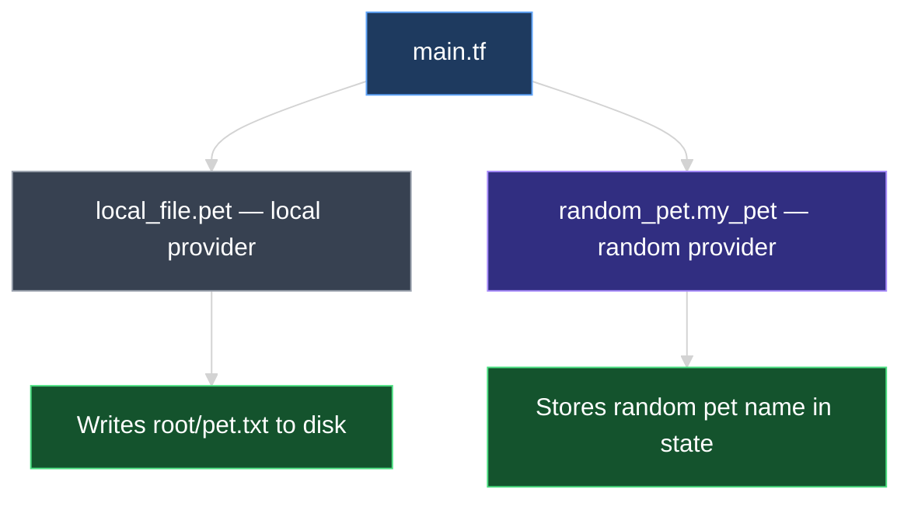
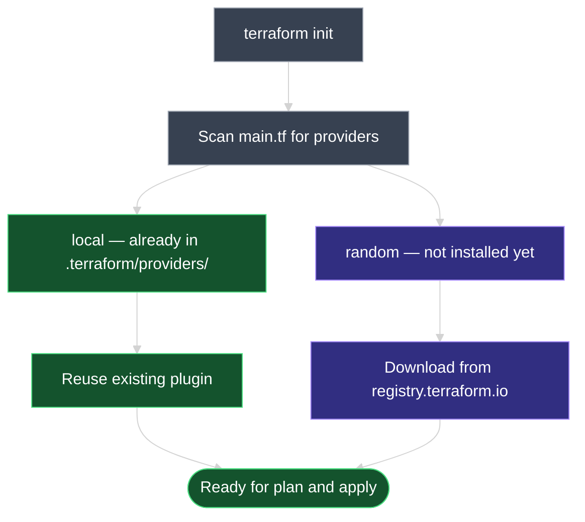
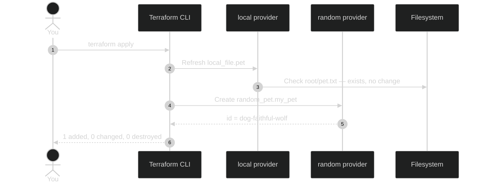

# Multiple Providers and Resources in One Configuration

This document explains how to use **more than one provider** in the same Terraform configuration — adding the **`random`** provider alongside **`local`**, creating a `random_pet` resource, and why you must run **`terraform init`** again when a new provider is introduced.

---

## 1. From One Provider to Many

Until now, our configuration used a single provider — **`local`** — to create a file on disk:

```hcl
resource "local_file" "pet" {
  filename = "root/pet.txt"
  content  = "I love pet!"
}
```

Terraform fully supports **multiple providers in the same configuration directory**. Each resource type declares which provider it needs through its name prefix.

| Resource type | Provider | What it manages |
| --- | --- | --- |
| `local_file` | `local` | Files on your local filesystem |
| `random_pet` | `random` | Randomly generated values (pet names, IDs, passwords) |



---

## 2. The `random` Provider and `random_pet` Resource

The **`random`** provider creates **logical resources** — random IDs, integers, passwords, and pet names. These do not provision cloud infrastructure or physical hardware. They generate values that Terraform stores in **state** and can reference from other resources.

### Breaking down `random_pet`

```hcl
resource "random_pet" "my_pet" {
  prefix    = "dog"
  separator = "-"
  length    = 2
}
```

| Part | Value | Meaning |
| --- | --- | --- |
| Block type | `resource` | Terraform block type (fixed) |
| Resource type | `random_pet` | Provider = **`random`** · Resource = **`pet`** |
| Resource name | `my_pet` | Your logical label for this resource |
| `prefix` | `"dog"` | Text added before the generated name |
| `separator` | `"-"` | Character between prefix and generated words |
| `length` | `2` | Number of random words in the generated name |

> **Rule:** `random_pet` → provider is **`random`** (before `_`), resource type is **`pet`** (after `_`).

### Example output after apply

The `random_pet` resource exposes an **`id`** attribute containing the generated name:

```text
random_pet.my_pet: Creation complete after 0s [id=dog-faithful-wolf]
```

The name is random — it does not have to include "dog" every time; `prefix` only prepends your chosen text. In course materials, a dog icon may be used as a visual shorthand for "pet" — the provider can generate any pet-style name.

---

## 3. Updated `main.tf` — Two Providers, Two Resources

Add the `random_pet` block to your existing `main.tf`:

```hcl
resource "local_file" "pet" {
  filename = "root/pet.txt"
  content  = "I love pet!"
}

resource "random_pet" "my_pet" {
  prefix    = "dog"
  separator = "-"
  length    = 2
}
```

Your configuration directory now depends on **two providers**:

```text
03_GettingStarted/02_HCL_Basics_Lab/terraform-projects/HCL/
├── main.tf
└── .terraform/providers/
    ├── .../hashicorp/local/...
    └── .../hashicorp/random/...    ← new after init
```

> Use the [Terraform Registry documentation](https://registry.terraform.io/providers/hashicorp/random/latest/docs/resources/pet) to look up required vs. optional arguments for any resource type.

---

## 4. Run `terraform init` Again (Mandatory)

Whenever you add a resource type from a **new provider**, you **must run `terraform init` again** so Terraform downloads that provider's plugin.

```bash
terraform init
```

### Expected output

```text
Initializing provider plugins...
- Reusing previous version of hashicorp/local from the dependency lock file
- Finding latest version of hashicorp/random...
- Installing hashicorp/random v3.x.x...
- Installed hashicorp/random v3.x.x (signed by HashiCorp)
```

| Provider | What init does |
| --- | --- |
| **`hashicorp/local`** | Already installed — **reused** from previous init |
| **`hashicorp/random`** | Not used before — **newly installed** |



> **`terraform init` is safe to re-run** at any time. It never modifies deployed infrastructure.

---

## 5. Plan and Apply

### `terraform plan`

```bash
terraform plan
```

| Resource | Expected plan result |
| --- | --- |
| `local_file.pet` | **No changes** — already exists from a previous apply |
| `random_pet.my_pet` | **`+ create`** — new resource block |

```diff
  # local_file.pet will be unchanged
  # random_pet.my_pet will be created
+ resource "random_pet" "my_pet" {
+     length    = 2
+     prefix    = "dog"
+     separator = "-"
+   }
```

### `terraform apply`

```bash
terraform apply
```

| Resource | What happens |
| --- | --- |
| `local_file.pet` | **Left unchanged** — `root/pet.txt` is not recreated |
| `random_pet.my_pet` | **Created** — random pet name generated and stored in state |

```text
local_file.pet: Refreshing state...
random_pet.my_pet: Creating...
random_pet.my_pet: Creation complete after 0s [id=dog-faithful-wolf]

Apply complete! Resources: 1 added, 0 changed, 0 destroyed.
```

### Logical provider vs. physical provider

| Provider | Type | Creates on disk / cloud? |
| --- | --- | --- |
| **`local`** | Physical / OS-level | **Yes** — writes `root/pet.txt` |
| **`random`** | Logical | **No** — generates a value; result lives in **state** and terminal output |



---

## 6. Hands-On Lab

In your configuration directory:

1. Add the `random_pet.my_pet` block to `main.tf`.
2. Run `terraform init` — confirm `local` is reused and `random` is installed.
3. Run `terraform plan` — confirm only `random_pet.my_pet` shows `+ create`.
4. Run `terraform apply` — note the `id` attribute in the output.
5. Run `terraform plan` again — both resources should show **no changes**.

---

### Topic Summary: Multiple Providers

A single Terraform configuration can use **multiple providers** at once. Each resource type prefix (`local_`, `random_`, `aws_`) tells Terraform which provider plugin to use. Adding a resource from a **new** provider requires running **`terraform init` again** to download that plugin — existing providers are reused. In this lesson, `local_file.pet` stays unchanged while `random_pet.my_pet` is created. The `random` provider is **logical** — it generates values stored in state rather than provisioning physical infrastructure.

### Knowledge Check Q&A

**Q: Can one Terraform configuration use more than one provider?**

**A:** Yes. You can mix resources from different providers (e.g., `local_file` and `random_pet`) in the same `main.tf` or across multiple `.tf` files in the same configuration directory.

**Q: In `resource "random_pet" "my_pet"`, which part identifies the provider?**

**A:** The prefix before the underscore in the resource type — **`random`** in `random_pet`. The part after the underscore (`pet`) is the resource type within that provider.

**Q: Why must you run `terraform init` again after adding `random_pet`?**

**A:** Because `random_pet` requires the **`random`** provider plugin, which was not downloaded during the earlier init that only needed the `local` provider. Init detects the new provider and installs it.

**Q: What does `terraform init` do with the `local` provider if it was already installed?**

**A:** It **reuses** the existing plugin from `.terraform/providers/` — it does not download it again unless the version constraint changed.

**Q: After adding `random_pet` to an already-applied `local_file.pet`, what will `terraform plan` show?**

**A:** `local_file.pet` — **no changes**. `random_pet.my_pet` — **`+ create`**.

**Q: What is a "logical" provider like `random`?**

**A:** A provider that generates computed values (names, IDs, passwords) stored in Terraform **state** rather than creating real-world infrastructure like files, VMs, or databases.

**Q: What are the three arguments used in the `random_pet` example and what do they do?**

**A:** **`prefix`** — text prepended to the name; **`separator`** — character between prefix and generated words; **`length`** — number of random words to generate.

**Q: Where can you find the full list of arguments for `random_pet`?**

**A:** In the official Terraform Registry documentation at `registry.terraform.io` under the `hashicorp/random` provider's `random_pet` resource page.
