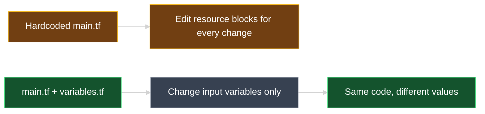
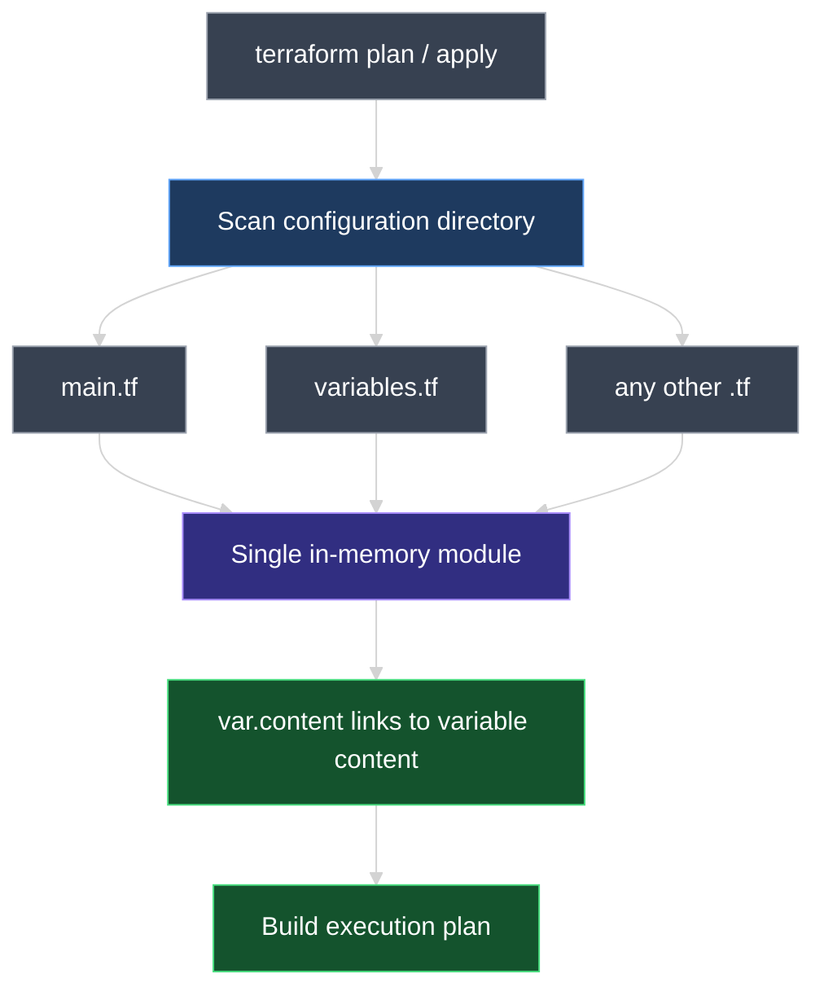
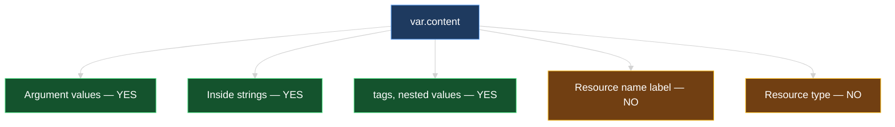
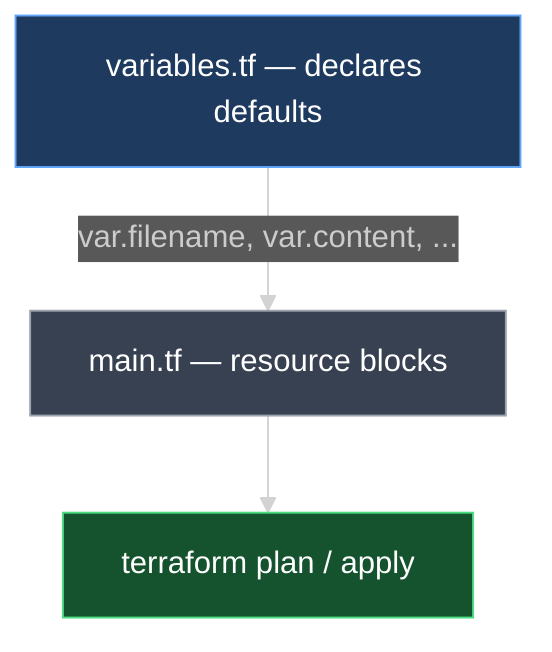
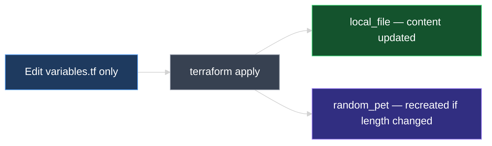
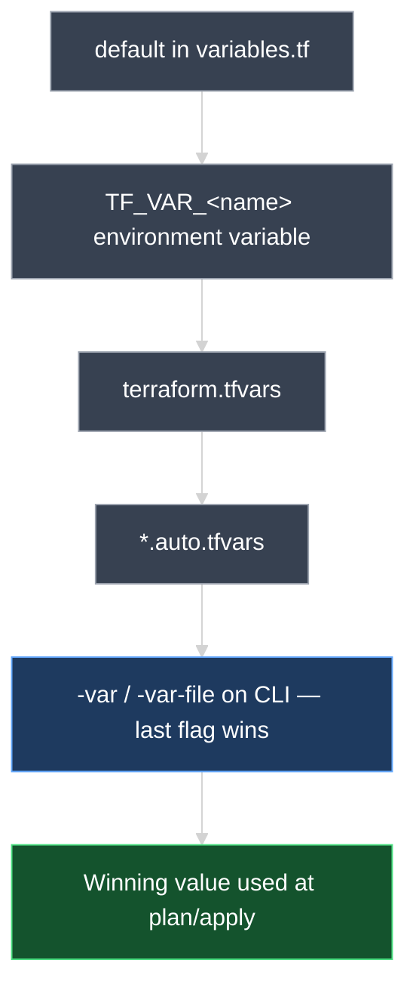

# Input Variables in Terraform

This document explains why **hardcoded values** limit reusable Infrastructure as Code, how to declare **input variables** in `variables.tf`, reference them with **`var.`** in `main.tf`, and update infrastructure by changing variables alone — without editing resource blocks.

---

## 1. The Problem with Hardcoded Values

So far, argument values were written directly inside resource blocks:

```hcl
resource "local_file" "pet" {
  filename = "root/pet.txt"
  content  = "I love pet!"
}

resource "random_pet" "my_pet" {
  prefix    = "dog"
  separator = "-"
  length    = 2
}
```

These are **hardcoded values** — fixed strings and numbers baked into `main.tf`.

| Hardcoding | Why it hurts IaC |
| --- | --- |
| Same code, different environments | You must edit `main.tf` for dev vs. prod |
| Reuse across teams/projects | Copy-paste and manual edits increase errors |
| Change content or settings | Resource blocks become cluttered with literals |

> **Goal of IaC:** Write configuration **once**, deploy many times with different **inputs** — not by rewriting resource definitions every time.



---

## 2. Declaring Variables in `variables.tf`

Input variables work like variables in Bash, PowerShell, or other languages — they hold values you pass into your configuration.

**Industry practice:** declare variables in a dedicated **`variables.tf`** file (merged automatically with `main.tf` in the same configuration directory).

```hcl
variable "filename" {
  default = "root/pet.txt"
}

variable "content" {
  default = "I love pet!"
}

variable "prefix" {
  default = "dog"
}

variable "separator" {
  default = "-"
}

variable "length" {
  default = 2
}
```

### Anatomy of a `variable` block

| Part | Example | Meaning |
| --- | --- | --- |
| Block type | `variable` | Fixed Terraform keyword |
| Variable name | `"filename"` | Your chosen name — use something descriptive (often matching the argument it replaces) |
| `default` | `"root/pet.txt"` | **Optional** — value used when no other input is supplied |

> **Naming tip:** If a variable replaces the `content` argument, naming it `content` keeps the configuration easy to read.

### Variable naming rules and conventions

**Terraform rules (required):**

| Rule | Valid | Invalid |
| --- | --- | --- |
| Must start with a **letter** or **underscore** | `content`, `_private` | `1content`, `-content` |
| May contain letters, digits, underscores, dashes | `pet_name`, `instance-type` | `pet name` (spaces) |
| Must be **unique** within the module | One `variable "content"` | Two variables with same name |
| Case-sensitive | `content` ≠ `Content` | — |

**Industry conventions (recommended):**

| Convention | Example | Why |
| --- | --- | --- |
| **snake_case** | `instance_type`, `file_content` | Standard in Terraform community and registry modules |
| **Descriptive names** | `ami_id`, not `a` | Readable in `var.ami_id` and `.tfvars` |
| **Match purpose** | `prefix` for pet prefix | Easier to maintain than `var.x` |
| **Avoid reserved/confusing names** | Don't name a variable `resource` or `provider` | Reduces confusion with block types |

```hcl
# Good
variable "file_content" { default = "Hello" }
variable "instance_type" { default = "t2.micro" }

# Avoid
variable "x" { default = "Hello" }
variable "Content" { default = "Hello" }   # inconsistent casing vs var.content
```

### How `variables.tf` and `main.tf` work together (no import needed)

This is a common point of confusion if you come from languages like Python or JavaScript, where you **`import`** another file to use its variables. **Terraform does not work that way.**

#### What actually happens

When you run `terraform plan` or `terraform apply` from a configuration directory, Terraform:

1. **Scans the entire directory** for every file ending in `.tf`
2. **Reads all of them** — `main.tf`, `variables.tf`, `outputs.tf`, `cat.tf`, etc.
3. **Combines them in memory** into **one single module** (one configuration)
4. **Resolves references** — `var.content` in `main.tf` finds `variable "content"` declared in `variables.tf`

There is **no** `import`, **`include`**, or **`link`** statement because **the folder is the boundary**, not the file.

```text
my-terraform-project/          ← you run terraform commands HERE
├── main.tf                    ┐
├── variables.tf               ├── all merged into ONE configuration
└── outputs.tf                 ┘

Terraform does NOT read:
├── ../other-project/main.tf   ← different directory = different configuration
└── scripts/setup.sh           ← not a .tf file
```



#### Why split into two files if Terraform merges them anyway?

**Only for humans** — file names are **organizational**, not functional.

| File | Human purpose | Required by Terraform? |
| --- | --- | --- |
| `main.tf` | "Here are my resources" | No — could put everything in `foo.tf` |
| `variables.tf` | "Here are my inputs" | No — variables could live in `main.tf` |
| `outputs.tf` | "Here are my outputs" | No — convention only |

You could declare variables and resources in **one file** and Terraform would behave identically:

```hcl
# single-file.tf — valid, but harder to maintain at scale
variable "content" { default = "Hello" }

resource "local_file" "pet" {
  content = var.content
}
```

Splitting into `variables.tf` + `main.tf` is **industry practice** for readability — not a technical requirement.

#### When would `var.content` **fail** to find `variable "content"`?

| Situation | Result |
| --- | --- |
| `variable "content"` in `variables.tf`, `var.content` in `main.tf`, **same folder** | **Works** |
| Variable declared in **parent or sibling** folder | **Fails** — different configuration |
| Variable in **subfolder** without `module` block | **Fails** — subfolder not auto-loaded |
| Typo: `variable "content"` but `var.contnt` | **Fails** — name mismatch |
| **`var.filename` in `main.tf` but no `variable "filename"`** — only `.tfvars` assign values | **Fails** — undeclared input variable |

> **Remember:** Same configuration directory + `.tf` extension = **one shared namespace**. `var.content` in any `.tf` file can see `variable "content"` declared in any other `.tf` file in that same directory.

### Declare before assign — `.tfvars` alone is not enough

**Yes — you get an error** if you reference `var.filename` without declaring `variable "filename"` in any **`.tf`** file. This is a common lab mistake: `main.tf` uses the variable, and **`terraform.tfvars`** / **`*.auto.tfvars`** assign a value, but there is **no `variables.tf`** (and no `variable` block anywhere else).

```hcl
# main.tf — references the variable
resource "local_file" "games" {
  filename = var.filename
  content  = "football"
}
```

```hcl
# terraform.tfvars — assigns ONLY (does not declare)
filename = "root/pets.txt"
```

```hcl
# basket.auto.tfvars — also assigns only
filename = "root/basket.txt"
```

**Missing — required:**

```hcl
# variables.tf (or any .tf file in the same directory)
variable "filename" {
  type = string
}
```

| File | Role | Declares `variable "filename"`? | Assigns `filename = "..."`? |
| --- | --- | --- | --- |
| **`variables.tf`** | Input declarations | **Yes** | No |
| **`main.tf`** | Resources | Yes *(possible but not conventional)* | No |
| **`terraform.tfvars`** | Values | **No** | **Yes** |
| **`*.auto.tfvars`** | Values | **No** | **Yes** |

Without a declaration, Terraform reports:

```text
Error: Reference to undeclared input variable

  on main.tf line 2, in resource "local_file" "games":
   2:   filename = var.filename

An input variable with the name "filename" has not been declared.
```

In VS Code / Cursor, **`var.filename`** may show a **red squiggle** for the same reason — the language server looks for a **`variable`** block, not a `.tfvars` assignment.

> **Order of operations:** (1) **Declare** with `variable "name" { ... }` in a `.tf` file → (2) **Assign** via `default`, `.tfvars`, `-var`, or `TF_VAR_`. Assignment methods are covered in **`06_Assigning_Variable_Values.md`**.

---

## 3. Using Variables in `main.tf` with `var.`

Replace hardcoded argument values with **`var.<variable_name>`**:

```hcl
resource "random_pet" "my_pet" {
  prefix    = var.prefix
  separator = var.separator
  length    = var.length
}

resource "local_file" "pet" {
  filename = var.filename
  content  = var.content
}
```

### Reference syntax

```text
var.content
│   │
│   └── variable name declared in variables.tf
└── required prefix for all input variables
```

| When writing… | Quotes needed? | Example |
| --- | --- | --- |
| **Literal string** in `main.tf` | **Yes** | `content = "I love pet!"` |
| **Variable reference** | **No** | `content = var.content` |

Terraform already knows `var.content` is a string (or number) from the variable definition — wrapping it in `"${var.content}"` is unnecessary for simple references.

### Where can you use `var.` — and where can you not?

This lecture focuses on **argument values**, but variables are expressions — they work anywhere Terraform expects a **value**, not a **label**.

| Location | Can use `var.`? | Example |
| --- | --- | --- |
| **Argument values** | **Yes** | `content = var.content` |
| **String templates** | **Yes** | `filename = "root/${var.filename}"` |
| **Nested blocks** (e.g., `tags`) | **Yes** | `Name = var.instance_name` |
| **`count` / `for_each`** (later) | **Yes** | `count = var.instance_count` |
| **Resource type** (`local_file`) | **No** — must be literal | `resource "local_file"` only |
| **Resource name** (`pet`, `my_pet`) | **No** — must be literal | `resource "local_file" "pet"` only |
| **`variable` block name** | **No** — must be literal | `variable "content"` only |

```hcl
# Valid — variable as argument value
resource "local_file" "pet" {
  filename = var.filename
  content  = var.content
}

# INVALID — resource name cannot be a variable
resource "local_file" var.pet_name {   # syntax error
  content = var.content
}
```

**Why resource names must be literal:** Terraform builds the **resource address** (`local_file.pet`) at parse time — before variables are evaluated. The address is how state, references, and `terraform import` identify a resource. It must be a fixed string in code.

**If you need many resources from one template** (e.g., one file per user in a migration), you use **`for_each`** or **`count`** with a variable map or number — covered later. That creates `local_file.user["john"]`, not a dynamic label in the block header.



> **Short answer:** Variables replace **values inside** resource blocks (arguments, tags, expressions). They do **not** replace the **resource name** or **resource type** in the block header.



### Configuration directory layout

```text
my-terraform-project/
├── main.tf         ← resources use var.*
├── variables.tf    ← input variables and defaults
└── ...
```

---

## 4. First Deploy: Plan and Apply

The workflow is unchanged — variables only replace literals:

```bash
terraform plan
terraform apply
```

Resources are created using **default values** from `variables.tf`. No extra flags are required when defaults are set.

| Resource | Arguments now sourced from |
| --- | --- |
| `local_file.pet` | `var.filename`, `var.content` |
| `random_pet.my_pet` | `var.prefix`, `var.separator`, `var.length` |

---

## 5. Updating Infrastructure by Changing Variables Only

A major benefit: you can change behavior **without editing `main.tf`**.

### Example update — change `variables.tf` only

**Before:**

```hcl
variable "content" {
  default = "I love pet!"
}

variable "length" {
  default = 1
}
```

**After:**

```hcl
variable "content" {
  default = "My favorite pet is Mrs. hiskers"
}

variable "length" {
  default = 2
}
```

`main.tf` stays exactly the same:

```hcl
resource "local_file" "pet" {
  filename = var.filename
  content  = var.content
}

resource "random_pet" "my_pet" {
  prefix    = var.prefix
  separator = var.separator
  length    = var.length
}
```

Run:

```bash
terraform apply
```

| Change in `variables.tf` | Effect after apply |
| --- | --- |
| `content` updated | `local_file.pet` — **replaced** (destroy + recreate — `content` is a force-new argument for `local_file`) |
| `length` changed from `1` to `2` | `random_pet.my_pet` — **replaced** (new random name with two words after prefix) |

```text
random_pet.my_pet: Destroying... [id=dog-coral]
random_pet.my_pet: Creation complete [id=dog-delicate-wallaby]
local_file.pet: Destroying...
local_file.pet: Destruction complete
local_file.pet: Creating...
local_file.pet: Creation complete

Apply complete! Resources: 2 added, 0 changed, 2 destroyed.
```

> **`local_file` has no in-place update path** — the provider only implements create and delete for it, so **every** argument (`content`, `filename`, permissions, …) is force-new. Changing `content` always destroys the old file and creates a new one, just like changing `random_pet.length` recreates the pet name. Not every resource type behaves this way — many cloud resources support true in-place updates for most arguments — but `local_file` specifically does not. See `07_Resource_Attributes_and_References.md` for the full explanation.



---

## 6. Preview: Variables with AWS EC2

Later in the course you will provision real cloud resources. The same variable pattern applies — only the resource type changes.

```hcl
# variables.tf
variable "ami_id" {
  default = "ami-0c2f25c1f66a1ff4d"
}

variable "instance_type" {
  default = "t2.micro"
}

variable "instance_name" {
  default = "webserver"
}
```

```hcl
# main.tf
resource "aws_instance" "web" {
  ami           = var.ami_id
  instance_type = var.instance_type

  tags = {
    Name = var.instance_name
  }
}
```

| Concept | Local lab | AWS (later) |
| --- | --- | --- |
| Declare inputs | `variables.tf` | `variables.tf` |
| Reference in resources | `var.content` | `var.instance_type` |
| Change without editing resources | Update defaults in `variables.tf` | Same |

Do not worry if `aws_instance` arguments are unfamiliar — a dedicated AWS lecture covers them later. The **variable mechanics are identical**.

---

## 7. How `.tfvars` Files Work

A **`.tfvars`** file supplies **variable values** without editing `variables.tf` defaults. It is the standard way to separate **code** from **environment-specific values** (dev, staging, prod).

### Two different file roles

| File | Syntax | Purpose |
| --- | --- | --- |
| **`variables.tf`** | `variable "content" { default = "..." }` | **Declares** that a variable exists (+ optional default) |
| **`terraform.tfvars`** | `content = "Hello from tfvars"` | **Assigns** values to already-declared variables |

```hcl
# variables.tf — declaration
variable "content" {
  default = "I love pet!"
}

variable "length" {
  default = 2
}
```

```hcl
# terraform.tfvars — assignment only (no "variable" keyword)
content = "My favorite pet is Mrs. hiskers"
length  = 2
```

`main.tf` is unchanged — still uses `var.content` and `var.length`.

### Auto-loaded vs. explicit `.tfvars` files

| File | Loaded automatically? |
| --- | --- |
| **`terraform.tfvars`** | **Yes** — if present in the configuration directory |
| **`*.auto.tfvars`** (e.g., `dev.auto.tfvars`) | **Yes** — all matching files, alphabetically |
| **Custom name** (e.g., `prod.tfvars`) | **No** — pass with `-var-file` |

```bash
terraform plan -var-file="prod.tfvars"
terraform apply -var-file="prod.tfvars"
```

```text
my-terraform-project/
├── main.tf
├── variables.tf              ← declares variables
├── terraform.tfvars          ← auto-loaded values (e.g., dev defaults)
├── prod.tfvars               ← loaded only with -var-file=prod.tfvars
└── staging.auto.tfvars       ← auto-loaded
```

### Value precedence (highest wins)

When the same variable is set in multiple places, Terraform resolves one winner using a fixed ladder (lowest → highest):

```text
1. default in variables.tf                                    (lowest priority)
2. TF_VAR_<name> environment variable
3. terraform.tfvars
4. *.auto.tfvars (alphabetical order; later files win ties)
5. -var / -var-file on the CLI — whichever appears LAST on
   the command line wins (highest priority)
```

> **`-var` does not automatically beat `-var-file`.** Both sit at the same, highest step — if a command passes both, whichever one appears **last** on the command line wins. See `06_Assigning_Variable_Values.md` §6 for the full worked example and cheat sheet.

**Example:**

```hcl
# variables.tf
variable "content" { default = "default from variables.tf" }
```

```hcl
# terraform.tfvars
content = "value from terraform.tfvars"
```

```bash
terraform apply -var="content=override from CLI"
# Result: content = "override from CLI"
```



### `.tfvars` syntax notes

```hcl
# Strings — quotes optional for simple values
content = "Hello"
prefix  = dog

# Numbers and booleans — no quotes
length  = 2
enable_x = true

# Maps and lists — for later
tags = {
  Environment = "dev"
  Team        = "platform"
}
```

> **Important:** Never put `variable "content"` blocks inside `.tfvars` — that belongs only in `variables.tf`. `.tfvars` files contain **assignments** (`name = value`), not declarations.

---

## 8. Other Ways to Set Variable Values

| Method | Example | When used |
| --- | --- | --- |
| **`default` in `variables.tf`** | `default = "Hello"` | Fallback; learning labs |
| **`terraform.tfvars`** | `content = "Hello"` | Auto-loaded per project |
| **`-var-file`** | `-var-file=prod.tfvars` | Per-environment files |
| **CLI `-var`** | `-var="content=Hello"` | One-off overrides |
| **Environment variable** | `TF_VAR_content=Hello` | CI/CD pipelines |

---

## 9. Hands-On Lab

In your configuration directory:

1. Create `variables.tf` with variables for `filename`, `content`, `prefix`, `separator`, and `length`.
2. Update `main.tf` to use `var.*` instead of hardcoded values.
3. Run `terraform plan` and `terraform apply` — confirm resources are created.
4. Change only `content` and `length` in `variables.tf`.
5. Run `terraform apply` again — confirm file content updates and pet name regenerates.
6. Confirm `main.tf` was **never modified** after step 2.
7. Create `terraform.tfvars` with new values — run `terraform plan` and confirm overrides apply without editing `variables.tf`.
8. Optional: create `prod.tfvars` and run `terraform plan -var-file=prod.tfvars`.

---

### Topic Summary: Input Variables

Hardcoded values in resource blocks limit reuse. **Input variables** must be **declared** with a **`variable`** block in a **`.tf`** file before you reference **`var.<name>`** — `.tfvars` and other assignment files only supply values, they do not declare variables. Declarations typically live in **`variables.tf`** with optional **`default`** values, parameterizing **argument values**, string templates, and nested fields — but **not** resource type or resource name labels (those must be literal strings). All `.tf` files in the **same directory** are **auto-merged into one module** — no import needed. Reference values with **`var.<name>`** using **snake_case** naming. Supply values via **`default`**, auto-loaded **`terraform.tfvars`**, **`-var-file`**, **`-var`**, or **`TF_VAR_`**. Update **`variables.tf`** or **`.tfvars`** and run **`terraform apply`** without changing resource block structure in `main.tf`.

---

## Knowledge Check

Answer each question on your own first, then read the explanation below it.

---

### 1 · Why variables?

**Why is hardcoding argument values in `main.tf` a bad practice for IaC?**

> Hardcoding limits **reusability** — you must edit resource blocks for every environment or change instead of supplying new inputs. That defeats parameterized Infrastructure as Code.

---

### 2 · Where to declare

**Which file is commonly used to declare input variables?**

> **`variables.tf`** — an industry convention in the same directory as `main.tf`. Terraform automatically merges it with every other `.tf` file in that folder.

---

### 3 · Referencing variables

**How do you reference an input variable named `content` in a resource block?**

> Write **`var.content`**. The **`var.`** prefix tells Terraform to read the input variable — not a literal string.

---

### 4 · Quotes around `var.*`

**Do you need double quotes around `var.content` when assigning it to an argument?**

> **No.** Write `content = var.content` directly. Quotes are for **literal strings**, not variable references.

---

### 5 · The `default` argument

**What does the `default` argument inside a `variable` block do?**

> It sets the value Terraform uses when **no other input** is provided — no CLI flag, `.tfvars`, or environment variable. Optional, but useful for sensible fallbacks.

---

### 6 · Updating values

**If you change a value in `variables.tf`, must you also edit `main.tf`?**

> **No.** Update the variable (or `.tfvars`), run **`terraform apply`**, and Terraform updates resources from the new values. The resource block structure in `main.tf` stays the same.

---

### 7 · Force-new changes

**What happens if you change `random_pet.length` from `1` to `2` in `variables.tf` and run apply?**

> Terraform detects a change to a **force-new** argument. It **destroys and recreates** `random_pet.my_pet` with a new random name containing two words after the prefix.

---

### 8 · Declaration syntax

**What block type and keyword do you use to declare an input variable?**

> A **`variable`** block: `variable "name" { default = "value" }` (plus optional `type` and `description`).

---

### 9 · Where variables work

**Can input variables be used only for resource arguments?**

> **No.** Variables work anywhere a **value expression** is allowed — arguments, string templates, tags, and (later) `count`/`for_each`.
>
> They **cannot** replace the **resource type** or **resource name** in the block header — those must be literal strings.

---

### 10 · Dynamic resource names

**Can you write `resource "local_file" var.pet_name` to make the resource name dynamic?**

> **No.** The resource name label must be a **fixed string** at parse time. Use **`for_each`** or **`count`** with a variable map or number in a later lecture.

---

### 11 · Naming rules

**What are the naming rules for Terraform variables?**

> Start with a letter or underscore; use letters, digits, underscores, and dashes only; keep names **unique** in the module. **`snake_case`** (`instance_type`) is the community convention.

---

### 12 · `variables.tf` vs `terraform.tfvars`

**What is the difference between `variables.tf` and `terraform.tfvars`?**

> **`variables.tf`** **declares** variables: `variable "name" { ... }`.  
> **`terraform.tfvars`** **assigns values**: `name = value` — no `variable` keyword. Terraform auto-loads `terraform.tfvars` when present.

---

### 13 · Custom `.tfvars`

**How do you use a custom `.tfvars` file that is not named `terraform.tfvars`?**

> Pass it explicitly: `terraform plan -var-file="prod.tfvars"` or `terraform apply -var-file="prod.tfvars"`.

---

### 14 · Precedence

**If the same variable has a `default`, a value in `terraform.tfvars`, and a `-var` flag, which wins?**

> **`-var` on the CLI** — it sits at the highest step, tied with `-var-file` (whichever appears last on the command line wins if both are used). Below that: **`*.auto.tfvars`**, then **`terraform.tfvars`**, then **`TF_VAR_`**, then **`default`** in `variables.tf`.

---

### 15 · No import needed

**Why does `main.tf` find variables from `variables.tf` without an import statement?**

> Terraform **loads every `.tf` file** in the configuration directory and merges them into **one module**. The folder is the boundary — `variables.tf` is a naming convention, not a special file type.

---

### 16 · Single-file configs

**Could you put variable blocks and resource blocks in the same file instead of splitting them?**

> **Yes** — Terraform behaves the same. Teams split files for **readability**, not because the engine requires it.

---

### 17 · Missing declaration

**I have `terraform.tfvars` but no `variables.tf`. Will `var.filename` work?**

> **No.** `.tfvars` files only **assign values** — they never **declare** variables. Add `variable "filename" { ... }` in a `.tf` file or Terraform reports an **undeclared input variable** error.

---

### 18 · IDE errors

**Why does my editor show a red error on `var.filename` even though I have a value in `terraform.tfvars`?**

> The editor looks for a **`variable "filename"` declaration** in a `.tf` file — not a `.tfvars` assignment. Add the declaration; the squiggle should clear.

