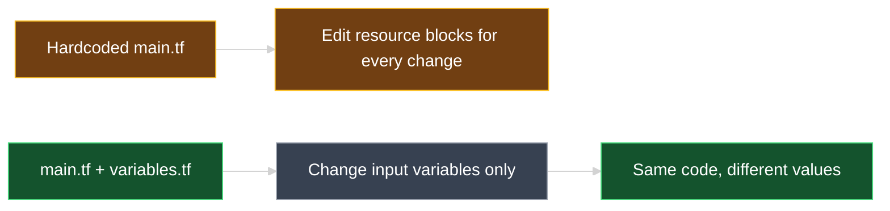
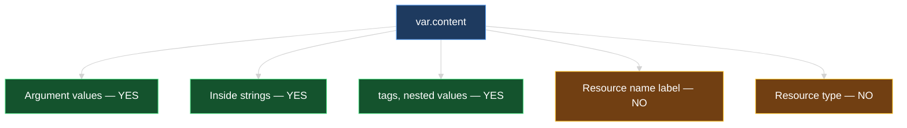
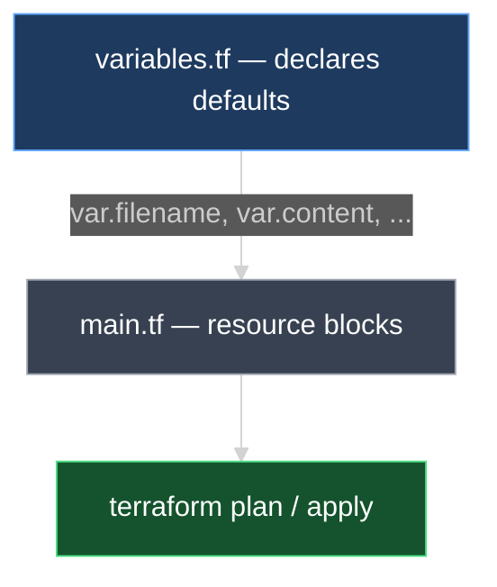
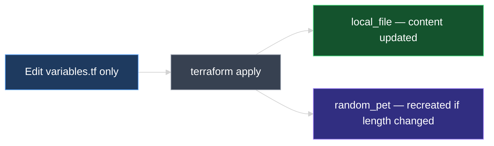
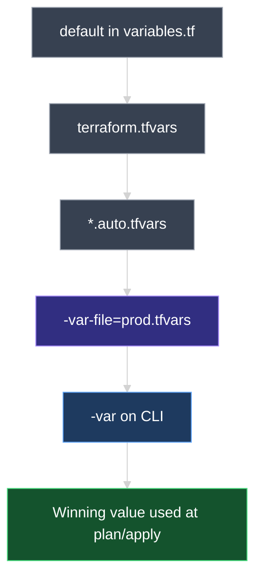

# Input Variables in Terraform

This document explains why **hardcoded values** limit reusable Infrastructure as Code, how to declare **input variables** in `variables.tf`, reference them with **`var.`** in `main.tf`, and update infrastructure by changing variables alone — without editing resource blocks.

---

## 1. The Problem with Hardcoded Values

So far, argument values were written directly inside resource blocks:

```hcl
resource "local_file" "pet" {
  filename = "root/pet.txt"
  content  = "I love pet!"
}

resource "random_pet" "my_pet" {
  prefix    = "dog"
  separator = "-"
  length    = 2
}
```

These are **hardcoded values** — fixed strings and numbers baked into `main.tf`.

| Hardcoding | Why it hurts IaC |
| --- | --- |
| Same code, different environments | You must edit `main.tf` for dev vs. prod |
| Reuse across teams/projects | Copy-paste and manual edits increase errors |
| Change content or settings | Resource blocks become cluttered with literals |

> **Goal of IaC:** Write configuration **once**, deploy many times with different **inputs** — not by rewriting resource definitions every time.



---

## 2. Declaring Variables in `variables.tf`

Input variables work like variables in Bash, PowerShell, or other languages — they hold values you pass into your configuration.

**Industry practice:** declare variables in a dedicated **`variables.tf`** file (merged automatically with `main.tf` in the same configuration directory).

```hcl
variable "filename" {
  default = "root/pet.txt"
}

variable "content" {
  default = "I love pet!"
}

variable "prefix" {
  default = "dog"
}

variable "separator" {
  default = "-"
}

variable "length" {
  default = 2
}
```

### Anatomy of a `variable` block

| Part | Example | Meaning |
| --- | --- | --- |
| Block type | `variable` | Fixed Terraform keyword |
| Variable name | `"filename"` | Your chosen name — use something descriptive (often matching the argument it replaces) |
| `default` | `"root/pet.txt"` | **Optional** — value used when no other input is supplied |

> **Naming tip:** If a variable replaces the `content` argument, naming it `content` keeps the configuration easy to read.

### Variable naming rules and conventions

**Terraform rules (required):**

| Rule | Valid | Invalid |
| --- | --- | --- |
| Must start with a **letter** or **underscore** | `content`, `_private` | `1content`, `-content` |
| May contain letters, digits, underscores, dashes | `pet_name`, `instance-type` | `pet name` (spaces) |
| Must be **unique** within the module | One `variable "content"` | Two variables with same name |
| Case-sensitive | `content` ≠ `Content` | — |

**Industry conventions (recommended):**

| Convention | Example | Why |
| --- | --- | --- |
| **snake_case** | `instance_type`, `file_content` | Standard in Terraform community and registry modules |
| **Descriptive names** | `ami_id`, not `a` | Readable in `var.ami_id` and `.tfvars` |
| **Match purpose** | `prefix` for pet prefix | Easier to maintain than `var.x` |
| **Avoid reserved/confusing names** | Don't name a variable `resource` or `provider` | Reduces confusion with block types |

```hcl
# Good
variable "file_content" { default = "Hello" }
variable "instance_type" { default = "t2.micro" }

# Avoid
variable "x" { default = "Hello" }
variable "Content" { default = "Hello" }   # inconsistent casing vs var.content
```

Terraform merges `variables.tf` and `main.tf` into **one configuration** — no import or link statement is required.

---

## 3. Using Variables in `main.tf` with `var.`

Replace hardcoded argument values with **`var.<variable_name>`**:

```hcl
resource "random_pet" "my_pet" {
  prefix    = var.prefix
  separator = var.separator
  length    = var.length
}

resource "local_file" "pet" {
  filename = var.filename
  content  = var.content
}
```

### Reference syntax

```text
var.content
│   │
│   └── variable name declared in variables.tf
└── required prefix for all input variables
```

| When writing… | Quotes needed? | Example |
| --- | --- | --- |
| **Literal string** in `main.tf` | **Yes** | `content = "I love pet!"` |
| **Variable reference** | **No** | `content = var.content` |

Terraform already knows `var.content` is a string (or number) from the variable definition — wrapping it in `"${var.content}"` is unnecessary for simple references.

### Where can you use `var.` — and where can you not?

This lecture focuses on **argument values**, but variables are expressions — they work anywhere Terraform expects a **value**, not a **label**.

| Location | Can use `var.`? | Example |
| --- | --- | --- |
| **Argument values** | **Yes** | `content = var.content` |
| **String templates** | **Yes** | `filename = "root/${var.filename}"` |
| **Nested blocks** (e.g., `tags`) | **Yes** | `Name = var.instance_name` |
| **`count` / `for_each`** (later) | **Yes** | `count = var.instance_count` |
| **Resource type** (`local_file`) | **No** — must be literal | `resource "local_file"` only |
| **Resource name** (`pet`, `my_pet`) | **No** — must be literal | `resource "local_file" "pet"` only |
| **`variable` block name** | **No** — must be literal | `variable "content"` only |

```hcl
# Valid — variable as argument value
resource "local_file" "pet" {
  filename = var.filename
  content  = var.content
}

# INVALID — resource name cannot be a variable
resource "local_file" var.pet_name {   # syntax error
  content = var.content
}
```

**Why resource names must be literal:** Terraform builds the **resource address** (`local_file.pet`) at parse time — before variables are evaluated. The address is how state, references, and `terraform import` identify a resource. It must be a fixed string in code.

**If you need many resources from one template** (e.g., one file per user in a migration), you use **`for_each`** or **`count`** with a variable map or number — covered later. That creates `local_file.user["john"]`, not a dynamic label in the block header.



> **Short answer:** Variables replace **values inside** resource blocks (arguments, tags, expressions). They do **not** replace the **resource name** or **resource type** in the block header.



### Configuration directory layout

```text
my-terraform-project/
├── main.tf         ← resources use var.*
├── variables.tf    ← input variables and defaults
└── ...
```

---

## 4. First Deploy: Plan and Apply

The workflow is unchanged — variables only replace literals:

```bash
terraform plan
terraform apply
```

Resources are created using **default values** from `variables.tf`. No extra flags are required when defaults are set.

| Resource | Arguments now sourced from |
| --- | --- |
| `local_file.pet` | `var.filename`, `var.content` |
| `random_pet.my_pet` | `var.prefix`, `var.separator`, `var.length` |

---

## 5. Updating Infrastructure by Changing Variables Only

A major benefit: you can change behavior **without editing `main.tf`**.

### Example update — change `variables.tf` only

**Before:**

```hcl
variable "content" {
  default = "I love pet!"
}

variable "length" {
  default = 1
}
```

**After:**

```hcl
variable "content" {
  default = "My favorite pet is Mrs. hiskers"
}

variable "length" {
  default = 2
}
```

`main.tf` stays exactly the same:

```hcl
resource "local_file" "pet" {
  filename = var.filename
  content  = var.content
}

resource "random_pet" "my_pet" {
  prefix    = var.prefix
  separator = var.separator
  length    = var.length
}
```

Run:

```bash
terraform apply
```

| Change in `variables.tf` | Effect after apply |
| --- | --- |
| `content` updated | `local_file.pet` — **updated in-place** (file text changes) |
| `length` changed from `1` to `2` | `random_pet.my_pet` — **replaced** (new random name with two words after prefix) |

```text
random_pet.my_pet: Destroying... [id=dog-coral]
random_pet.my_pet: Creation complete [id=dog-delicate-wallaby]
local_file.pet: Modifying...
local_file.pet: Modifications complete

Apply complete! Resources: 1 added, 1 changed, 1 destroyed.
```

> When a **force-new** argument like `random_pet.length` changes, Terraform **destroys and recreates** that resource. Updating `local_file.content` typically **updates** the existing file without recreating the resource address.



---

## 6. Preview: Variables with AWS EC2

Later in the course you will provision real cloud resources. The same variable pattern applies — only the resource type changes.

```hcl
# variables.tf
variable "ami_id" {
  default = "ami-0c2f25c1f66a1ff4d"
}

variable "instance_type" {
  default = "t2.micro"
}

variable "instance_name" {
  default = "webserver"
}
```

```hcl
# main.tf
resource "aws_instance" "web" {
  ami           = var.ami_id
  instance_type = var.instance_type

  tags = {
    Name = var.instance_name
  }
}
```

| Concept | Local lab | AWS (later) |
| --- | --- | --- |
| Declare inputs | `variables.tf` | `variables.tf` |
| Reference in resources | `var.content` | `var.instance_type` |
| Change without editing resources | Update defaults in `variables.tf` | Same |

Do not worry if `aws_instance` arguments are unfamiliar — a dedicated AWS lecture covers them later. The **variable mechanics are identical**.

---

## 7. How `.tfvars` Files Work

A **`.tfvars`** file supplies **variable values** without editing `variables.tf` defaults. It is the standard way to separate **code** from **environment-specific values** (dev, staging, prod).

### Two different file roles

| File | Syntax | Purpose |
| --- | --- | --- |
| **`variables.tf`** | `variable "content" { default = "..." }` | **Declares** that a variable exists (+ optional default) |
| **`terraform.tfvars`** | `content = "Hello from tfvars"` | **Assigns** values to already-declared variables |

```hcl
# variables.tf — declaration
variable "content" {
  default = "I love pet!"
}

variable "length" {
  default = 2
}
```

```hcl
# terraform.tfvars — assignment only (no "variable" keyword)
content = "My favorite pet is Mrs. hiskers"
length  = 2
```

`main.tf` is unchanged — still uses `var.content` and `var.length`.

### Auto-loaded vs. explicit `.tfvars` files

| File | Loaded automatically? |
| --- | --- |
| **`terraform.tfvars`** | **Yes** — if present in the configuration directory |
| **`*.auto.tfvars`** (e.g., `dev.auto.tfvars`) | **Yes** — all matching files, alphabetically |
| **Custom name** (e.g., `prod.tfvars`) | **No** — pass with `-var-file` |

```bash
terraform plan -var-file="prod.tfvars"
terraform apply -var-file="prod.tfvars"
```

```text
my-terraform-project/
├── main.tf
├── variables.tf              ← declares variables
├── terraform.tfvars          ← auto-loaded values (e.g., dev defaults)
├── prod.tfvars               ← loaded only with -var-file=prod.tfvars
└── staging.auto.tfvars       ← auto-loaded
```

### Value precedence (highest wins)

When the same variable is set in multiple places:

```text
1. -var flag on CLI              (highest priority)
2. -var-file=custom.tfvars
3. terraform.tfvars / *.auto.tfvars
4. TF_VAR_<name> environment variable
5. default in variables.tf       (lowest priority)
```

**Example:**

```hcl
# variables.tf
variable "content" { default = "default from variables.tf" }
```

```hcl
# terraform.tfvars
content = "value from terraform.tfvars"
```

```bash
terraform apply -var="content=override from CLI"
# Result: content = "override from CLI"
```



### `.tfvars` syntax notes

```hcl
# Strings — quotes optional for simple values
content = "Hello"
prefix  = dog

# Numbers and booleans — no quotes
length  = 2
enable_x = true

# Maps and lists — for later
tags = {
  Environment = "dev"
  Team        = "platform"
}
```

> **Important:** Never put `variable "content"` blocks inside `.tfvars` — that belongs only in `variables.tf`. `.tfvars` files contain **assignments** (`name = value`), not declarations.

---

## 8. Other Ways to Set Variable Values

| Method | Example | When used |
| --- | --- | --- |
| **`default` in `variables.tf`** | `default = "Hello"` | Fallback; learning labs |
| **`terraform.tfvars`** | `content = "Hello"` | Auto-loaded per project |
| **`-var-file`** | `-var-file=prod.tfvars` | Per-environment files |
| **CLI `-var`** | `-var="content=Hello"` | One-off overrides |
| **Environment variable** | `TF_VAR_content=Hello` | CI/CD pipelines |

---

## 9. Hands-On Lab

In your configuration directory:

1. Create `variables.tf` with variables for `filename`, `content`, `prefix`, `separator`, and `length`.
2. Update `main.tf` to use `var.*` instead of hardcoded values.
3. Run `terraform plan` and `terraform apply` — confirm resources are created.
4. Change only `content` and `length` in `variables.tf`.
5. Run `terraform apply` again — confirm file content updates and pet name regenerates.
6. Confirm `main.tf` was **never modified** after step 2.
7. Create `terraform.tfvars` with new values — run `terraform plan` and confirm overrides apply without editing `variables.tf`.
8. Optional: create `prod.tfvars` and run `terraform plan -var-file=prod.tfvars`.

---

### Topic Summary: Input Variables

Hardcoded values in resource blocks limit reuse. **Input variables** declared in **`variables.tf`** with optional **`default`** values parameterize **argument values**, string templates, and nested fields — but **not** resource type or resource name labels (those must be literal strings). Reference values with **`var.<name>`** using **snake_case** naming. Supply values via **`default`**, auto-loaded **`terraform.tfvars`**, **`-var-file`**, **`-var`**, or **`TF_VAR_`** — with CLI overrides winning over defaults. Update **`variables.tf`** or **`.tfvars`** and run **`terraform apply`** without changing resource block structure in `main.tf`.

### Knowledge Check Q&A

**Q: Why is hardcoding argument values in `main.tf` a bad practice for IaC?**

**A:** It limits **reusability** — the same code cannot be easily redeployed with different settings. You must edit resource blocks instead of supplying new inputs, which defeats the purpose of parameterized Infrastructure as Code.

**Q: Which file is commonly used to declare input variables?**

**A:** **`variables.tf`** — an industry convention in the same configuration directory as `main.tf`. Terraform automatically merges it with other `.tf` files.

**Q: How do you reference an input variable named `content` in a resource block?**

**A:** Use **`var.content`**. The `var.` prefix tells Terraform to read the input variable value.

**Q: Do you need double quotes around `var.content` when assigning it to an argument?**

**A:** **No.** For a direct variable reference, write `content = var.content`. Quotes are for literal strings, not variable references.

**Q: What does the `default` argument inside a `variable` block do?**

**A:** It sets the value Terraform uses when **no other input** is provided (no CLI flag, `.tfvars`, or environment variable). It is optional but convenient for learning and sensible fallbacks.

**Q: If you change a value in `variables.tf`, must you also edit `main.tf`?**

**A:** **No.** That is the point of variables — update `variables.tf` (or other input sources later), run `terraform apply`, and Terraform updates resources based on the new values while `main.tf` resource structure stays the same.

**Q: What happens if you change `random_pet.length` from `1` to `2` in `variables.tf` and run apply?**

**A:** Terraform detects a change to a **force-new** argument. It **destroys and recreates** `random_pet.my_pet` with a new random name containing two words after the prefix.

**Q: What block type and keyword do you use to declare an input variable?**

**A:** A **`variable`** block: `variable "name" { default = "value" }`.

**Q: Can input variables be used only for resource arguments?**

**A:** **No** — variables work anywhere a **value expression** is allowed: arguments, string templates, tag values, and (later) `count`/`for_each`. They **cannot** replace the **resource type** or **resource name** in the block header — those must be literal strings like `resource "local_file" "pet"`.

**Q: Can you write `resource "local_file" var.pet_name` to make the resource name dynamic?**

**A:** **No.** The resource name label must be a fixed string at parse time. To manage many similar resources, use **`for_each`** or **`count`** with a variable map or number in a later lecture.

**Q: What are the naming rules for Terraform variables?**

**A:** Names must start with a letter or underscore, contain only letters, digits, underscores, and dashes, and be unique in the module. **snake_case** (`instance_type`) is the industry convention.

**Q: What is the difference between `variables.tf` and `terraform.tfvars`?**

**A:** **`variables.tf`** **declares** variables with `variable "name" { ... }`. **`terraform.tfvars`** **assigns values** with `name = value` — no `variable` keyword. Terraform auto-loads `terraform.tfvars` when present.

**Q: How do you use a custom `.tfvars` file that is not named `terraform.tfvars`?**

**A:** Pass it explicitly: `terraform plan -var-file="prod.tfvars"` or `terraform apply -var-file="prod.tfvars"`.

**Q: If the same variable has a `default`, a value in `terraform.tfvars`, and a `-var` flag, which wins?**

**A:** **`-var` on the CLI** has the highest priority, then **`-var-file`**, then **`terraform.tfvars` / `*.auto.tfvars`**, then **`TF_VAR_` env vars**, then **`default`** in `variables.tf`.
