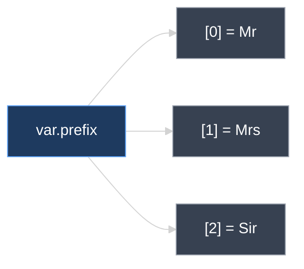
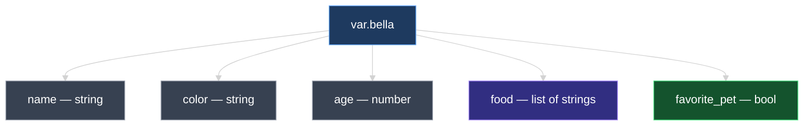

# The Variable Block: Arguments and Types

This document takes a close look at the **`variable`** block in Terraform — its three main arguments (`default`, `type`, `description`), primitive types (`string`, `number`, `bool`), and composite types (`list`, `map`, `set`, `object`, `tuple`), including how to access values and what happens when types do not match.

---

## 1. The Three Arguments of a `variable` Block

Every input variable is declared with a **`variable`** block. It supports three arguments:

| Argument | Required? | Purpose |
| --- | --- | --- |
| **`default`** | Optional | Value used when nothing else supplies the variable |
| **`type`** | Optional | Restricts what kind of value is allowed |
| **`description`** | Optional (recommended) | Human-readable explanation of what the variable is for |

```hcl
variable "content" {
  type        = string
  description = "Text written into the local file"
  default     = "I love pet!"
}
```

> **Best practice:** Always add a **`description`** so teammates (and future you) know what the variable controls. Add **`type`** when you want Terraform to **reject invalid values** before apply.

If **`type` is omitted**, Terraform defaults to **`any`** — any value shape is accepted with no type checking.

---

## 2. Primitive Types: `string`, `number`, `bool`

### `string`

A single text value — letters, numbers, symbols, spaces.

```hcl
variable "prefix" {
  type    = string
  default = "dog"
}
```

Usage: `var.prefix` → `"dog"`

### `number`

A single numeric value — integer or decimal, positive or negative.

```hcl
variable "length" {
  type    = number
  default = 2
}
```

Usage: `var.length` → `2`

### `bool`

Either **`true`** or **`false`**.

```hcl
variable "favorite_pet" {
  type    = bool
  default = true
}
```

Usage: `var.favorite_pet` → `true`

| Type | Accepts | Example default |
| --- | --- | --- |
| `string` | One text value | `"Hello"`, `"ami-abc123"` |
| `number` | One number | `2`, `-1`, `3.14` |
| `bool` | `true` or `false` | `true` |
| `any` *(implicit if type omitted)* | Anything | No validation |

---

## 3. Lists — Numbered Collections

A **`list`** holds an **ordered** sequence of values. Each item is called an **element** and is accessed by **index** in square brackets.

**Index always starts at `0`.**

```hcl
variable "prefix" {
  type = list(string)
  default = ["Mr", "Mrs", "Sir"]
}
```

| Index | Element |
| --- | --- |
| `0` | `"Mr"` |
| `1` | `"Mrs"` |
| `2` | `"Sir"` |

### Accessing list elements

```hcl
resource "local_file" "example" {
  filename = "root/greeting.txt"
  content  = var.prefix[0]   # Mr
}
```

| Expression | Value |
| --- | --- |
| `var.prefix[0]` | `"Mr"` |
| `var.prefix[1]` | `"Mrs"` |
| `var.prefix[2]` | `"Sir"` |

```hcl
# List of numbers
variable "ports" {
  type    = list(number)
  default = [80, 443, 8080]
}

# Usage
var.ports[0]   # 80
```



---

## 4. Maps — Key-Value Pairs

A **`map`** stores values identified by **keys** — like a dictionary or hash table.

```hcl
variable "file_content" {
  type = map(string)
  default = {
    statement1 = "I love pet!"
    statement2 = "My favorite pet is Mrs. hiskers"
  }
}
```

### Accessing map values by key

```hcl
resource "local_file" "pet" {
  filename = "root/pet.txt"
  content  = var.file_content["statement2"]
}
```

| Expression | Value |
| --- | --- |
| `var.file_content["statement1"]` | `"I love pet!"` |
| `var.file_content["statement2"]` | `"My favorite pet is Mrs. hiskers"` |

```hcl
# Map of numbers
variable "instance_counts" {
  type = map(number)
  default = {
    dev  = 1
    prod = 5
  }
}

# Usage
var.instance_counts["prod"]   # 5
```

---

## 5. Type Constraints and Validation Errors

The **`type`** argument enforces shape. If **`default`** (or values from `.tfvars`) do not match, Terraform **fails before apply**.

### Wrong element type in a list

```hcl
variable "bad_list" {
  type = list(number)
  default = ["80", "443", "8080"]   # strings — NOT numbers
}
```

```text
Error: Invalid default value for variable

Default value is not compatible with the variable type constraint:
a number is required, but have string.
```

### Wrong value type in a map

```hcl
# Valid — map(string)
variable "tags_string" {
  type = map(string)
  default = {
    Environment = "dev"
    Team        = "platform"
  }
}

# Valid — map(number)
variable "counts_number" {
  type = map(number)
  default = {
    web = 2
    db  = 1
  }
}
```

| Constraint | `default` must be |
| --- | --- |
| `list(string)` | `[ "a", "b" ]` |
| `list(number)` | `[ 1, 2, 3 ]` |
| `map(string)` | `{ key = "value" }` |
| `map(number)` | `{ key = 42 }` |

> Terraform validates types during **`terraform plan`** and **`terraform validate`** — you catch mismatches before anything is deployed.

---

## 6. Sets — Lists Without Duplicates

A **`set`** is like a list but **duplicate elements are not allowed**.

```hcl
# Valid set(string)
variable "valid_set" {
  type    = set(string)
  default = ["dev", "staging", "prod"]
}

# Valid set(number)
variable "port_set" {
  type    = set(number)
  default = [80, 443, 8080]
}
```

```hcl
# INVALID — duplicate "dev"
variable "invalid_set" {
  type    = set(string)
  default = ["dev", "staging", "dev"]
}
```

Terraform rejects duplicate values in a set default.

| | **List** | **Set** |
| --- | --- | --- |
| Order | **Ordered** — index `[0]`, `[1]` | Unordered collection |
| Duplicates | **Allowed** | **Not allowed** |
| Syntax | `[ "a", "b" ]` | Same bracket syntax |
| Use when | Order matters | Unique values only |

---

## 7. Objects — Combining Multiple Types

An **`object`** defines a **structured record** with named fields, each with its own type. You can combine strings, numbers, lists, and booleans in one variable.

Example: a cat named **Bella** with multiple attributes:

```hcl
variable "bella" {
  type = object({
    name         = string
    color        = string
    age          = number
    food         = list(string)
    favorite_pet = bool
  })

  default = {
    name         = "bella"
    color        = "brown"
    age          = 7
    food         = ["fish", "chicken", "turkey"]
    favorite_pet = true
  }
}
```

### Accessing object fields

```hcl
var.bella.name          # "bella"
var.bella.color         # "brown"
var.bella.age           # 7
var.bella.food[0]       # "fish"
var.bella.favorite_pet  # true
```



---

## 8. Tuples — Fixed Length, Mixed Types

A **`tuple`** looks like a list but is **stricter**:

| | **List** | **Tuple** |
| --- | --- | --- |
| Element types | **Same type** for all (`list(string)`) | **Different type per position** |
| Length | Can grow/shrink | **Fixed** — exact count enforced |

```hcl
variable "pet_tuple" {
  type = tuple([string, number, bool])

  default = ["cat", 7, true]
  #          ^       ^   ^
  #          string  num bool  — exactly 3 elements
}
```

| Index | Expected type | Example value |
| --- | --- | --- |
| `0` | `string` | `"cat"` |
| `1` | `number` | `7` |
| `2` | `bool` | `true` |

Usage:

```hcl
var.pet_tuple[0]   # "cat"
var.pet_tuple[1]   # 7
var.pet_tuple[2]   # true
```

### What causes errors

**Wrong type at a position:**

```hcl
default = ["cat", "seven", true]   # ERROR — index 1 must be number, not string
```

**Too many elements:**

```hcl
default = ["cat", 7, true, "dog"]   # ERROR — tuple expects exactly 3 elements
```

```text
Error: Invalid default value for variable

Incorrect attribute value type: length must be 3, but have 4.
```

---

## 9. Quick Reference: All Types

Every row uses **one real variable name** from this lesson. **`variable "name"`** is the declaration; **`var.name`** reads it in resources. For maps, **`["key"]`** picks one entry inside that variable — e.g. `var.instance_counts["prod"]` reads key **`prod`** from variable **`instance_counts`**.

| Type | Variable | Use in `main.tf` | Resolves to |
| --- | --- | --- | --- |
| `string` | `content` | `content = var.content` | `"I love pet!"` |
| `number` | `length` | `length = var.length` | `2` |
| `bool` | `favorite_pet` | `count = var.favorite_pet ? 1 : 0` | `true` |
| `list(string)` | `prefix` | `content = var.prefix[0]` | `"Mr"` |
| `list(number)` | `ports` | `port = var.ports[1]` | `443` |
| `map(string)` | `file_content` | `content = var.file_content["statement2"]` | `"My favorite pet is Mrs. hiskers"` |
| `map(number)` | `instance_counts` | `count = var.instance_counts["prod"]` | `5` |
| `set(string)` | `environments` | `for_each = var.environments` | unique strings only |
| `object({...})` | `bella` | `content = var.bella.food[0]` | `"fish"` |
| `tuple([...])` | `pet_tuple` | `content = var.pet_tuple[1]` | `7` |
| `any` | `notes` | `content = var.notes` | any shape accepted |

### Declarations (`variables.tf`)

Full blocks for every variable in the table above:

```hcl
variable "content" {
  type    = string
  default = "I love pet!"
}

variable "length" {
  type    = number
  default = 2
}

variable "favorite_pet" {
  type    = bool
  default = true
}

variable "prefix" {
  type    = list(string)
  default = ["Mr", "Mrs", "Sir"]
}

variable "ports" {
  type    = list(number)
  default = [80, 443, 8080]
}

variable "file_content" {
  type = map(string)
  default = {
    statement1 = "I love pet!"
    statement2 = "My favorite pet is Mrs. hiskers"
  }
}

variable "instance_counts" {
  type = map(number)
  default = {
    dev  = 1
    prod = 5
  }
}

variable "environments" {
  type    = set(string)
  default = ["dev", "staging", "prod"]
}

variable "bella" {
  type = object({
    name = string
    age  = number
    food = list(string)
  })
  default = {
    name = "bella"
    age  = 7
    food = ["fish", "chicken"]
  }
}

variable "pet_tuple" {
  type    = tuple([string, number, bool])
  default = ["cat", 7, true]
}

variable "notes" {
  default = "I love pet!"
  # type omitted → any
}
```

### Usage in a resource (`main.tf`)

```hcl
resource "local_file" "pet" {
  filename = "root/pet.txt"
  content  = var.file_content["statement2"]
}
```

| Expression | What it means | Value |
| --- | --- | --- |
| `var.file_content["statement2"]` | Key **`statement2`** inside **`file_content`** | `"My favorite pet is Mrs. hiskers"` |
| `var.instance_counts["dev"]` | Key **`dev`** inside **`instance_counts`** | `1` |
| `var.instance_counts["prod"]` | Key **`prod`** inside **`instance_counts`** | `5` |
| `var.ports[0]` | First list element (index starts at 0) | `80` |
| `var.ports[1]` | Second list element | `443` |
| `var.prefix[0]` | First list element | `"Mr"` |
| `var.bella.food[0]` | Field **`food`**, first item | `"fish"` |
| `var.pet_tuple[1]` | Tuple index 1 (must be number) | `7` |

---

## 10. Hands-On Lab

In your configuration directory:

1. Add `description` and `type` to existing variables from the Input Variables lesson.
2. Create a `list(string)` variable `prefix` — use `var.prefix[0]` in a resource.
3. Create a `map(string)` variable `file_content` — use `var.file_content["statement2"]` for `local_file` content.
4. Intentionally mismatch types (e.g., `list(number)` with string defaults) — run `terraform validate` and read the error.
5. Create a `set(string)` with a duplicate value — confirm Terraform rejects it.
6. Create an `object` variable `bella` — reference `var.bella.name` and `var.bella.food[0]`.
7. Create a `tuple([string, number, bool])` — try adding a fourth element and confirm the error.

---

### Topic Summary: Variable Block and Types

A **`variable`** block supports **`default`**, **`type`**, and **`description`**. Primitive types are **`string`**, **`number`**, and **`bool`**. Omitting `type` defaults to **`any`**. **Lists** are ordered collections accessed by index starting at **`0`**. **Maps** are key-value pairs accessed with **`var.name["key"]`**. **Sets** behave like lists but forbid duplicates. **Objects** combine named fields of different types. **Tuples** enforce a **fixed length** and **specific type per position**. Type constraints cause **`terraform plan`** / **`validate`** to fail when defaults or inputs do not match.

---

## Knowledge Check

Answer each question on your own first, then read the explanation below it.

---

### 1 · Variable block arguments

**What are the three arguments of a Terraform `variable` block?**

> **`default`** — fallback value when nothing else supplies the variable.  
> **`type`** — optional constraint on what shape of value is allowed.  
> **`description`** — optional human-readable docs (recommended best practice).

---

### 2 · Default type

**What is the default type if you omit the `type` argument?**

> **`any`** — Terraform accepts any value shape with no type validation. Add an explicit `type` when you want Terraform to reject mismatched values at plan/validate time.

---

### 3 · List indexing

**How do you access the second element of a list variable named `prefix`?**

> **`var.prefix[1]`** — list indexes start at **0**, so index `1` is the second element (`"Mrs"` if the default is `["Mr", "Mrs", "Sir"]`).

---

### 4 · Map keys

**How do you read the value for key `statement2` from a map variable `file_content`?**

> **`var.file_content["statement2"]`** — the variable name first, then the key in square brackets. The key is a label inside the map, not a separate variable.

---

### 5 · Type validation

**What happens if you declare `type = list(number)` but provide string defaults like `["80", "443"]`?**

> Terraform fails with a **type error** during **`terraform plan`** or **`validate`** — for example: *"a number is required, but have string"*. Fix the defaults or change the type.

---

### 6 · List vs set

**What is the difference between a list and a set?**

> Both hold collections, but a **set forbids duplicate values** and is unordered. A **list** is **ordered** and indexed with `[0]`, `[1]`, … — use a set when **uniqueness** matters.

---

### 7 · List vs tuple

**What is the difference between a list and a tuple?**

> A **list** requires every element to share one type — e.g. `list(string)`.  
> A **tuple** fixes **both** the count and the type per position — e.g. `tuple([string, number, bool])` must have exactly three values of those exact types.

---

### 8 · Object fields

**How do you access the `age` field of an object variable named `bella`?**

> **`var.bella.age`** — dot notation for named fields. For a list field inside the object: **`var.bella.food[0]`**.

---

### 9 · Tuple length

**Why would adding a fourth element to a `tuple([string, number, bool])` default fail?**

> A tuple enforces an **exact element count**. Three types were declared, so exactly **three** values must be provided — a fourth value violates the constraint.

