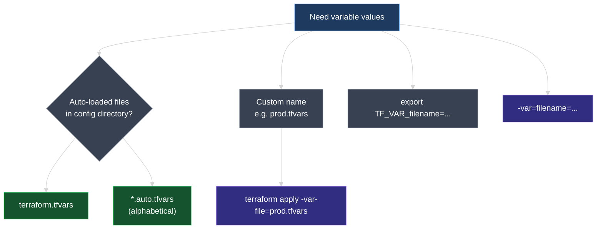
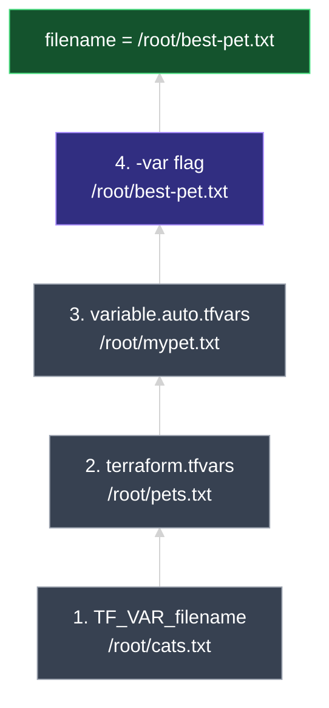

# Assigning Values to Input Variables

This document covers every way to **supply values** to Terraform input variables — defaults, interactive prompts, CLI flags, environment variables, and **`.tfvars`** files — plus **variable definition precedence** when the same variable is set in more than one place.

---

## 1. Recap: Defaults Are Only One Option

In earlier lessons, variables were declared in **`variables.tf`** with a **`default`**:

```hcl
variable "filename" {
  type    = string
  default = "root/pet.txt"
}
```

That is **one** way to pass a value. The **`default`** argument is **optional** — when it is present and nothing else supplies a value, Terraform uses it automatically.

| Method | Where | Auto-loaded? |
| --- | --- | --- |
| **`default`** | `variables.tf` | Always part of the declaration |
| **Interactive prompt** | Terminal during `apply` / `plan` | When variable has **no** value from any source |
| **`-var`** | Command line | No — you pass it explicitly |
| **`TF_VAR_<name>`** | Shell environment | Yes — if exported before the command |
| **`terraform.tfvars`** | Project file | Yes — if file exists |
| **`*.auto.tfvars`** | Project file | Yes — all matching files |
| **Custom `.tfvars` + `-var-file`** | Any named file | No — requires `-var-file` |

You can use **any combination** of these. When the same variable is set in multiple places, Terraform picks one value using **precedence** (see §6).

> **Prerequisite:** Every method below only **assigns a value** to a variable that is **already declared** with a `variable "name" { ... }` block in a `.tf` file. If you use `var.filename` without a declaration — even with `.tfvars` present — Terraform errors. See **`04_Input_Variables.md` §2** (*Declare before assign*).

---

## 2. No Default → Interactive Prompt

If a variable has **no `default`** and **no value** from CLI, environment, or `.tfvars`, Terraform asks you at the terminal when you run **`terraform plan`** or **`terraform apply`**.

```hcl
# variables.tf — no default
variable "filename" {
  type = string
}

variable "content" {
  type = string
}
```

```hcl
# main.tf
resource "local_file" "pet" {
  filename = var.filename
  content  = var.content
}
```

```bash
terraform apply
```

```text
var.filename
  Enter a value: root/pet.txt

var.content
  Enter a value: I love pet!
```

| When interactive mode runs | When it does not |
| --- | --- |
| Variable has **no default** and **no external value** | A value is already supplied via `.tfvars`, `-var`, `TF_VAR_`, etc. |
| Useful for quick local tests | Awkward for CI/CD — pipelines need non-interactive inputs |

> **Rule:** Production and automation should **never rely on prompts**. Use `.tfvars`, environment variables, or `-var` instead.

---

## 3. Command-Line Flags: `-var`

Pass values directly on the Terraform command with **`-var`** using **`name=value`** syntax:

```bash
terraform apply -var="filename=root/pets.txt" -var="content=Hello from CLI"
```

| Detail | Example |
| --- | --- |
| One variable | `-var="filename=root/pets.txt"` |
| Multiple variables | Repeat **`-var`** for each name |
| Strings with spaces | Quote the whole assignment: `-var="content=I love pet!"` |
| Works with | `terraform plan`, `terraform apply`, `terraform destroy`, etc. |

```bash
terraform plan  -var="filename=root/pets.txt"
terraform apply -var="filename=root/pets.txt" -var="length=2"
```

**`-var`** is ideal for **one-off overrides** — testing a path, forcing a value in a pipeline step, or overriding a single setting without editing files.

---

## 4. Environment Variables: `TF_VAR_<name>`

Export an environment variable prefixed with **`TF_VAR_`** followed by the **exact variable name**:

```bash
# Linux / macOS / Git Bash
export TF_VAR_filename="/root/pets.txt"
export TF_VAR_length=2

terraform apply
```

```powershell
# Windows PowerShell
$env:TF_VAR_filename = "root/pets.txt"
$env:TF_VAR_length    = "2"

terraform apply
```

| Environment variable | Sets variable | Value |
| --- | --- | --- |
| `TF_VAR_filename` | `filename` | `"/root/pets.txt"` |
| `TF_VAR_length` | `length` | `2` |

> The prefix is always **`TF_VAR_`**. The part after the prefix must match the variable name in **`variables.tf`** — e.g. `TF_VAR_filename` → `variable "filename"`.

Environment variables are common in **CI/CD** (GitHub Actions, Jenkins, Azure DevOps) where secrets and per-run settings are injected without committing values to git.

---

## 5. Variable Definition Files (`.tfvars`)

When you manage **many variables**, put assignments in a **variable definition file** instead of repeating **`-var`** on every command.

### File naming rules

| Filename pattern | Auto-loaded? |
| --- | --- |
| **`terraform.tfvars`** | **Yes** |
| **`terraform.tfvars.json`** | **Yes** |
| **`<anything>.auto.tfvars`** | **Yes** — all such files, **alphabetical order** |
| **`<anything>.auto.tfvars.json`** | **Yes** — same rule |
| **Any other name** ending in `.tfvars` or `.tfvars.json` (e.g. `prod.tfvars`, `variable.tfvars`) | **No** — use **`-var-file`** |

### Syntax: assignments only

A `.tfvars` file uses **HCL assignment syntax** — **`name = value`** lines only. There is **no** `variable` keyword.

```hcl
# terraform.tfvars
filename = "root/pets.txt"
content  = "I love pet!"
length   = 2
```

```hcl
# variable.auto.tfvars  (auto-loaded because of .auto.tfvars suffix)
filename = "root/mypet.txt"
```

```hcl
# prod.tfvars  (NOT auto-loaded — custom name)
filename = "root/prod-pet.txt"
content  = "Production pet file"
```

Load a custom-named file explicitly:

```bash
terraform apply -var-file="prod.tfvars"
terraform plan  -var-file="variable.tfvars"
```

Multiple **`-var-file`** flags can be passed; later flags override earlier ones for the same variable.



> **Important:** Never declare `variable "filename" { ... }` blocks inside `.tfvars` files. Declarations belong in **`variables.tf`**; `.tfvars` files only **assign** values.

---

## 6. Variable Definition Precedence

When the **same variable** receives values from **multiple sources**, Terraform loads them in a fixed order. **Later sources override earlier ones.**

### Loading order (lowest → highest priority)

| Order | Source | Example value for `filename` |
| --- | --- | --- |
| 1 *(lowest among inputs)* | **`TF_VAR_` environment variable** | `/root/cats.txt` |
| 2 | **`terraform.tfvars`** | `/root/pets.txt` |
| 3 | **`*.auto.tfvars`** *(alphabetical; later filenames win within this group)* | `/root/mypet.txt` |
| 4 *(highest)* | **`-var` / `-var-file` on CLI** | `/root/best-pet.txt` |

If a variable has a **`default`** in `variables.tf` and **no other input**, the default is used. Among external sources, **`default`** is overridden by everything in the table above.

### Worked example: which value wins?

**Configuration:**

```hcl
# main.tf
resource "local_file" "pet" {
  filename = var.filename
  content  = "I love pet!"
}
```

```hcl
# variables.tf — no default
variable "filename" {
  type = string
}
```

**Four different values for the same variable:**

| Source | How it is set | Value |
| --- | --- | --- |
| Environment | `export TF_VAR_filename="/root/cats.txt"` | `/root/cats.txt` |
| `terraform.tfvars` | `filename = "/root/pets.txt"` | `/root/pets.txt` |
| `variable.auto.tfvars` | `filename = "/root/mypet.txt"` | `/root/mypet.txt` |
| CLI | `terraform apply -var="filename=/root/best-pet.txt"` | `/root/best-pet.txt` |

**Winner:** **`/root/best-pet.txt`** — the **`-var`** flag has the **highest priority** and overwrites all previous sources.



### Quick precedence cheat sheet

| Question | Answer |
| --- | --- |
| CLI vs `terraform.tfvars`? | **CLI wins** (`-var` / `-var-file`) |
| `terraform.tfvars` vs `TF_VAR_`? | **`terraform.tfvars` wins** |
| `variable.auto.tfvars` vs `terraform.tfvars`? | **`.auto.tfvars` wins** (loaded after) |
| Nothing external, but has `default`? | **`default`** is used |
| Nothing at all? | **Interactive prompt** (or error in non-interactive mode) |

---

## 7. Hands-On Lab

In your configuration directory (same project as the Input Variables lesson — ensure every `var.*` reference is **declared** in `variables.tf` per **`04_Input_Variables.md` §2**):

1. Remove **`default`** from `variable "filename"` in `variables.tf`.
2. Run **`terraform apply`** — enter values at the prompts; confirm the file is created.
3. Set **`TF_VAR_filename`** in your shell and run **`terraform plan`** — confirm the plan uses the env value (no prompt).
4. Create **`terraform.tfvars`** with `filename = "root/from-tfvars.txt"` — run **`plan`** and confirm it overrides the env var.
5. Create **`variable.auto.tfvars`** with a different `filename` — confirm it overrides `terraform.tfvars`.
6. Run **`terraform apply -var="filename=root/from-cli.txt"`** — confirm the CLI value wins.
7. Create **`prod.tfvars`** (custom name) and run **`terraform plan -var-file=prod.tfvars`** — confirm values load only when the flag is passed.
8. Run **`terraform validate`** after each change to catch syntax errors in `.tfvars` files early.

---

### Topic Summary: Assigning Variable Values

Input variables can receive values from **`default`**, **interactive prompts**, **`-var`**, **`TF_VAR_<name>` environment variables**, and **`.tfvars`** files — but only after the variable is **declared** in a `.tf` file (see **`04_Input_Variables.md`**). Files named **`terraform.tfvars`** or ending in **`.auto.tfvars`** are **auto-loaded**; other `.tfvars` names require **`-var-file`**. When multiple sources set the same variable, Terraform applies **precedence**: environment variables load first, then **`terraform.tfvars`**, then **`*.auto.tfvars`** (alphabetical), and **`-var` / `-var-file`** on the CLI **win last**.

### Knowledge Check Q&A

**Q: What happens when you run `terraform apply` and a variable has no `default` and no value from `.tfvars`, `-var`, or `TF_VAR_`?**

**A:** Terraform prompts you **interactively** to enter a value for each unset variable.

**Q: How do you pass a variable named `filename` on the command line?**

**A:** Use **`-var="filename=root/pets.txt"`**. Repeat **`-var`** for each additional variable.

**Q: How do you set the variable `length` using an environment variable?**

**A:** Export **`TF_VAR_length`** with the desired value — e.g. `export TF_VAR_length=2` (bash) or `$env:TF_VAR_length = "2"` (PowerShell).

**Q: Which `.tfvars` files are loaded automatically without a flag?**

**A:** **`terraform.tfvars`**, **`terraform.tfvars.json`**, and any file ending in **`.auto.tfvars`** or **`.auto.tfvars.json`**.

**Q: How do you use a file named `variable.tfvars` or `prod.tfvars`?**

**A:** Pass it with **`-var-file`**: `terraform apply -var-file="prod.tfvars"`.

**Q: In the worked example with env var, `terraform.tfvars`, `variable.auto.tfvars`, and `-var` all setting `filename`, which value wins?**

**A:** **`/root/best-pet.txt`** from the **`-var`** flag — CLI flags have the **highest precedence**.

**Q: Does `terraform.tfvars` override `TF_VAR_filename`?**

**A:** **Yes.** `terraform.tfvars` is loaded **after** environment variables, so its value replaces the env var value unless a higher-priority source overrides it.

**Q: What syntax belongs in a `.tfvars` file?**

**A:** **Assignments only** — `name = value` lines in HCL syntax. No `variable` blocks. To declare variables, see **`04_Input_Variables.md` §2**.
