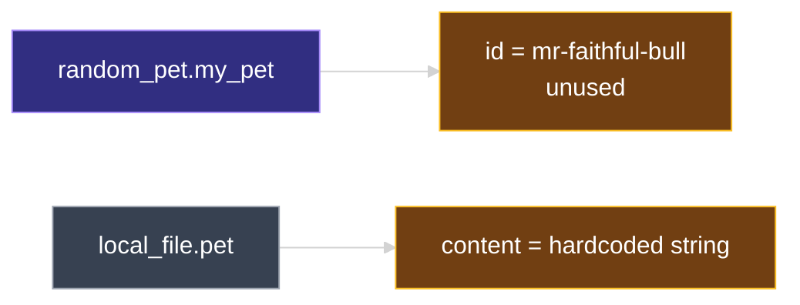
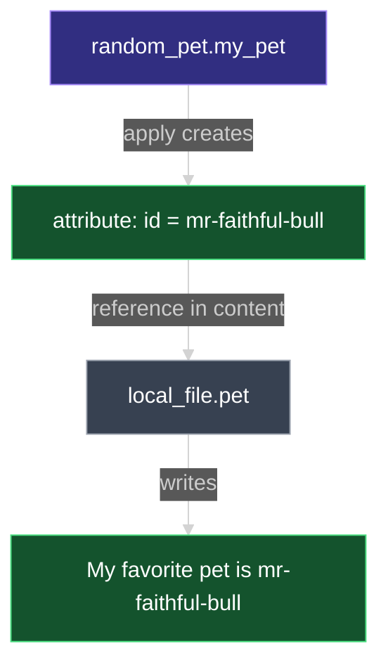

# Resource Attributes and Reference Expressions

This document explains how to **link two resources together** by reading **resource attributes** — values a resource exports after creation — and passing them into another resource using **reference expressions** and **`${ ... }` interpolation**.

---

## 1. From Variables to Resource Linking

In recent lectures, **input variables** (`var.*`) improved reusability — you change values without rewriting resource blocks.

Variables parameterize **inputs you choose**. **Resource attributes** parameterize **outputs Terraform creates** — like a generated pet name or a cloud instance ID. Real infrastructure almost always chains these together.

| Mechanism | Syntax | Value comes from |
| --- | --- | --- |
| **Input variable** | `var.filename` | You declare it in `variables.tf` / `.tfvars` |
| **Resource attribute** | `random_pet.my_pet.id` | Terraform creates it when the resource is applied |

---

## 2. Two Resources With No Link (Starting Point)

A typical configuration has **`local_file`** and **`random_pet`** side by side — each with its own **arguments** (inputs to create the resource):

```hcl
resource "random_pet" "my_pet" {
  prefix    = "Mr"
  separator = "-"
  length    = 2
}

resource "local_file" "pet" {
  filename = "root/pet.txt"
  content  = "My favorite pet is Mr. Cat"
}
```

| Resource | Arguments used | Purpose |
| --- | --- | --- |
| `random_pet.my_pet` | `prefix`, `separator`, `length` | Control how the random name is built |
| `local_file.pet` | `filename`, `content` | Path and text written to disk |

After **`terraform apply`**, Terraform creates both resources independently:

```text
random_pet.my_pet: Creation complete after 0s [id=mr-faithful-bull]
local_file.pet: Creation complete after 0s [id=...]
```

The **`id`** shown for `random_pet` (e.g. **`mr-faithful-bull`**) is the generated pet name — but **`local_file` does not use it yet**. The file content is still the hardcoded string **`My favorite pet is Mr. Cat`**.

> **Real-world gap:** Cloud networks, subnets, instances, and security groups are almost never fully independent. One resource's **output** becomes another's **input**. Variables alone cannot express “use whatever ID Terraform just created.”



---

## 3. Arguments vs Attributes

Every resource block has two different kinds of values to understand:

| Term | Direction | When known | Example |
| --- | --- | --- | --- |
| **Argument** | **Into** the resource — you set it | Before / during create | `prefix = "Mr"`, `content = "Hello"` |
| **Attribute** | **Out of** the resource — Terraform exposes it | **After** the resource exists | `random_pet.my_pet.id` |

**Arguments** appear in your HCL inside the resource block. **Attributes** appear in the provider documentation under **Attribute Reference** — they are read-only values returned after apply.

### Finding attributes in the Registry

Open the resource docs on [registry.terraform.io](https://registry.terraform.io) — e.g. [`random_pet`](https://registry.terraform.io/providers/hashicorp/random/latest/docs/resources/pet).

| Documentation section | What it lists |
| --- | --- |
| **Argument Reference** | Inputs you can set (`prefix`, `length`, …) |
| **Attribute Reference** | Outputs after apply (`id`, …) |

For **`random_pet`**, the main attribute is:

| Attribute | Type | Meaning |
| --- | --- | --- |
| **`id`** | `string` | The generated pet name (same value shown in apply output) |

---

## 4. Reference Expression Syntax

To use one resource's attribute in another resource, write a **reference expression**:

```text
<resource_type>.<resource_name>.<attribute>
```

For our pet example:

```text
random_pet.my_pet.id
     │         │     │
     │         │     └── attribute (exported after apply)
     │         └── resource name you chose in the block
     └── resource type (provider_random + _ + pet)
```

| Part | In our config | Rule |
| --- | --- | --- |
| Resource type | `random_pet` | Exact type string from the `resource` block |
| Resource name | `my_pet` | Exact label from `resource "random_pet" "my_pet"` |
| Attribute | `id` | From **Attribute Reference** in docs |

> **Resource name is not the pet name.** `"my_pet"` is your logical label in Terraform. The generated name lives in the **`.id` attribute**.

---

## 5. Interpolation: `${ ... }` Inside Strings

The **`content`** argument expects a **string**. To embed a reference inside text, use an **interpolation sequence**:

```hcl
content = "My favorite pet is ${random_pet.my_pet.id}"
#          └─ string literal ──┘└─ expression ──────────────┘
#                              ${ ... }  evaluates and inserts result
```

| Piece | Name | Role |
| --- | --- | --- |
| `"..."` | String literal | Fixed text around the dynamic part |
| **`${`** | Interpolation start | “Evaluate what follows as an expression” |
| `random_pet.my_pet.id` | Reference expression | Resolves to the attribute value |
| **`}`** | Interpolation end | Close the expression |

**How Terraform evaluates it:**

1. Evaluate **`random_pet.my_pet.id`** → e.g. **`mr-faithful-bull`**
2. Convert the result to a string (if needed)
3. Insert it into the surrounding string

**Final value:**

```text
My favorite pet is mr-faithful-bull
```

### Updated configuration — resources linked

```hcl
resource "random_pet" "my_pet" {
  prefix    = "Mr"
  separator = "-"
  length    = 2
}

resource "local_file" "pet" {
  filename = "root/pet.txt"
  content  = "My favorite pet is ${random_pet.my_pet.id}"
}
```

You can also use a reference **without** surrounding text — the whole argument can be a reference:

```hcl
content = random_pet.my_pet.id   # entire string is the pet name
```

When the argument is **only** a reference, **`${ ... }` is optional** in modern Terraform. Inside a longer string, **`${ ... }` is required**.



---

## 6. Implicit Dependency

When **`local_file.pet`** references **`random_pet.my_pet.id`**, Terraform builds a **dependency**:

| Before linking | After linking |
| --- | --- |
| Resources can be created in parallel | **`random_pet` must exist first** |
| No ordering guarantee | **`local_file` waits for `.id`** |

You do **not** write a separate `depends_on` for this simple case — the reference in `content` is enough. Terraform's graph understands that the file needs the pet name first.

> See **`03_Multiple_Providers_and_Resources.md`** for linking **`id`** into **`filename`** as well — same reference syntax, different argument.

---

## 7. Plan and Apply — Content Replaced

After changing `content` from a hardcoded string to **`${random_pet.my_pet.id}`**, run:

```bash
terraform plan
```

Terraform detects that **`local_file.pet`** must be **updated in place** (content changed):

```diff
  # local_file.pet will be updated in-place
  ~ resource "local_file" "pet" {
      ~ content  = "My favorite pet is Mr. Cat" -> "My favorite pet is mr-faithful-bull"
        filename = "root/pet.txt"
        id       = "..."
    }
```

```bash
terraform apply
```

After apply, open **`root/pet.txt`** — the content matches the **`random_pet`** name, not the old hardcoded text.

| What changed | What stayed the same |
| --- | --- |
| **`content`** — now driven by **`random_pet.my_pet.id`** | **`random_pet`** arguments (`prefix`, `length`, …) |
| **Dependency** — file waits for pet name | Resource types and names |

If you change **`random_pet`** in a way that forces replacement (e.g. **`length`**), the **`.id` value changes** — and any resource referencing it (like **`local_file`**) updates accordingly on the next apply.

---

## 8. Reference vs Variable — Quick Comparison

| | **`var.content`** | **`random_pet.my_pet.id`** |
| --- | --- | --- |
| **Set by** | You (default, `.tfvars`, CLI, …) | Terraform when resource is created |
| **Known when** | Before apply (if you supplied it) | After **`random_pet`** is applied |
| **Syntax** | `var.<variable_name>` | `<type>.<name>.<attribute>` |
| **In strings** | `content = var.content` or `"Hello ${var.name}"` | `"Pet: ${random_pet.my_pet.id}"` |
| **Declares dependency** | No | **Yes** — when referencing another resource |

---

## 9. Hands-On Lab

In your configuration directory (with **`random_pet`** and **`local_file`** already defined):

1. Confirm **`local_file.pet`** uses a **hardcoded** `content` string (e.g. `"My favorite pet is Mr. Cat"`).
2. Run **`terraform apply`** — note the **`id`** printed for **`random_pet.my_pet`** in the output.
3. Open the [random_pet docs](https://registry.terraform.io/providers/hashicorp/random/latest/docs/resources/pet) — read **Attribute Reference** and locate **`id`**.
4. Change **`content`** to `"My favorite pet is ${random_pet.my_pet.id}"`.
5. Run **`terraform plan`** — confirm **`content`** shows **`~`** change from old string to the pet name.
6. Run **`terraform apply`** — open the file on disk and verify the text matches **`random_pet.my_pet.id`**.
7. Optional: also set `filename = "root/${random_pet.my_pet.id}.txt"` and observe filename change in the plan.
8. Optional: change **`length`** on **`random_pet`**, apply again, and observe both **`.id`** and **`local_file.content`** update together.

---

### Topic Summary: Resource Attributes and References

**Arguments** are values you pass **into** a resource to create it. **Attributes** are values Terraform exports **after** apply — listed under **Attribute Reference** in the Registry. Link resources with **`resource_type.resource_name.attribute`**. Inside strings, wrap expressions in **`${ ... }`** interpolation so Terraform evaluates the reference and inserts the result. Referencing another resource creates an **implicit dependency** — the referenced resource must be created first. This pattern connects **`random_pet.my_pet.id`** to **`local_file.pet`** content (and optionally filename), replacing hardcoded text with the dynamically generated name.

### Knowledge Check Q&A

**Q: What is the difference between a resource argument and a resource attribute?**

**A:** An **argument** is an **input** you set in the resource block to configure creation. An **attribute** is an **output** Terraform exposes after the resource exists — read-only, documented under **Attribute Reference**.

**Q: What attribute does `random_pet` expose that holds the generated pet name?**

**A:** **`id`** — a **string** containing the full generated name (e.g. `mr-faithful-bull`).

**Q: What is the syntax for referencing `id` from a resource named `my_pet`?**

**A:** **`random_pet.my_pet.id`** — resource type, resource name, and attribute separated by dots.

**Q: What does `${random_pet.my_pet.id}` do inside a string argument?**

**A:** It is an **interpolation sequence** — Terraform **evaluates** the expression inside **`${ ... }`**, converts the result to a string, and **inserts** it into the surrounding text.

**Q: Why does `local_file.pet` automatically depend on `random_pet.my_pet` when you use `${random_pet.my_pet.id}` in `content`?**

**A:** Terraform infers an **implicit dependency** from the reference — the pet name must exist before the file content can be computed. No separate `depends_on` is needed for this case.

**Q: Where in the Terraform Registry do you find which attributes a resource exports?**

**A:** The **Attribute Reference** section on the resource's documentation page.

**Q: What is the difference between `var.content` and `random_pet.my_pet.id`?**

**A:** **`var.content`** is an **input variable** you supply. **`random_pet.my_pet.id`** is a **resource attribute** Terraform produces when **`random_pet`** is applied — you cannot set `.id` directly; it is computed.

**Q: After changing `content` from a hardcoded string to use `${random_pet.my_pet.id}`, what does `terraform plan` typically show?**

**A:** An **in-place update** (`~`) on **`local_file.pet`** — **`content`** changes from the old literal string to the interpolated pet name.
