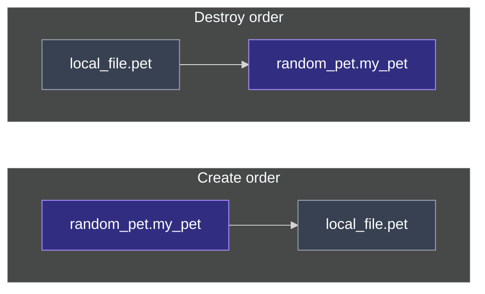
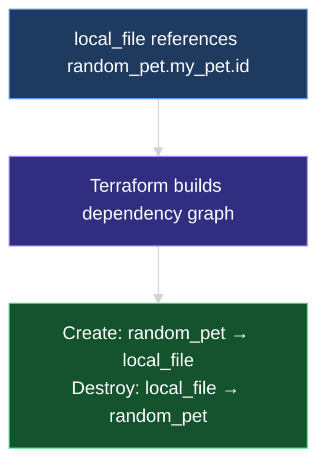
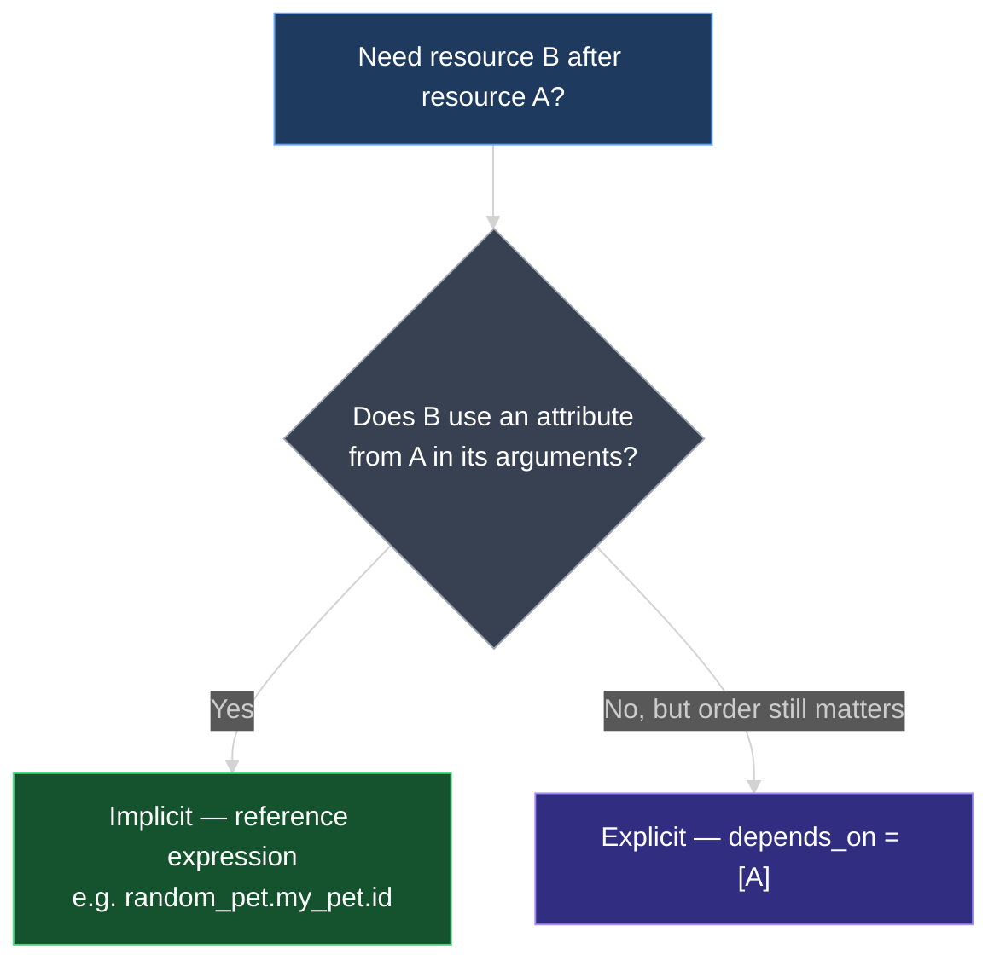

# Resource Dependencies in Terraform

This document explains the two types of **resource dependencies** — **implicit** (inferred from reference expressions) and **explicit** (`depends_on`) — plus the **create and destroy order** Terraform uses when resources depend on each other.

---

## 1. Recap: References Create Dependencies

In the previous lecture, **`local_file.pet`** used a **reference expression** to read **`random_pet.my_pet.id`**:

```hcl
resource "random_pet" "my_pet" {
  prefix    = "Mr"
  separator = "-"
  length    = 2
}

resource "local_file" "pet" {
  filename = "root/pet.txt"
  content  = "My favorite pet is ${random_pet.my_pet.id}"
}
```

Because **`content`** references **`random_pet.my_pet.id`**, Terraform knows **`local_file.pet` depends on `random_pet.my_pet`**. The pet name must exist before the file content can be computed.

> See **`07_Resource_Attributes_and_References.md`** for reference syntax and **`${ ... }` interpolation**.

---

## 2. Create Order vs Destroy Order

When resources depend on each other, Terraform does **not** create or delete them in random order.

### On create (`terraform apply`)

Terraform provisions **dependencies first**, then the resource that depends on them:

```text
1. random_pet.my_pet     ← created first
2. local_file.pet        ← created second (needs .id from step 1)
```

### On destroy (`terraform destroy`)

Terraform reverses the order — **dependents first**, then what they depended on:

```text
1. local_file.pet        ← destroyed first
2. random_pet.my_pet     ← destroyed second
```

| Phase | Order | Rule |
| --- | --- | --- |
| **Create** | Dependency → dependent | Build foundations before things that need them |
| **Destroy** | Dependent → dependency | Remove consumers before providers |



You do not configure this order manually when using reference expressions — Terraform's **dependency graph** handles it.

---

## 3. Implicit Dependency

When a resource **references another resource's attribute** in its configuration, Terraform infers an **implicit dependency**.

| Characteristic | Implicit dependency |
| --- | --- |
| **How it is declared** | You do **not** write anything extra — the reference in an argument is enough |
| **How Terraform discovers it** | Parses expressions like `random_pet.my_pet.id` in `content`, `filename`, etc. |
| **Example** | `content = "My favorite pet is ${random_pet.my_pet.id}"` |

```hcl
resource "local_file" "pet" {
  filename = "root/pet.txt"
  content  = "My favorite pet is ${random_pet.my_pet.id}"
  # implicit dependency on random_pet.my_pet — no depends_on needed
}
```

**Implicit dependencies are the default and preferred approach** whenever you use a reference expression. Terraform figures out which resource depends on which — you never list them yourself for this case.



---

## 4. Explicit Dependency — `depends_on`

Sometimes a resource **must wait for another** even though it does **not** reference that resource in any argument. For that, use the **`depends_on`** meta-argument inside the resource block.

### Example: hardcoded content, but ordered create

Return to the **older configuration** — **`content`** is a fixed string with **no reference expression**:

```hcl
resource "random_pet" "my_pet" {
  prefix    = "Mr"
  separator = "-"
  length    = 2
}

resource "local_file" "pet" {
  filename = "root/pet.txt"
  content  = "My favorite pet is Mr. Cat"

  depends_on = [random_pet.my_pet]
}
```

| Part | Meaning |
| --- | --- |
| **`depends_on`** | Meta-argument — not a provider argument; tells Terraform about ordering |
| **`[random_pet.my_pet]`** | List of resources this block must wait for |
| **No `.id`** | Reference the **resource**, not an attribute: `random_pet.my_pet`, not `random_pet.my_pet.id` |

With **`depends_on`**, Terraform still creates **`random_pet.my_pet` first**, then **`local_file.pet`** — even though **`content`** does not mention the pet resource.

This is an **explicit dependency** — you **tell Terraform directly** which resource must exist first.

---

## 5. Implicit vs Explicit — When to Use Each

| | **Implicit** | **Explicit (`depends_on`)** |
| --- | --- | --- |
| **Trigger** | Reference expression in an argument | No reference, but ordering still required |
| **Syntax** | `content = "${random_pet.my_pet.id}"` | `depends_on = [random_pet.my_pet]` |
| **Who decides** | Terraform infers from expressions | You declare in configuration |
| **Prefer when** | You use the other resource's output as input | Indirect reliance — side effects, timing, or behavior not visible in arguments |



> **Rule of thumb:** Use **reference expressions** whenever you can — they carry both the **value** and the **dependency**. Use **`depends_on`** only when the dependency is **real but invisible** in your arguments (common with IAM policies, bootstrap scripts, and resources that must exist before another runs but are not referenced by attribute).

Real-world examples of **`depends_on`** appear in later sections of this course.

---

## 6. What You See During Apply and Destroy

### Apply with implicit dependency (reference in `content`)

```text
random_pet.my_pet: Creating...
random_pet.my_pet: Creation complete [id=mr-faithful-bull]
local_file.pet: Creating...
local_file.pet: Creation complete
```

### Destroy (reverse order)

```text
local_file.pet: Destroying...
local_file.pet: Destruction complete
random_pet.my_pet: Destroying...
random_pet.my_pet: Destruction complete
```

The same ordering applies whether the dependency is **implicit** or **explicit** — Terraform's graph determines create and destroy sequence.

---

## 7. Hands-On Lab

In your configuration directory:

1. Start with **`local_file.pet`** using **`${random_pet.my_pet.id}`** in **`content`** — run **`terraform apply`** and confirm **`random_pet`** appears **before** **`local_file`** in the output.
2. Run **`terraform destroy`** — confirm **`local_file`** is destroyed **before** **`random_pet`**.
3. Change **`content`** back to a **hardcoded string** (no reference) — run **`plan`** and note that Terraform may no longer infer a dependency.
4. Add **`depends_on = [random_pet.my_pet]`** to **`local_file.pet`** — run **`apply`** again and confirm create order is restored.
5. Remove **`depends_on`** and restore the **reference expression** in **`content`** — confirm implicit dependency works without **`depends_on`**.
6. Optional: run **`terraform graph | dot -Tsvg > graph.svg`** (if Graphviz is installed) and inspect the edge from **`random_pet`** to **`local_file`**.

---

### Topic Summary: Resource Dependencies

When one resource uses another's **attribute** in a **reference expression**, Terraform creates an **implicit dependency** and provisions resources in dependency order — **create** goes dependency → dependent; **destroy** reverses that order. You do not configure this manually for simple references. When ordering matters but **no attribute is referenced** in arguments, use an **explicit dependency** with **`depends_on = [resource.name]`** inside the dependent resource block. Prefer implicit dependencies from references; reserve **`depends_on`** for indirect relationships explored later in the course.

---

## Knowledge Check

Answer each question on your own first, then read the explanation below it.

---

### 1 · What creates an implicit dependency

**How does Terraform know `local_file.pet` depends on `random_pet.my_pet` when you use `${random_pet.my_pet.id}` in `content`?**

> It **parses the reference expression** in the argument. Any reference to another resource's attribute creates an **implicit dependency** — no `depends_on` required.

---

### 2 · Create order

**When applying a configuration where `local_file` depends on `random_pet`, which resource is created first?**

> **`random_pet.my_pet` first**, then **`local_file.pet`**. Terraform creates dependencies before dependents.

---

### 3 · Destroy order

**When destroying the same configuration, which resource is deleted first?**

> **`local_file.pet` first**, then **`random_pet.my_pet`**. Destroy order is the **reverse** of create order.

---

### 4 · Implicit vs explicit

**What is the difference between an implicit and an explicit dependency?**

> **Implicit** — Terraform **infers** order from **reference expressions** in arguments; you write nothing extra.  
> **Explicit** — you declare **`depends_on = [other_resource]`** when ordering matters but **no reference** appears in arguments.

---

### 5 · `depends_on` syntax

**How do you explicitly make `local_file.pet` wait for `random_pet.my_pet` without referencing `.id` in `content`?**

> Add inside the `local_file` block: **`depends_on = [random_pet.my_pet]`** — a list of resource references **without** attribute names.

---

### 6 · When to use `depends_on`

**When is `depends_on` necessary instead of a reference expression?**

> When a resource **indirectly** relies on another — ordering or side effects matter — but its arguments **do not reference** the other resource's attributes. Real-world cases are covered in later lectures.

---

### 7 · Prefer references

**Should you use `depends_on` when you already reference `random_pet.my_pet.id` in `content`?**

> **No.** The reference already creates an implicit dependency. Adding **`depends_on`** would be redundant for this case — use the reference alone.

---

### 8 · Meta-argument

**Is `depends_on` a provider argument like `filename` or `content`?**

> **No.** It is a **Terraform meta-argument** — interpreted by Terraform for graph ordering, not passed to the provider API like `local_file`'s `filename` or `content`.
