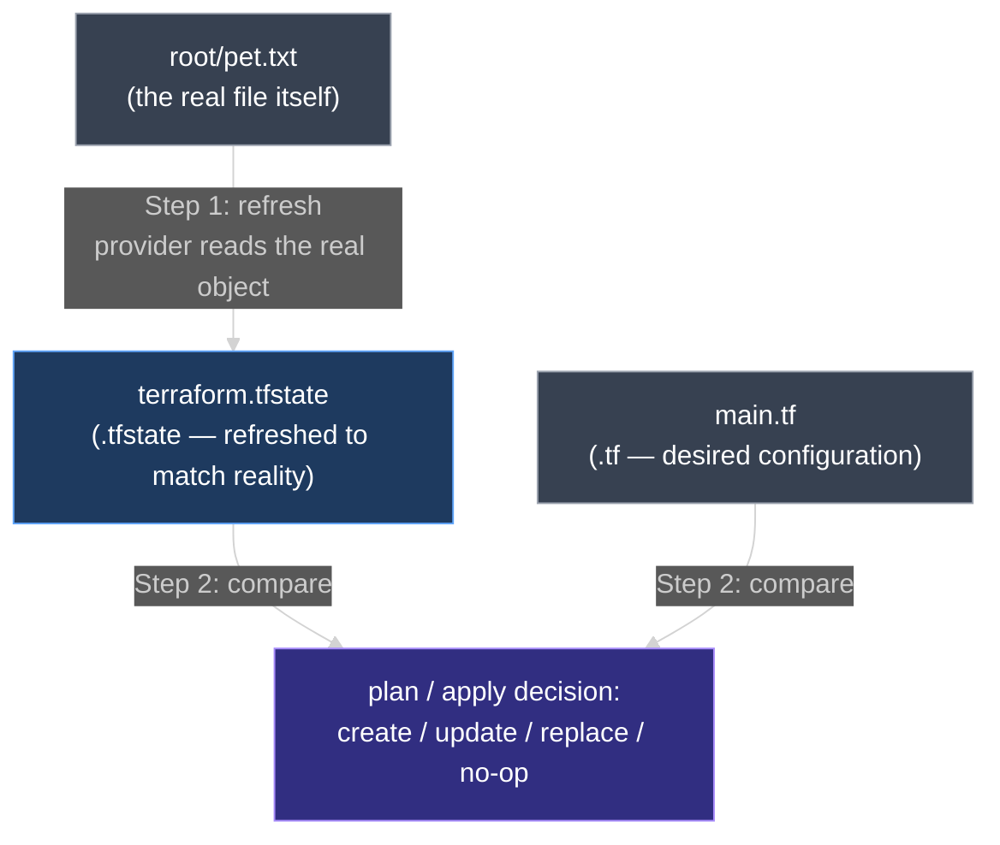
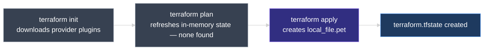
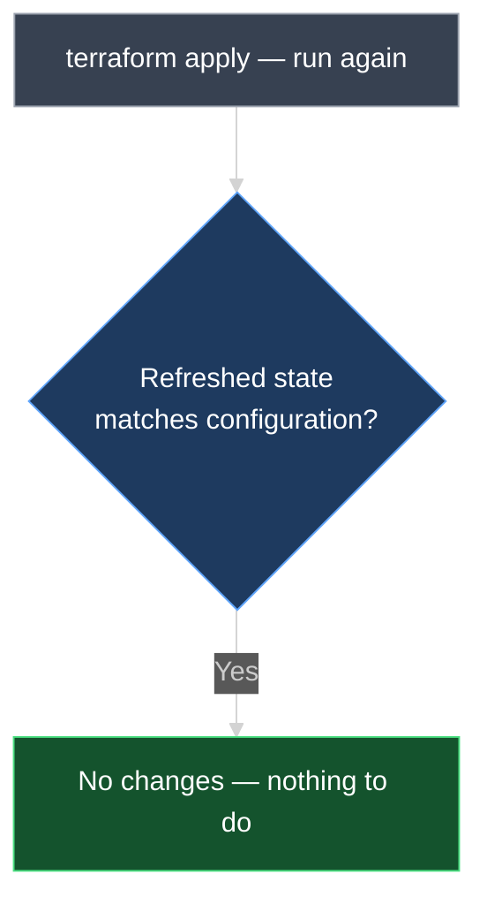
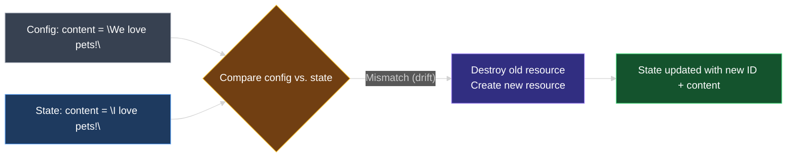

# Terraform State

Terraform state is the `terraform.tfstate` file Terraform writes behind the scenes. This document covers why it exists, exactly how it drives every `terraform plan` and `terraform apply`, and how Terraform uses it to recognize infrastructure it created long ago.

---

## 1. Recap: Where We Left Off

By now you know how to write configuration files with HCL, declare and use **variables**, use **reference expressions**, and link resources together with **dependencies**. All of that happens inside a configuration directory — for example, `terraform-local-file` — containing:

- **`main.tf`** — the resource block(s)
- **`variables.tf`** — the variable declarations used by `main.tf`

At this point, before running anything, the `local_file` resource described in `main.tf` does not exist anywhere — not in the directory, not in the "real world."

```hcl
resource "local_file" "pet" {
  filename = "root/pet.txt"
  content  = "I love pets!"
}
```

---

## 2. Why Terraform Needs a State File

Suppose the configuration above declared an **AWS EC2 instance** instead of a local file. `terraform apply` boots the instance once; a week later, `terraform plan` runs again with no changes to any `.tf` file. AWS has no concept of "created by `aws_instance.web`" — that label exists only in the configuration, never on the instance itself. Something has to remember, on Terraform's behalf, which real object belongs to which resource block. That something is state.

Every `plan` and `apply` is really answering one question — **what needs to change to make reality match the configuration?** — and that requires three separate pieces of information, only two of which exist for free:

| Source | Answers | File / extension | Written by |
| --- | --- | --- | --- |
| **Configuration** | What do you *want*? | `main.tf`, `variables.tf` — **`.tf`** files | You |
| **Real-world infrastructure** | What actually exists *right now*? | The real object itself — e.g. the file at `root/pet.txt`, or an EC2 instance running in AWS | The provider (disk, cloud API, etc.) |
| **State** | What did Terraform *itself* create, with which ID and attributes? | `terraform.tfstate` — the **`.tfstate`** file | Terraform |

Configuration alone can't say whether a resource already exists — every `plan` would look like a fresh `create`. The real world alone isn't reliable either, since most resource types expose no built-in way to prove "this object was created by this specific resource block." Terraform closes that gap with its **own persistent record** — state — mapping *"this resource block in my configuration"* to *"this specific object Terraform created."*

Configuration is never compared against the real world directly. Every `plan` and `apply` runs the same two steps, in this order:

1. **Refresh** — Terraform asks the provider to re-read the real-world object for every resource already recorded in `terraform.tfstate`, and updates its in-memory copy of that state data to match what it just read. Real-world data reaches Terraform only by flowing into state through this step.
2. **Compare** — Terraform compares the `.tf` configuration against that freshly refreshed state — never against the real-world object itself — to decide what to create, update, replace, or leave alone.



> **Rule to remember:** real-world data only reaches Terraform by being refreshed into `terraform.tfstate` first; configuration is then compared only against that refreshed `.tfstate` data. State sits strictly between configuration and the real world — a two-step pipeline, not a three-way free-for-all.

---

## 3. How Terraform Recognizes a Resource It Already Created

The refresh step depends on Terraform being able to find the exact real-world object it created previously, not merely something that looks similar. It does this with a stored identifying value, captured once at creation time.

For `local_file.pet`, that value is the **`filename`** — the resource's real-world address is its path on disk. Refresh asks the provider to check whether a file still exists at `root/pet.txt` and, if so, read its current content. For `aws_instance.web`, the identifying value is different: AWS assigns an opaque **instance ID** (e.g. `i-0abcd1234efgh5678`) the moment the instance launches, and Terraform stores that ID in state. Refresh then asks AWS to look up that exact instance ID — a `DescribeInstances` call filtered to it, not a scan of every instance in the account. Either way, the principle is the same: state stores whatever value the resource type uses as its real-world address, and refresh uses that stored value to look the object up again.

That lookup happens in one round trip, not one question per argument. A single Read call returns the object's **entire current attribute set** at once — for `aws_instance`, that means `ami`, `instance_type`, IP addresses, tags, everything, in one response. Terraform overwrites its whole in-memory copy of that resource's attributes from that one response; it never asks "does `instance_type` still say `t3.micro`?" as a separate question.

Two outcomes are possible:

- **Found** — the provider returns the object's current attributes. Terraform updates its in-memory state, and the resource is confirmed to still exist.
- **Not found** (for example, AWS returns `InvalidInstanceID.NotFound`) — Terraform concludes the resource no longer exists and removes it from the refreshed state.

Refresh always runs first and unconditionally, on every `plan` and `apply`, regardless of whether anything actually changed. Terraform has no way to know whether there's a difference until after refreshing — so the diff is *discovered* by the compare step that follows, never the reason refresh ran in the first place.

If someone terminates `aws_instance.web` by hand in the AWS Console, the next `plan` still follows the same sequence: refresh looks up the instance ID, gets back "not found," and updates state to show it's gone; compare then finds that `main.tf` still declares the instance should exist, while refreshed state says it doesn't. The plan reports a **create** — not "no changes" — using the exact mechanism that later catches a configuration edit like the `content` change in Section 9.

---

## 4. The Same Model on Real Infrastructure — EC2 and RDS PostgreSQL

This lesson's hands-on demo uses `local_file` and `random_pet` because they run without a cloud account, matching the rest of the course. The mechanics above apply unchanged to real infrastructure — for instance, an EC2 instance paired with an RDS PostgreSQL database:

```hcl
resource "aws_instance" "web" {
  ami           = "ami-0c101f26f147fa7fd"
  instance_type = "t3.micro"
}

resource "aws_db_instance" "app_db" {
  identifier        = "app-db"
  engine            = "postgres"
  instance_class    = "db.t3.micro"
  allocated_storage = 20
  username          = "app_user"
  password          = var.db_password
}
```

| Role | This lesson's demo | EC2 + RDS equivalent |
| --- | --- | --- |
| **`.tf` configuration** | `main.tf` declaring `local_file.pet` | `main.tf` declaring `aws_instance.web` and `aws_db_instance.app_db` |
| **Real-world object** | The `root/pet.txt` file on disk | The EC2 instance and RDS database running in AWS |
| **`.tfstate` record** | `local_file.pet`'s `id` (a content hash) | `aws_instance.web`'s `id` (e.g. `i-0abcd1234efgh5678`); `aws_db_instance.app_db`'s `id` |

Force-new behavior isn't universal, either. `local_file` treats every argument as force-new — any change destroys and recreates the file, as established in `07_Resource_Attributes_and_References.md`. `aws_instance` is less strict: changing `instance_type` can often apply in place, while changing `ami` forces replacement, since the machine image is baked in at launch. State is what lets Terraform tell, argument by argument, which kind of change it's looking at.

---

## 5. `terraform plan` Before Any State Exists

Running `terraform plan` for the first time starts by refreshing state in memory. Since this is the very first run, there is no state recorded at all — nothing to refresh. Terraform prints nothing related to a state refresh, because there's nothing to look up. From that absence, Terraform concludes that no resources are currently provisioned, and builds an execution plan of **create**:

```diff
  # local_file.pet will be created
  + resource "local_file" "pet" {
      + content              = "I love pets!"
      + filename             = "root/pet.txt"
      + id                   = (known after apply)
    }

Plan: 1 to add, 0 to change, 0 to destroy.
```

No state recorded yet means no resources exist yet, as far as Terraform is concerned — it never assumes; it only knows about infrastructure that appears in its state. `plan` never writes `terraform.tfstate` and never touches real infrastructure; it only reads, compares, and reports.

---

## 6. `terraform apply` Creates the Resource — and the State File

Running `terraform apply` follows the same first step: refresh in-memory state, find none, proceed with the create plan. Once confirmed, Terraform creates the `local_file` resource and assigns it a unique ID:

```text
local_file.pet: Creating...
local_file.pet: Creation complete after 0s [id=3fecf3d1e9a5a1226e6ac539ef1103f22e67e04b]

Apply complete! Resources: 1 added, 0 changed, 0 destroyed.
```

The file appears on disk with the expected content, and something else appears alongside it in the configuration directory: a new file called `terraform.tfstate`.



`terraform.tfstate` is not created until `terraform apply` runs at least once — `plan` alone never writes a state file, only `apply` does.

---

## 7. Running `apply` Again — Refresh Confirms Nothing Changed

Run `terraform apply` a second time, with no configuration changes:

```text
local_file.pet: Refreshing state... [id=3fecf3d1e9a5a1226e6ac539ef1103f22e67e04b]

No changes. Infrastructure is up-to-date.
```

| Source | What it says |
| --- | --- |
| **Configuration** | `content = "I love pets!"`, `filename = "root/pet.txt"` |
| **State** (after refresh) | `local_file.pet` exists, `id = 3fecf3d1e...`, same `content`/`filename` — the file on disk was read again and still matches |

Configuration and refreshed state agree, so Terraform recognizes the resource named `pet`, with the same ID already seen, exists exactly as configured — and takes no further action.



---

## 8. Inside `terraform.tfstate`

The state file is a JSON data structure mapping real-world infrastructure to the resource definitions in the configuration. It holds the complete record of everything Terraform has created. For the single `local_file.pet` resource, it records:

```json
{
  "version": 4,
  "terraform_version": "1.x.x",
  "resources": [
    {
      "mode": "managed",
      "type": "local_file",
      "name": "pet",
      "provider": "provider[\"registry.terraform.io/hashicorp/local\"]",
      "instances": [
        {
          "attributes": {
            "filename": "root/pet.txt",
            "content": "I love pets!",
            "id": "3fecf3d1e9a5a1226e6ac539ef1103f22e67e04b"
          }
        }
      ]
    }
  ]
}
```

| Part | What is it? |
| --- | --- |
| **`mode`** | `"managed"` means Terraform owns the full lifecycle of this resource, as opposed to a read-only data source |
| **`type`** | The resource type, e.g. `local_file` |
| **`name`** | The resource's logical name from the config, e.g. `pet` |
| **`provider`** | Which provider manages this resource |
| **`instances[].attributes`** | Every resource attribute — arguments set in configuration, plus computed values like `id` |

Terraform treats this file as the single source of truth for `plan` and `apply` — not merely a log of what happened, but the record it trusts over everything else, including the real-world infrastructure itself.

---

## 9. Changing the Configuration — Detecting Drift

Update `main.tf` so the `content` argument changes:

```hcl
resource "local_file" "pet" {
  filename = "root/pet.txt"
  content  = "We love pets!"
}
```

Rerunning `plan` or `apply` refreshes state, then compares:

| Source | `content` value |
| --- | --- |
| **Configuration** (what you want) | `"We love pets!"` |
| **State** (refreshed — the file on disk still reads this) | `"I love pets!"` |

Configuration disagrees with the refreshed state. That mismatch is exactly what Terraform is built to detect — the repo-wide term for it is **drift**: a difference between what's declared and what's actually recorded and deployed.

```diff
  # local_file.pet must be replaced
-/+ resource "local_file" "pet" {
      ~ content              = "I love pets!" -> "We love pets!" # forces replacement
      ~ id                   = "3fecf3d1e9a5a1226e6ac539ef1103f22e67e04b" -> (known after apply)
        filename             = "root/pet.txt"
    }

Plan: 1 to add, 0 to change, 1 to destroy.
```

Terraform decides the resource must be destroyed and recreated — recall from `07_Resource_Attributes_and_References.md` that every argument on `local_file` is force-new, so there is no in-place update path. Running `apply` updates both the real file and the state file:

```text
local_file.pet: Destroying... [id=3fecf3d1e9a5a1226e6ac539ef1103f22e67e04b]
local_file.pet: Destruction complete after 0s
local_file.pet: Creating...
local_file.pet: Creation complete after 0s [id=8a2f0e9d4b7c6a1f3e5d9c8b7a6f5e4d3c2b1a09]

Apply complete! Resources: 1 added, 0 changed, 1 destroyed.
```

The older resource ID disappears from `terraform.tfstate`; a new entry records the replacement's new ID and updated `content`.



Configuration and state are in sync again. With no difference remaining between them, a subsequent `plan` reports no changes.

---

## 10. State Is Always Created — It Is Non-Optional

This example uses a single resource, so the state file tracks a single entry. Real configurations often contain numerous resources across several providers. Regardless of infrastructure size:

- Terraform always creates a state file once you apply.
- Terraform always uses it to track the state of your infrastructure in the real world.
- Maintaining a state file is not optional — it is fundamental to how Terraform operates.

State is more than bookkeeping for a single-resource demo. Later lessons build on this same file to explain why it matters at scale — team collaboration, locking, performance — and what can go wrong if it's mishandled.

---

### Topic Summary: Terraform State

**Terraform state** is a JSON file (`terraform.tfstate`) Terraform creates the first time you run `apply`, mapping each configured resource to its real-world counterpart, ID, and attributes. Terraform needs it because neither configuration nor the real world alone can say what Terraform previously created — state is the missing map between the two, keyed by whatever identifying value each resource type exposes (an opaque provider-assigned ID for most cloud resources, or an identifying argument like `local_file`'s `filename`). Every `plan` or `apply` runs the same two-step, unconditional sequence: **refresh** state by re-reading the real-world object through the provider, then **compare** configuration against that refreshed state — never against the real world directly — to decide what to create, leave alone, or replace. When arguments **drift** between configuration and state, Terraform destroys the old resource and creates a new one, updating state to match. State is not a convenience feature; Terraform creates and relies on it for every configuration, regardless of size.

---

## Knowledge Check

Answer each question on your own first, then read the explanation below it.

---

### 1 · Why state exists at all

**Why can't Terraform just compare configuration directly against real-world infrastructure, without keeping a state file?**

> Neither side can answer the full question alone. Configuration only says what you *want*; it doesn't say what Terraform already created. Most resource types have no reliable, built-in way to prove "this real-world object was created by this specific resource block." State is the record that bridges the two.

---

### 2 · Why the first `plan` shows no state details

**Why does the very first `terraform plan` in a new configuration directory show nothing related to a state refresh?**

> Because no state file exists yet — `terraform.tfstate` is only created after the first `terraform apply`. With no state to refresh, Terraform assumes no resources are currently provisioned and plans a **create**.

---

### 3 · When the state file is created

**When does `terraform.tfstate` first appear in the configuration directory?**

> After the first successful `terraform apply`. `terraform plan` alone never creates it — `plan` only reads and compares, it does not write state.

---

### 4 · What "refreshing state" actually does

**What does Terraform mean when it says it's "refreshing state" before a plan or apply?**

> It asks the provider to re-read every resource already recorded in state — one Read call per resource, returning that resource's entire current attribute set at once — and updates its in-memory copy to match. This always happens *before* comparing state against configuration, and it happens unconditionally, whether or not anything actually changed.

---

### 5 · What the state file actually is

**What kind of file is `terraform.tfstate`, and what does it contain?**

> A JSON data structure mapping real-world infrastructure to the resources defined in configuration. It stores each resource's mode, type, logical name, provider, unique ID, and every attribute.

---

### 6 · Why a second `apply` does nothing

**If you run `terraform apply` twice in a row with no configuration changes, why does the second run make no changes?**

> Refresh finds the resource already recorded with a matching ID and attributes, and the freshly read real-world data agrees with both. Since configuration and refreshed state match, there is nothing to create, update, or destroy.

---

### 7 · Source of truth

**What does Terraform treat as its source of truth when running `plan` or `apply`?**

> The state file. Configuration is compared against what's recorded in state — refreshed against the real world first — never against real infrastructure directly.

---

### 8 · What happens on a configuration change

**If a resource argument in configuration (e.g., `content`) no longer matches what's recorded in state, what does Terraform do?**

> It detects the mismatch — drift — between configuration and refreshed state, plans to destroy the existing resource and create a new one (a replace), then updates state to reflect the new resource's ID and attributes.

---

### 9 · How Terraform finds a resource it created long ago

**A resource was created six months ago. How does the next `plan` determine whether it still exists — does Terraform search by name or tags?**

> Neither. State stores an identifying value for the resource — an opaque ID the provider assigned at creation for most cloud resources (e.g. an EC2 instance ID), or an identifying argument for others (`local_file`'s `filename`). Refresh looks the object up using that stored value; if the provider reports it missing, Terraform treats it as deleted, which is what turns into a **create** on the next plan.

---

### 10 · Is state optional?

**Is maintaining a state file optional for small configurations with only one or two resources?**

> No. Terraform always creates and relies on a state file after `apply`, regardless of how many resources or providers are involved. It is a fundamental, non-optional part of how Terraform works.

---

## FAQ

**Does the create call return just the ID, or more than that?**

> More than that. The provider's create call returns the resource's entire initial attribute set — the identifying value plus every other argument and computed value — and Terraform stores all of it in `terraform.tfstate`, not only the ID. The identifying value is what makes later lookups possible; the rest of the stored attributes are what later comparisons check against.

**Is the identifying value always a server-assigned ID?**

> No. Most cloud resources use an opaque ID the provider assigns at creation, independent of anything you configured — an EC2 instance ID, for example. Some resource types instead use an argument you chose as the real-world address: `local_file`'s `filename` is the file's path, and `aws_db_instance`'s `identifier` is both an input and the value AWS uses as the database's identity. Either way, state stores whatever value that resource type needs for the lookup to work.

**Does refresh check each argument separately?**

> No. It's a single Read call per resource, using the stored identifying value. That one response returns every current attribute of the real object at once, and Terraform overwrites its entire in-memory copy of that resource from it — not a separate round trip per argument.

**Does Terraform only refresh when it suspects something changed?**

> No. Refresh is unconditional — it runs at the start of every `plan` and `apply`, before any comparison, whether or not anything changed. Terraform cannot know whether there's a difference until after refreshing; the diff is what the *compare* step discovers, not what triggers refresh.

**What's the full sequence, end to end?**

> 1. **Create** (once) — the provider's create call returns an identifying value plus the resource's full initial attributes; Terraform stores all of it in `terraform.tfstate`.
> 2. **Refresh** (every later `plan`/`apply`, unconditionally) — Terraform uses the stored identifying value to make one Read call, which returns the object's current attributes in a single response, or reports it missing.
> 3. **Compare** (always runs after refresh) — Terraform checks the refreshed state's attribute values against what configuration declares, to decide: no changes, update in place, replace, or create.

---
