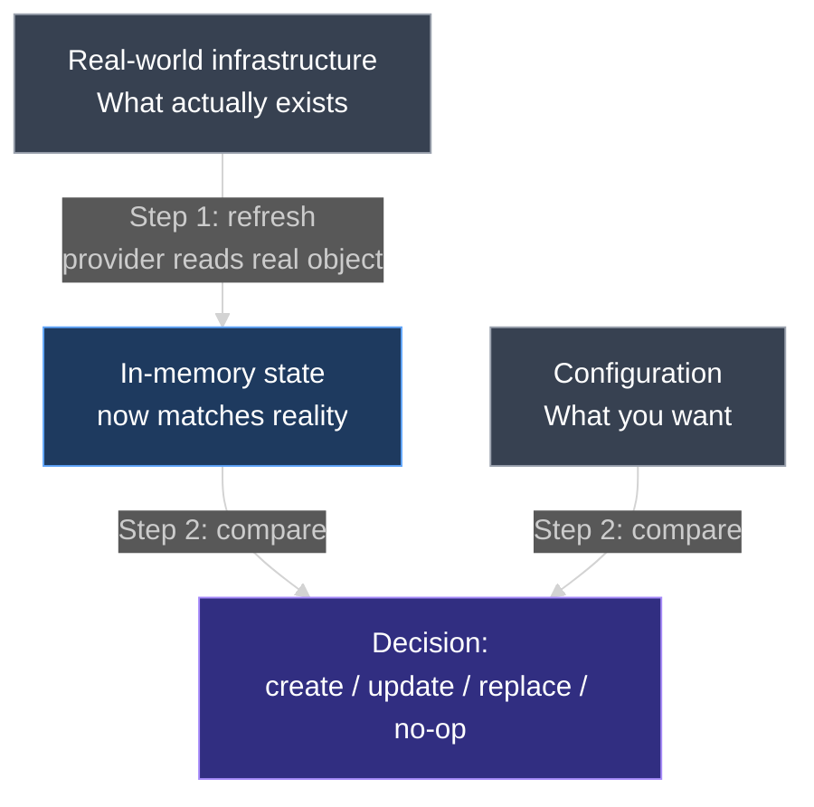
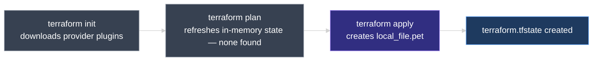
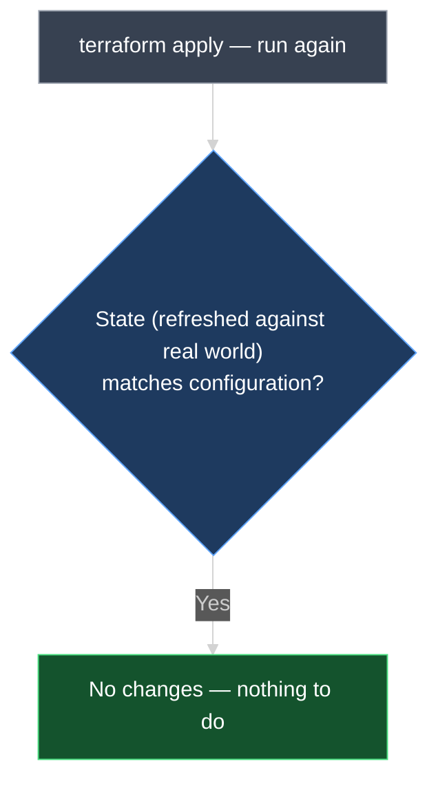
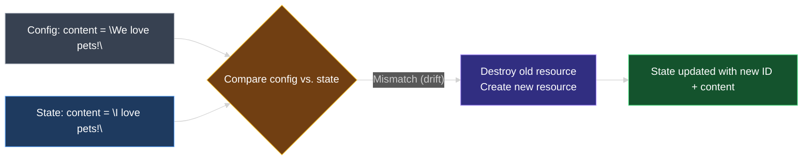

# Terraform State

This document explains **Terraform state** — the `terraform.tfstate` file Terraform creates behind the scenes, *why* Terraform needs it at all, and how it drives every `terraform plan` and `terraform apply` you run.

---

## 1. Recap: Where We Left Off

By now you know how to write configuration files with HCL, declare and use **variables**, use **reference expressions**, and link resources together with **dependencies**. All of that happens inside a configuration directory — for example, `terraform-local-file` — containing:

- **`main.tf`** — the resource block(s)
- **`variables.tf`** — the variable declarations used by `main.tf`

At this point, before running anything, the `local_file` resource described in `main.tf` does not exist anywhere — not in the directory, not in the "real world."

```hcl
resource "local_file" "pet" {
  filename = "root/pet.txt"
  content  = "I love pets!"
}
```

---

## 2. Why Terraform Needs a State File

Before walking through the demo, it helps to understand the problem state actually solves.

Terraform's job, every time you run `plan` or `apply`, is to answer one question: **"What do I need to change to make reality match my configuration?"** To answer that, Terraform needs three pieces of information — and only has two of them for free:

| Source | Answers | Where it lives |
| --- | --- | --- |
| **Configuration** | What do you *want*? (desired state) | `main.tf`, `variables.tf`, … — written by you |
| **Real-world infrastructure** | What actually exists *right now*? | The cloud provider, disk, API, etc. |
| **State** | What did Terraform *itself* create, with which ID and attributes? | `terraform.tfstate` — written by Terraform |

Configuration alone can't tell Terraform whether a resource already exists — every `plan` would look like a fresh `create`. And the real world alone isn't reliable either: most resource types have no built-in, guaranteed-unique way to match "the thing sitting in the cloud" back to "the resource block in my `.tf` file." A `local_file` resource, for instance, doesn't expose anything that says "I was created by Terraform's `local_file.pet` block."

So Terraform keeps its **own persistent record** — the state file — as the map between *"this resource block in my configuration"* and *"this specific object Terraform created."*

Here's the part that's easy to miss: **configuration is never compared to the real world directly.** Every `plan` and `apply` follows the same two-step sequence, in this exact order:

1. **Refresh** — Terraform asks each provider to **Read** the real-world object for every resource already in state, and updates its **in-memory copy of state** to match what it just read. Real-world data only ever enters the picture *through* this step, flowing *into* state.
2. **Compare** — Terraform compares your **configuration** against that freshly-refreshed **state** — not against the real world itself — to decide what to create, update, replace, or leave alone.



> **Rule to remember:** Terraform never compares your configuration straight against the real world. Real-world data only reaches Terraform by being **refreshed into state** first (step 1); your configuration is then compared only against that **refreshed state** (step 2). That's what "state sits between configuration and the real world" means — it's a strict two-step pipeline, not a three-way free-for-all.

---

## 3. `terraform plan` Before Any State Exists

Running `terraform plan` for the first time starts by trying to **refresh state in-memory**. "Refreshing" means Terraform asks the provider to re-**Read** every resource currently recorded in state, so its in-memory copy reflects reality before it compares anything to your configuration.

Since this is the very first run, **there is no state recorded at all** — nothing to refresh. Terraform prints nothing related to a state refresh, because there's nothing to look up. From that absence, Terraform concludes that **no resources are currently provisioned**, and builds an execution plan of **create**:

```diff
  # local_file.pet will be created
  + resource "local_file" "pet" {
      + content              = "I love pets!"
      + filename             = "root/pet.txt"
      + id                   = (known after apply)
    }

Plan: 1 to add, 0 to change, 0 to destroy.
```

> **No state recorded yet means no resources exist yet — in Terraform's eyes.** Terraform never assumes; it only knows about infrastructure that appears in its state.

**What `plan` does *not* do:** it never writes `terraform.tfstate` and never touches real infrastructure. It only reads (refreshes), compares, and reports.

---

## 4. `terraform apply` Creates the Resource — and the State File

Running `terraform apply` follows the same first step: try to refresh in-memory state, find none, and proceed with the **create** plan. Once you confirm, Terraform creates the `local_file` resource and assigns it a **unique ID**:

```text
local_file.pet: Creating...
local_file.pet: Creation complete after 0s [id=3fecf3d1e9a5a1226e6ac539ef1103f22e67e04b]

Apply complete! Resources: 1 added, 0 changed, 0 destroyed.
```

The file is created on disk with the expected content. But something else also appears in the configuration directory: a new file called **`terraform.tfstate`**.



> **`terraform.tfstate` is not created until `terraform apply` runs at least once.** `terraform plan` alone never writes a state file — it only reads and compares.

---

## 5. Running `apply` Again — the Three-Way Compare in Action

Run `terraform apply` a second time, with no configuration changes:

```text
local_file.pet: Refreshing state... [id=3fecf3d1e9a5a1226e6ac539ef1103f22e67e04b]

No changes. Infrastructure is up-to-date.
```

Walk through what just happened, using the same three sources from Section 2:

| Source | What it says |
| --- | --- |
| **Configuration** | `content = "I love pets!"`, `filename = "root/pet.txt"` |
| **State** | Resource `local_file.pet` exists, `id = 3fecf3d1e...`, same `content`/`filename` |
| **Real world** (after refresh) | The actual file on disk still has that same content |

All three agree — so Terraform recognizes that the resource named `pet`, with the **same ID** already seen, exists exactly as configured, and takes **no further action**.



---

## 6. Inside `terraform.tfstate`

The **state file** is a **JSON data structure** that maps real-world infrastructure resources to the resource definitions in your configuration files. It holds the complete record of everything Terraform has created.

For the single `local_file.pet` resource, the state file records:

```json
{
  "version": 4,
  "terraform_version": "1.x.x",
  "resources": [
    {
      "mode": "managed",
      "type": "local_file",
      "name": "pet",
      "provider": "provider[\"registry.terraform.io/hashicorp/local\"]",
      "instances": [
        {
          "attributes": {
            "filename": "root/pet.txt",
            "content": "I love pets!",
            "id": "3fecf3d1e9a5a1226e6ac539ef1103f22e67e04b"
          }
        }
      ]
    }
  ]
}
```

| Part | What is it? |
| --- | --- |
| **`mode`** | `"managed"` means Terraform owns the full lifecycle of this resource (as opposed to a read-only data source) |
| **`type`** | The resource type, e.g. `local_file` |
| **`name`** | The resource's logical name from the config, e.g. `pet` |
| **`provider`** | Which provider manages this resource |
| **`instances[].attributes`** | Every resource attribute — arguments you set plus computed values like `id` |

> Terraform uses this file as the **single source of truth** for `terraform plan` and `terraform apply` — not just a log of what happened, but the record Terraform trusts over everything else, including the real-world infrastructure itself.

---

## 7. Changing the Configuration — Config vs. State vs. Reality

Now update `main.tf` so the `content` argument changes:

```hcl
resource "local_file" "pet" {
  filename = "root/pet.txt"
  content  = "We love pets!"
}
```

Rerun `terraform plan` or `terraform apply`. Terraform again refreshes state, then compares all three sources:

| Source | `content` value |
| --- | --- |
| **Configuration** (what you want) | `"We love pets!"` |
| **State** (what Terraform last recorded) | `"I love pets!"` |
| **Real world** (refreshed — the actual file on disk) | `"I love pets!"` |

Configuration disagrees with state (and reality). That mismatch is exactly what Terraform is designed to detect — the repo-wide term for this is **drift**: a difference between what's declared and what's actually recorded/deployed.

```diff
  # local_file.pet must be replaced
-/+ resource "local_file" "pet" {
      ~ content              = "I love pets!" -> "We love pets!" # forces replacement
      ~ id                   = "3fecf3d1e9a5a1226e6ac539ef1103f22e67e04b" -> (known after apply)
        filename             = "root/pet.txt"
    }

Plan: 1 to add, 0 to change, 1 to destroy.
```

Terraform decides the resource must be **destroyed and recreated** (recall from `07_Resource_Attributes_and_References.md` that `local_file`'s arguments are all force-new — there is no in-place update path). Running `apply` updates both the real file and the state file:

```text
local_file.pet: Destroying... [id=3fecf3d1e9a5a1226e6ac539ef1103f22e67e04b]
local_file.pet: Destruction complete after 0s
local_file.pet: Creating...
local_file.pet: Creation complete after 0s [id=8a2f0e9d4b7c6a1f3e5d9c8b7a6f5e4d3c2b1a09]

Apply complete! Resources: 1 added, 0 changed, 1 destroyed.
```

The older resource ID is gone from `terraform.tfstate`; a new entry records the replaced resource's new ID and updated `content`.



At this point, configuration and state are **in sync** again. Since there is no longer any difference between them, a subsequent `plan` reports no changes.

---

## 8. State Is Always Created — It Is Non-Optional

This example uses a single resource, so the state file tracks a single entry. In a real-world scenario, a configuration may contain **numerous resources across several different providers**. Regardless of how large or small the infrastructure is:

- Terraform **always** creates a state file once you apply.
- Terraform **always** uses it to track the state of your infrastructure in the real world.
- Maintaining a state file is **not optional** — it is fundamental to how Terraform operates.

State is more than bookkeeping for a single-resource demo like this one — later lessons build on this same file to explain why state matters at scale (team collaboration, locking, performance) and what can go wrong if it's mishandled.

---

### Topic Summary: Terraform State

**Terraform state** is a JSON file (`terraform.tfstate`) that Terraform creates the first time you run `terraform apply`, mapping each resource in your configuration to its real-world counterpart, ID, and attributes. Terraform needs it because neither your configuration nor the real world alone can tell it what it previously created — state is the missing map between the two. Before any `apply`, there is no state and Terraform assumes nothing is provisioned; every subsequent `plan` or `apply` **refreshes** state (re-reading real-world resources through the provider) and compares all three sources — configuration, state, and reality — to decide what to create, leave alone, or replace. When a resource's arguments **drift** between configuration and state, Terraform destroys the old resource and creates a new one, updating the state file to match. State is not a convenience feature — Terraform creates and relies on it for every configuration, regardless of size.

---

## Knowledge Check

Answer each question on your own first, then read the explanation below it.

---

### 1 · Why state exists at all

**Why can't Terraform just compare your configuration directly against the real-world infrastructure, without keeping a state file?**

> Because neither side can answer the full question on its own. Configuration only says what you *want*; it doesn't say what Terraform already created. And most resource types have no reliable, built-in way to prove "this real-world object was created by this specific resource block." Terraform's own **state file** is the record that bridges the two, tracking IDs and attributes it can trust.

---

### 2 · Why the first `plan` shows no state details

**Why does the very first `terraform plan` in a new configuration directory show nothing related to a state refresh?**

> Because **no state file exists yet** — `terraform.tfstate` is only created after the first `terraform apply`. With no state to refresh, Terraform assumes no resources are currently provisioned and plans a **create**.

---

### 3 · When the state file is created

**When does `terraform.tfstate` first appear in the configuration directory?**

> After the **first successful `terraform apply`**. Running `terraform plan` alone never creates it — `plan` only reads and compares, it does not write state.

---

### 4 · What "refreshing state" actually does

**What does Terraform mean when it says it's "refreshing state" before a plan or apply?**

> It means Terraform asks each provider to **re-read** every resource already recorded in state, updating its in-memory copy to match current reality. This happens *before* Terraform compares state against your configuration — so the comparison uses up-to-date information, not stale data from the last apply.

---

### 5 · What the state file actually is

**What kind of file is `terraform.tfstate`, and what does it contain?**

> It is a **JSON data structure** that maps real-world infrastructure to the resources defined in your configuration. It stores each resource's mode, type, logical name, provider, unique ID, and every resource attribute.

---

### 6 · Why a second `apply` does nothing

**If you run `terraform apply` twice in a row with no configuration changes, why does the second run make no changes?**

> Terraform refreshes state and finds the resource **already recorded** with a matching ID and matching attributes, and the refreshed real-world data agrees. Since configuration, state, and reality all agree, there is nothing to create, update, or destroy.

---

### 7 · Source of truth

**What does Terraform treat as its source of truth when running `plan` or `apply`?**

> The **state file**. Terraform compares your configuration against what is recorded in state (refreshed against the real world) — not just against the real infrastructure directly.

---

### 8 · What happens on a configuration change

**If you change a resource argument in the configuration (e.g., `content`) so it no longer matches what's recorded in state, what does Terraform do?**

> It detects the mismatch — **drift** — between configuration and state, and creates a plan to **destroy the existing resource and create a new one** (a "replace"), then updates the state file to reflect the new resource's ID and attributes.

---

### 9 · Is state optional?

**Is maintaining a state file optional for small configurations with only one or two resources?**

> **No.** Terraform always creates and relies on a state file after `apply`, regardless of how many resources or providers are involved. It is a fundamental, non-optional part of how Terraform works.

---
