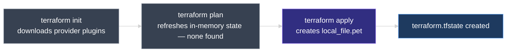
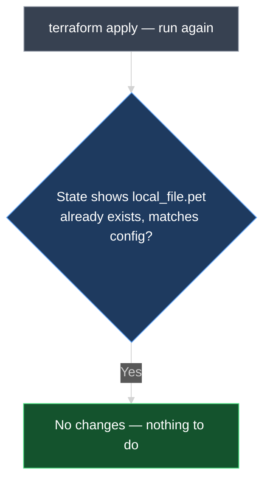
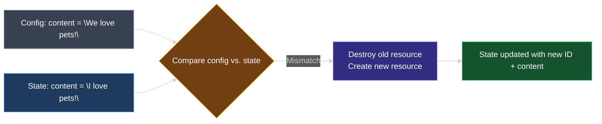

# Terraform State

This document explains **Terraform state** — the `terraform.tfstate` file Terraform creates behind the scenes, why it exists, and how it drives every `terraform plan` and `terraform apply` you run.

---

## 1. Recap: The Workflow Before State

By now you know how to write configuration files with HCL, declare and use **variables**, use **reference expressions**, and link resources together with **dependencies**. All of that happens inside a configuration directory — for example, `terraform-local-file` — containing:

- **`main.tf`** — the resource block(s)
- **`variables.tf`** — the variable declarations used by `main.tf`

At this point, before running anything, the `local_file` resource described in `main.tf` does not exist anywhere — not in the directory, not in the "real world."

```hcl
resource "local_file" "pet" {
  filename = "root/pet.txt"
  content  = "I love pets!"
}
```

---

## 2. `terraform plan` Before Any State Exists

Running `terraform plan` for the first time starts by trying to **refresh state in-memory** — Terraform's way of checking what it currently believes is deployed before comparing that against your configuration.

Since this is the very first run, there is **no state recorded** at all. Terraform prints nothing related to a state refresh, because there is nothing to refresh. From this absence, Terraform concludes that **no resources are currently provisioned**, and builds an execution plan of **create**:

```diff
  # local_file.pet will be created
  + resource "local_file" "pet" {
      + content              = "I love pets!"
      + filename             = "root/pet.txt"
      + id                   = (known after apply)
    }

Plan: 1 to add, 0 to change, 0 to destroy.
```

> **No state recorded yet means no resources exist yet — in Terraform's eyes.** Terraform never assumes; it only knows about infrastructure that appears in its state.

---

## 3. `terraform apply` Creates the Resource — and the State File

Running `terraform apply` follows the same first step: try to refresh in-memory state, find none, and proceed with the **create** plan. Once you confirm, Terraform creates the `local_file` resource and assigns it a **unique ID**:

```text
local_file.pet: Creating...
local_file.pet: Creation complete after 0s [id=3fecf3d1e9a5a1226e6ac539ef1103f22e67e04b]

Apply complete! Resources: 1 added, 0 changed, 0 destroyed.
```

The file is created on disk with the expected content. But something else also appears in the configuration directory: a new file called **`terraform.tfstate`**.



> **`terraform.tfstate` is not created until `terraform apply` runs at least once.** `terraform plan` alone never writes a state file — it only reads and compares.

---

## 4. Running `apply` Again — Terraform Already Knows

Run `terraform apply` a second time, with no configuration changes. Terraform recognizes that a `local_file` resource named `pet`, with the **same ID** already seen, exists — and takes **no further action**:

```text
local_file.pet: Refreshing state... [id=3fecf3d1e9a5a1226e6ac539ef1103f22e67e04b]

No changes. Infrastructure is up-to-date.
```

How does Terraform know? It checks the contents of **`terraform.tfstate`**.



---

## 5. Inside `terraform.tfstate`

The **state file** is a **JSON data structure** that maps real-world infrastructure resources to the resource definitions in your configuration files. It holds the complete record of everything Terraform has created.

For the single `local_file.pet` resource, the state file records:

```json
{
  "version": 4,
  "terraform_version": "1.x.x",
  "resources": [
    {
      "mode": "managed",
      "type": "local_file",
      "name": "pet",
      "provider": "provider[\"registry.terraform.io/hashicorp/local\"]",
      "instances": [
        {
          "attributes": {
            "filename": "root/pet.txt",
            "content": "I love pets!",
            "id": "3fecf3d1e9a5a1226e6ac539ef1103f22e67e04b"
          }
        }
      ]
    }
  ]
}
```

| Part | What is it? |
| --- | --- |
| **`type`** | The resource type, e.g. `local_file` |
| **`name`** | The resource's logical name from the config, e.g. `pet` |
| **`provider`** | Which provider manages this resource |
| **`instances[].attributes`** | Every resource attribute — arguments you set plus computed values like `id` |

> Terraform uses this file as the **single source of truth** for `terraform plan` and `terraform apply` — not just a log of what happened, but the record Terraform trusts over everything else, including the real-world infrastructure itself.

---

## 6. Changing the Configuration — Config vs. State vs. Reality

Now update `main.tf` so the `content` argument changes:

```hcl
resource "local_file" "pet" {
  filename = "root/pet.txt"
  content  = "We love pets!"
}
```

Rerun `terraform plan` or `terraform apply`. Terraform again refreshes state, then compares it against the configuration. It finds that the **`content`** argument differs between the two:

- **Configuration** says `content = "We love pets!"`
- **State** (and the real file) still shows `content = "I love pets!"`

```diff
  # local_file.pet must be replaced
-/+ resource "local_file" "pet" {
      ~ content              = "I love pets!" -> "We love pets!" # forces replacement
      ~ id                   = "3fecf3d1e9a5a1226e6ac539ef1103f22e67e04b" -> (known after apply)
        filename             = "root/pet.txt"
    }

Plan: 1 to add, 0 to change, 1 to destroy.
```

Terraform decides the resource must be **destroyed and recreated**. Running `apply` updates both the real file and the state file:

```text
local_file.pet: Destroying... [id=3fecf3d1e9a5a1226e6ac539ef1103f22e67e04b]
local_file.pet: Destruction complete after 0s
local_file.pet: Creating...
local_file.pet: Creation complete after 0s [id=8a2f0e9d4b7c6a1f3e5d9c8b7a6f5e4d3c2b1a09]

Apply complete! Resources: 1 added, 0 changed, 1 destroyed.
```

The older resource ID is gone from `terraform.tfstate`; a new entry records the replaced resource's new ID and updated `content`.



At this point, configuration and state are **in sync** again. Since there is no longer any difference between them, a subsequent `plan` reports no changes.

---

## 7. State Is Always Created — It Is Non-Optional

This example uses a single resource, so the state file tracks a single entry. In a real-world scenario, a configuration may contain **numerous resources across several different providers**. Regardless of how large or small the infrastructure is:

- Terraform **always** creates a state file once you apply.
- Terraform **always** uses it to track the state of your infrastructure in the real world.
- Maintaining a state file is **not optional** — it is fundamental to how Terraform operates.

---

### Topic Summary: Terraform State

**Terraform state** is a JSON file (`terraform.tfstate`) that Terraform creates the first time you run `terraform apply`, mapping each resource in your configuration to its real-world counterpart, ID, and attributes. Before any `apply`, there is no state and Terraform assumes nothing is provisioned; every subsequent `plan` or `apply` **refreshes** the state and compares it against your configuration to decide what to create, leave alone, or replace. When a resource's arguments differ between configuration and state, Terraform destroys the old resource and creates a new one, updating the state file to match. State is not a convenience feature — Terraform creates and relies on it for every configuration, regardless of size.

---

## Knowledge Check

Answer each question on your own first, then read the explanation below it.

---

### 1 · Why the first `plan` shows no state details

**Why does the very first `terraform plan` in a new configuration directory show nothing related to a state refresh?**

> Because **no state file exists yet** — `terraform.tfstate` is only created after the first `terraform apply`. With no state to refresh, Terraform assumes no resources are currently provisioned and plans a **create**.

---

### 2 · When the state file is created

**When does `terraform.tfstate` first appear in the configuration directory?**

> After the **first successful `terraform apply`**. Running `terraform plan` alone never creates it — `plan` only reads and compares, it does not write state.

---

### 3 · What the state file actually is

**What kind of file is `terraform.tfstate`, and what does it contain?**

> It is a **JSON data structure** that maps real-world infrastructure to the resources defined in your configuration. It stores the resource type, logical name, provider, unique ID, and every resource attribute.

---

### 4 · Why a second `apply` does nothing

**If you run `terraform apply` twice in a row with no configuration changes, why does the second run make no changes?**

> Terraform refreshes state and finds the resource **already recorded** with a matching ID and matching attributes. Since configuration and state agree, there is nothing to create, update, or destroy.

---

### 5 · Source of truth

**What does Terraform treat as its source of truth when running `plan` or `apply`?**

> The **state file**. Terraform compares your configuration against what is recorded in state (refreshed against the real world) — not just against the real infrastructure directly.

---

### 6 · What happens on a configuration change

**If you change a resource argument in the configuration (e.g., `content`) so it no longer matches what's recorded in state, what does Terraform do?**

> It detects the **mismatch** between configuration and state and creates a plan to **destroy the existing resource and create a new one** (a "replace"), then updates the state file to reflect the new resource's ID and attributes.

---

### 7 · Is state optional?

**Is maintaining a state file optional for small configurations with only one or two resources?**

> **No.** Terraform always creates and relies on a state file after `apply`, regardless of how many resources or providers are involved. It is a fundamental, non-optional part of how Terraform works.

---
