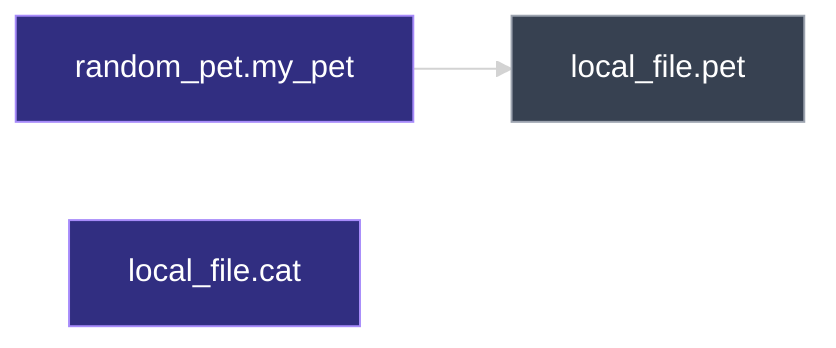
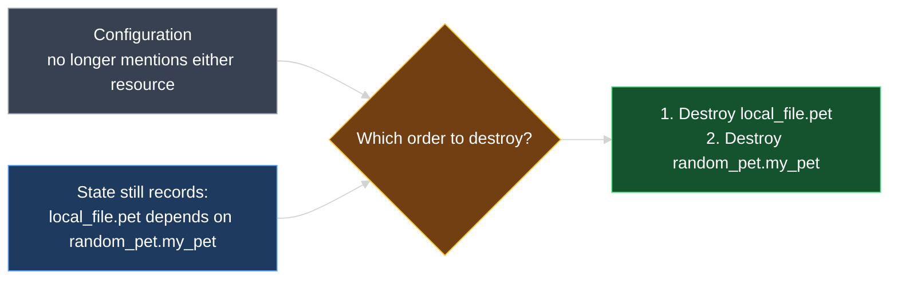
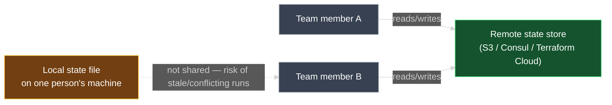

# Purpose of Terraform State

This document explains **why** Terraform state matters beyond just "it exists" — the four concrete jobs it does: mapping resources to the real world, tracking dependency metadata, improving performance, and enabling team collaboration.

---

## 1. Recap: State Is a Blueprint

`01_Terraform_State.md` showed **how** `terraform.tfstate` maps your configuration to real-world infrastructure and how Terraform compares configuration, state, and reality to build an execution plan whenever **drift** is detected.

Because of that mapping, the state file can be thought of as a **blueprint** of every resource Terraform manages out in the real world. Every time Terraform creates a resource, it records that resource's identity in state — regardless of what kind of resource it is:

| Resource | What gets created | Still gets a unique ID in state? |
| --- | --- | --- |
| `local_file` | A real file on disk | Yes |
| `random_pet` | Nothing external — just generates a name in memory (a **logical resource**) | Yes |
| A cloud resource (e.g., a VM, a bucket) | A real object in a cloud provider | Yes |

> **Rule to remember:** It doesn't matter whether a resource touches disk, a cloud API, or nothing external at all — if Terraform manages it, it gets a unique ID recorded in state. State tracks *everything* Terraform is responsible for, not just "real" infrastructure.

With that foundation, this lesson covers four purposes state serves beyond the basic mapping.

---

## 2. Purpose 1 — Tracking Dependency Metadata

Besides mapping resources to reality, the state file also records **metadata** — including **resource dependencies**. Recall from `08_Resource_Dependencies.md` that Terraform supports two kinds:

- **Implicit dependency** — inferred from a reference expression (e.g., `${random_pet.my_pet.id}` inside another resource's argument)
- **Explicit dependency** — declared with `depends_on`

### Example configuration — three resources

```hcl
resource "random_pet" "my_pet" {
  prefix    = "Mr"
  separator = "-"
  length    = 2
}

resource "local_file" "pet" {
  filename = "root/pet.txt"
  content  = "My favorite pet is ${random_pet.my_pet.id}"
}

resource "local_file" "cat" {
  filename = "root/cat.txt"
  content  = "My favorite pet is Mr. Cat"
}
```

| Resource | Depends on | Why |
| --- | --- | --- |
| `local_file.pet` | `random_pet.my_pet` | References `random_pet.my_pet.id` in `content` — implicit dependency |
| `local_file.cat` | Nothing | No reference to any other resource — fully independent |

### Create order

`local_file.cat` and `random_pet.my_pet` share **no dependency relationship**, so Terraform creates them **in parallel**. `local_file.pet` must wait, because it needs `random_pet.my_pet`'s `.id` first:



```text
random_pet.my_pet: Creating...
local_file.cat: Creating...
local_file.cat: Creation complete after 0s [id=...]
random_pet.my_pet: Creation complete after 0s [id=mr-faithful-bull]
local_file.pet: Creating...
local_file.pet: Creation complete after 0s [id=...]
```

`random_pet.my_pet` and `local_file.cat` finish first (in either order, since they run concurrently); only then does `local_file.pet` start.

---

## 3. Purpose 1, Continued — Why State Remembers Dependencies After You Delete Them

Up to this point, nothing here needed state to decide creation order — Terraform read the dependency straight out of the **configuration's** reference expressions. But watch what happens when the configuration itself no longer contains that information.

### Removing resources from the configuration

Suppose you now delete both `random_pet.my_pet` and `local_file.pet` from `main.tf`, leaving only `local_file.cat`:

```hcl
resource "local_file" "cat" {
  filename = "root/cat.txt"
  content  = "My favorite pet is Mr. Cat"
}
```

Run `terraform apply`. Terraform detects both resources are missing from configuration but still present in state, so it plans to **destroy** them. But destroying resources in the wrong order can fail — you can't always safely tear down `random_pet.my_pet` before something that depends on it is gone. **Which one goes first?**

The configuration can no longer answer that — the reference expression that used to declare the dependency is gone along with the resource blocks. **This is exactly where state's tracked metadata matters.** The dependency edge (`local_file.pet` depends on `random_pet.my_pet`) is still recorded inside `terraform.tfstate` from when the resources were created, even though it no longer appears anywhere in `.tf` files.

Terraform reads that metadata from state and reverses it for deletion — **dependents before dependencies** — the same destroy-order rule from `08_Resource_Dependencies.md`, now driven by state instead of configuration:



```text
local_file.pet: Destroying... [id=...]
local_file.pet: Destruction complete after 0s
random_pet.my_pet: Destroying... [id=mr-faithful-bull]
random_pet.my_pet: Destruction complete after 0s

Apply complete! Resources: 0 added, 0 changed, 2 destroyed.
```

`local_file.cat` is untouched throughout, since it never depended on either removed resource and is still present in configuration.

> **Rule to remember:** Reference expressions in configuration establish a dependency, but it's the **state file** that continues to remember it — even after the configuration lines that created it are gone. Without that stored metadata, Terraform would have no reliable way to pick a safe destroy order.

---

## 4. Purpose 2 — Performance

Reconciling state against real-world infrastructure (the **refresh** step from `01_Terraform_State.md`) means asking every provider to re-read every tracked resource. For a handful of resources, that's fast enough to do before every single `plan` or `apply`.

Real infrastructure is rarely that small. Production configurations can manage **hundreds or thousands of resources**, spread across **multiple providers** — especially cloud providers. Fetching current details for every one of them, on every command, can take **several seconds to several minutes**. At that scale, refreshing on every operation becomes too slow to be practical.

To solve this, Terraform treats the state file itself as a **cache of attribute values** for every managed resource — a record it can trust **without** reconciling against the real world every time.

### Skipping the refresh: `-refresh=false`

You can tell Terraform to rely purely on its cached state and skip the real-world reconciliation step with the **`-refresh=false`** flag on any command that uses state:

```bash
terraform plan -refresh=false
```

With this flag, Terraform does **not** print a "Refreshing state..." step. It compares your configuration directly against the **cached attributes already in state** — no calls out to the real world at all. If, for example, `content` has changed in configuration since the last apply, the plan still correctly shows a **replacement**, because that comparison only ever needed the cached state values, not a fresh read:

```diff
  # local_file.pet must be replaced
-/+ resource "local_file" "pet" {
      ~ content  = "I love pets!" -> "We love pets!" # forces replacement
        filename = "root/pet.txt"
    }

Plan: 1 to add, 0 to change, 1 to destroy.
```

| | Normal `plan` / `apply` | `plan -refresh=false` |
| --- | --- | --- |
| Refreshes state from real world first? | Yes | **No** |
| Source compared against configuration | State, after being refreshed | State, as cached — no real-world check |
| Best for | Accuracy — catching drift from outside Terraform | Speed — large infrastructures, frequent runs |

> **Trade-off:** skipping refresh is faster, but it means Terraform won't notice if something changed the real resource **outside** of Terraform since the last refresh. Use it deliberately, not as a default habit.

---

## 5. Purpose 3 — Team Collaboration

By default, `terraform.tfstate` lives as a plain file **inside your configuration directory** — on whichever machine ran `terraform apply`. That's fine while learning or working solo on small projects. It breaks down the moment more than one person needs to run Terraform against the same infrastructure.

Working as a team with a local state file requires:

- Every team member to have the **latest** state data before running Terraform.
- Making sure **nobody else runs Terraform at the same time** against that same state.

Fail either of those, and the result is **unpredictable errors** — two people applying against different, stale copies of state can each make decisions the other doesn't know about, corrupting the shared picture of what's actually deployed.

### The fix: remote state

Instead of keeping state as a local file, teams store it in a **remote data store** that everyone accesses securely and consistently:

| Remote state store | Type |
| --- | --- |
| **Amazon S3** | Cloud object storage |
| **HashiCorp Consul** | Distributed key-value store |
| **Terraform Cloud** | HashiCorp's managed Terraform service |



Remote state stores are covered in depth in a later section, and Terraform Cloud gets its own dedicated section as well — for now, the key idea is: **local state does not scale past one person.**

---

## 6. Hands-On Lab

In a configuration directory:

1. Define **`random_pet.my_pet`**, **`local_file.pet`** (referencing `random_pet.my_pet.id`), and **`local_file.cat`** (no reference) as shown in Section 2.
2. Run **`terraform apply`** — confirm `random_pet.my_pet` and `local_file.cat` create without waiting on each other, and `local_file.pet` creates last.
3. Remove `random_pet.my_pet` and `local_file.pet` from the configuration, leaving only `local_file.cat`.
4. Run **`terraform apply`** again — confirm `local_file.pet` is destroyed **before** `random_pet.my_pet`, and `local_file.cat` is left alone.
5. Recreate all three resources. Change `content` on `local_file.pet`, then run **`terraform plan -refresh=false`** — confirm there is no "Refreshing state..." line, and the plan still correctly shows a replacement.
6. Inspect `terraform.tfstate` after step 2 and locate the dependency metadata for `local_file.pet`.

---

### Topic Summary: Purpose of Terraform State

Terraform state serves **four** purposes beyond simply existing. It acts as a **blueprint**, recording a unique ID for every resource Terraform manages — logical resources like `random_pet` included, not just resources with real-world footprints. It **tracks dependency metadata**, so Terraform still knows the correct destroy order even after the configuration lines that created a dependency have been removed. It boosts **performance** by acting as a cache of attribute values Terraform can trust without reconciling against real infrastructure on every command (skippable via `-refresh=false`). And it enables **team collaboration** — but only when moved out of a single person's local file and into a **remote state store** like S3, Consul, or Terraform Cloud, since concurrent or stale local runs produce unpredictable errors.

---

## Knowledge Check

Answer each question on your own first, then read the explanation below it.

---

### 1 · State as a blueprint

**Does a "logical" resource like `random_pet`, which doesn't create anything in the real world, still get tracked in state?**

> **Yes.** State records a unique ID for every resource Terraform manages, regardless of whether it touches disk, a cloud API, or nothing external at all. `random_pet` is tracked exactly like `local_file` or a cloud resource.

---

### 2 · What state tracks besides resource identity

**Besides mapping resources to real-world infrastructure, what other kind of information does the state file track?**

> **Metadata** — including **resource dependencies** (implicit and explicit). This metadata is what lets Terraform determine a safe destroy order later, independent of what the current configuration says.

---

### 3 · Parallel vs. dependent creation

**In a configuration with `random_pet.my_pet`, `local_file.pet` (referencing `random_pet.my_pet.id`), and an unrelated `local_file.cat`, which resources create in parallel?**

> **`random_pet.my_pet` and `local_file.cat`** — neither references the other, so there's no dependency between them. `local_file.pet` must wait for `random_pet.my_pet` to finish first, since it needs `.id`.

---

### 4 · Deletion order after removing resources

**If you delete both `random_pet.my_pet` and `local_file.pet` from your configuration, how does Terraform know to destroy `local_file.pet` before `random_pet.my_pet`, when that dependency no longer appears anywhere in your `.tf` files?**

> Terraform reads the dependency relationship from **state**, not configuration. State recorded that `local_file.pet` depended on `random_pet.my_pet` back when it was created, and that metadata persists in state even after the corresponding configuration lines are deleted.

---

### 5 · Why refreshing doesn't scale

**Why can't Terraform simply refresh state against the real world before every single `plan` or `apply`, for large infrastructures?**

> Because reconciling state means asking every provider to re-read every tracked resource. With hundreds or thousands of resources across multiple (often cloud) providers, that can take **several seconds to several minutes** — too slow to do on every operation.

---

### 6 · The `-refresh=false` flag

**What does adding `-refresh=false` to a Terraform command change?**

> Terraform **skips reconciling state against the real world** and compares your configuration directly against the **cached attribute values already stored in state** — trading real-world accuracy for speed.

---

### 7 · Risk of `-refresh=false`

**What's the trade-off of using `-refresh=false`?**

> Terraform won't detect changes made to real infrastructure **outside** of Terraform since the last refresh — it trusts the cached state as-is. It's a deliberate speed/accuracy trade-off, not a safe default.

---

### 8 · Why local state fails for teams

**What goes wrong when a team relies on the default local `terraform.tfstate` file instead of a remote state store?**

> Every team member must have the **latest** state before running Terraform, and no two people can safely run Terraform **at the same time** against that state. Violating either leads to **unpredictable errors** from conflicting or stale state.

---

### 9 · Remote state stores

**Name two examples of remote state stores mentioned for team collaboration.**

> Any two of: **Amazon S3**, **HashiCorp Consul**, or **Terraform Cloud**. All three let a team share one authoritative copy of state securely instead of relying on individual local files.

---
