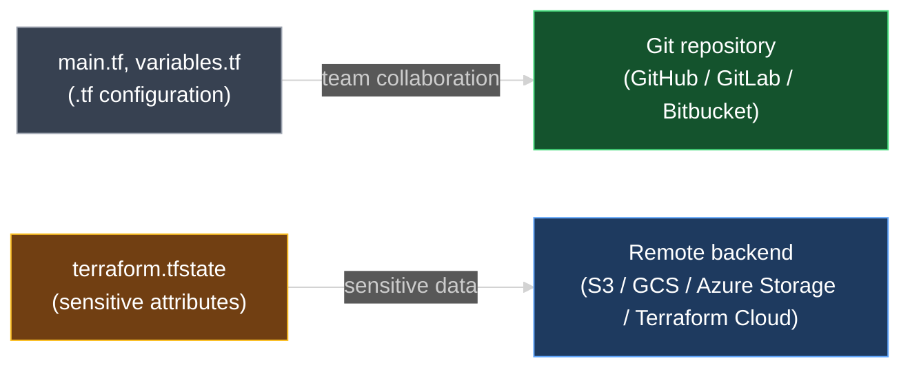

# Terraform State Considerations

`01_Terraform_State.md` and `02_Purpose_of_Terraform_State.md` established state as Terraform's single source of truth for what's actually deployed. This document covers the operational cautions that come with that: the sensitive data state holds, where state should (and shouldn't) live, and why you should never hand-edit it.

---

## 1. Recap: State Is Non-Optional, With Caveats

Terraform always creates and relies on a state file — that part isn't in question. What this lesson covers is how to handle that file responsibly once it exists, because of what it contains and how easy it is to corrupt by hand.

---

## 2. The State File Contains Sensitive Information

Every attribute of every resource Terraform manages lands in state, in full detail — not a summary, the actual values. For a virtual machine, that includes everything needed to fully describe it: the machine image it was launched from, its instance size (which implies its CPU and memory allocation), its disk configuration, its assigned IP addresses, and the SSH key used to access it.

```json
{
  "type": "aws_instance",
  "name": "web",
  "instances": [
    {
      "attributes": {
        "id": "i-0abcd1234efgh5678",
        "ami": "ami-0c101f26f147fa7fd",
        "instance_type": "t3.micro",
        "key_name": "prod-ssh-key",
        "public_ip": "54.210.11.42",
        "private_ip": "10.0.1.15",
        "root_block_device": [
          { "volume_size": 20, "volume_type": "gp3" }
        ]
      }
    }
  ]
}
```

| What the lecture describes | Where it lands in state |
| --- | --- |
| CPU and memory allocation | Implied by `instance_type` (e.g. `t3.micro`) |
| Operating system / image used | `ami` |
| Disk type and size | `root_block_device` |
| IP address allocated to the VM | `public_ip`, `private_ip` |
| SSH keypair used | `key_name` |

Database resources raise the stakes further. `aws_db_instance.app_db`, used in `01_Terraform_State.md`, sets a `password` argument for the database's master user — that value is written into state exactly as provided, in plain text, alongside every other attribute.

When using **local state**, all of this sits in a plain-text JSON file on disk — nothing about it is encrypted or masked by default. State needs to be treated as sensitive data, not as ordinary project output.

> **Rule to remember:** state is not source code. It contains real infrastructure secrets — IPs, key names, database passwords — and needs storage and access controls that match that sensitivity.

---

## 3. Configuration Files vs. State Files — Where Each Belongs

A Terraform configuration directory holds two fundamentally different kinds of files, and they call for different storage practices:

| | Configuration files (`.tf`) | State file (`.tfstate`) |
| --- | --- | --- |
| **Contains** | The desired infrastructure, written by you | Every real attribute of what's actually deployed |
| **Sensitive?** | Generally no — it's a design, not a record of secrets | **Yes** — IPs, keys, passwords, full resource detail |
| **Best practice for teams** | Store in a distributed version control system (GitHub, GitLab, Bitbucket) | **Do not** store in a Git repository |
| **Where it should live instead** | — | A remote backend: AWS S3, Google Cloud Storage, Azure Storage, Terraform Cloud, etc. |

Configuration belongs in version control because a team needs to review, diff, and collaborate on it the same way they would any other code. State doesn't belong there for the opposite reason: committing it to Git would put every secret it holds into a system built for permanent, widely-shared history — exactly the wrong fit for data like a database password.



`02_Purpose_of_Terraform_State.md` already introduced remote state stores for a different reason — a local state file doesn't scale past one person, since teammates need the latest copy and can't safely run Terraform concurrently against it. This lesson adds a second, independent reason to reach the same solution: even a solo user should avoid committing state to Git, because of what it contains. Working with remote backends in practice is covered in a dedicated section later in the course.

---

## 4. Never Hand-Edit the State File

`terraform.tfstate` is a JSON data structure meant for **internal use by Terraform itself** — not something to open in an editor and change by hand. A manual edit that doesn't exactly match what Terraform expects can desynchronize state from reality, and Terraform has no way to detect that the file was altered outside its own workflow.

There are legitimate situations where state does need to change deliberately — for example, correcting a mistake or removing a resource from being tracked without destroying it. For those cases, use the `terraform state` family of commands rather than editing the JSON directly; they're covered in a later section of the course.

---

### Topic Summary: Terraform State Considerations

State holds the complete, unmasked detail of every resource Terraform manages — machine images, disk configuration, IP addresses, SSH key names, and for databases, initial passwords — all in plain-text JSON when stored locally. Because of that, configuration files and the state file need different homes: `.tf` files belong in a team's version control system, while `terraform.tfstate` belongs in a remote backend (S3, GCS, Azure Storage, Terraform Cloud) rather than a Git repository. State is also meant strictly for Terraform's own internal use — never edit it by hand; use `terraform state` commands when a deliberate change to tracked state is genuinely needed.

---

## Knowledge Check

Answer each question on your own first, then read the explanation below it.

---

### 1 · Why state is sensitive

**Why is a Terraform state file considered sensitive, even for something as ordinary as an EC2 instance?**

> Because it stores the resource's full attribute set in plain detail — machine image, instance size, disk configuration, IP addresses, and the SSH key name used to access it. For database resources, it can also include initial passwords. None of this is summarized or masked; it's the real values.

---

### 2 · Local state and encryption

**When using local state, is the sensitive data in `terraform.tfstate` encrypted by default?**

> No. Local state is a plain-text JSON file on disk with no encryption or masking applied automatically. Anyone with file access can read every attribute in it.

---

### 3 · Configuration vs. state storage

**Should `.tf` configuration files and `terraform.tfstate` be stored the same way?**

> No. Configuration files are a good fit for a team's version control system (GitHub, GitLab, Bitbucket), since they're code meant to be reviewed and diffed. The state file should **not** go into a Git repository, because of the sensitive data it holds — it belongs in a remote backend instead (S3, GCS, Azure Storage, Terraform Cloud).

---

### 4 · Why not commit state to Git

**What's the specific risk of committing `terraform.tfstate` to a Git repository?**

> Git is built for permanent, widely-shared history — every commit stays recoverable indefinitely. Committing state would put real secrets (IPs, key names, database passwords) into that history, exactly the kind of data that shouldn't be preserved and distributed that way.

---

### 5 · Two reasons for remote state

**`02_Purpose_of_Terraform_State.md` already recommended remote state stores for team collaboration. What additional reason does this lesson give for the same recommendation?**

> Security. The collaboration reason is about avoiding stale or conflicting local copies across a team. This lesson's reason is independent of team size: state holds sensitive data, so even a single user should keep it out of Git and in a remote backend.

---

### 6 · Editing state directly

**Is it safe to open `terraform.tfstate` in a text editor and change a value directly?**

> No. State is meant for Terraform's own internal use. A manual edit that doesn't exactly match what Terraform expects can desynchronize state from real infrastructure, with no built-in way for Terraform to detect that the file was altered outside its normal workflow.

---

### 7 · The right way to change tracked state

**If a resource genuinely needs to be removed from state tracking without destroying it, what should you use instead of editing the JSON by hand?**

> The `terraform state` family of commands. They make deliberate changes to tracked state safely, instead of risking corruption from a manual JSON edit. The specific commands are covered in a later section of the course.

---
