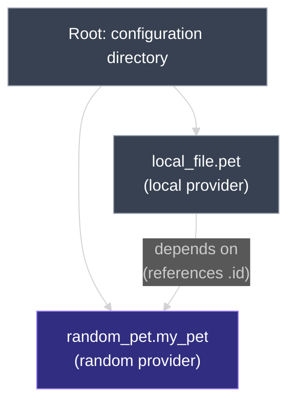

# Terraform Commands

Beyond `terraform init`, `plan`, and `apply`, the Terraform CLI has several commands for checking syntax, formatting code, inspecting state, and visualizing dependencies. This document covers `validate`, `fmt`, `show`, `providers`, `output`, `refresh`, and `graph` — what each one does, and whether it touches real infrastructure, the state file, or neither.

---

## 1. `terraform validate` — Checking Syntax Without Planning

Checking whether a configuration file is syntactically correct doesn't require running `plan` or `apply`. `terraform validate` checks the configuration on its own:

```bash
terraform validate
```

```text
Success! The configuration is valid.
```

If there's an error, `validate` points to the exact line causing it and hints at the fix. For example, using `file_permissions` instead of the correct `file_permission` argument on a `local_file` resource:

```text
Error: Unsupported argument

  on main.tf line 3, in resource "local_file" "pet":
   3:   file_permissions = "0700"

An argument named "file_permissions" is not expected here. Did you mean "file_permission"?
```

| Does `validate` check... | |
| --- | --- |
| HCL syntax and argument names | **Yes** |
| Internal consistency (e.g., valid references) | **Yes** |
| Whether real infrastructure matches configuration | **No** — that's what `plan` is for |
| Provider credentials / connectivity | **No** |

---

## 2. `terraform fmt` — Canonical Formatting

```bash
terraform fmt
```

`fmt` scans every `.tf` file in the current working directory and rewrites it into Terraform's canonical formatting — consistent indentation and alignment. It's purely cosmetic: it doesn't change what the configuration does, only how it reads. Running it prints the names of any files it changed:

```text
main.tf
variables.tf
```

Running `fmt` again with nothing left to reformat prints nothing and changes no files.

---

## 3. `terraform show` — Current State, Human-Readable

```bash
terraform show
```

`show` prints the current state of the infrastructure **as Terraform sees it** — which means it reads `terraform.tfstate`, not the real world directly (see `01_Terraform_State.md` for why state, not live infrastructure, is what Terraform treats as authoritative). For an already-created `local_file.pet`, `show` prints every attribute Terraform recorded: filename, file and directory permissions, content, and the resource's `id`.

Add `-json` to get the same data as structured JSON instead of human-readable text — useful for piping into other tools:

```bash
terraform show -json
```

---

## 4. `terraform providers` — Listing and Mirroring Providers

```bash
terraform providers
```

Lists every provider required by the configuration in the current directory, along with the version constraints in use.

The `mirror` subcommand copies the provider plugins needed for the current configuration into another local directory — useful for air-gapped environments or pre-staging providers before a deploy:

```bash
terraform providers mirror /root/terraform/new_local_file
```

This downloads (or copies from the local cache) every provider plugin the configuration needs into `/root/terraform/new_local_file`, ready to be used by a configuration pointed at that directory instead of the public registry.

---

## 5. `terraform output` — Printing Output Variables

Declaring `output` blocks was covered in `09_Output_Variables.md`. To print their values after an apply:

```bash
terraform output
```

Prints every output variable in the configuration directory. To print just one, append its name:

```bash
terraform output pet_name
```

---

## 6. `terraform refresh` — Manually Syncing State

```bash
terraform refresh
```

Recall from `01_Terraform_State.md` that `plan` and `apply` both perform an implicit refresh — reading the real-world object for every tracked resource and updating Terraform's in-memory copy of state, before comparing anything against configuration. `terraform refresh` triggers that same reconciliation directly, on demand, and **writes the result to `terraform.tfstate`** rather than only holding it in memory for the current command.

This matters when a resource has been changed outside Terraform's control — a manual edit, someone else's script, a console change. `refresh` picks up that drift and updates the state file to match, so the *next* `plan` or `apply` has accurate data to compare against. `refresh` never modifies real infrastructure — only the state file.

Because `plan` and `apply` already refresh automatically before generating an execution plan, running `terraform refresh` by itself is mainly useful for inspecting or persisting drift without also generating a plan. That automatic refresh step can be skipped with `-refresh=false` on `plan` or `apply` — covered in `02_Purpose_of_Terraform_State.md` as a performance tradeoff for large infrastructures.

---

## 7. `terraform graph` — Visualizing Dependencies

```bash
terraform graph
```

`graph` produces a visual representation of the dependency graph in a configuration (or an execution plan). Unlike most other commands, it can run as soon as the configuration files exist — even before `terraform init`.

Take a configuration where `local_file.pet` references `random_pet.my_pet.id`:

```hcl
resource "random_pet" "my_pet" {
  prefix    = "Mr"
  separator = "-"
  length    = 2
}

resource "local_file" "pet" {
  filename = "root/pet.txt"
  content  = "My favorite pet is ${random_pet.my_pet.id}"
}
```

Running `terraform graph` outputs the dependency graph in **DOT** format — a plain-text graph description language. Raw DOT output is hard to read directly, so it's typically piped through a graph visualization tool like **Graphviz**:

```bash
# Install Graphviz on Ubuntu
sudo apt install graphviz

# Render the graph to an SVG image
terraform graph | dot -Tsvg > graph.svg
```

Opening `graph.svg` in a browser shows the dependency graph: the root node is the configuration directory, with a node for each resource — `local_file.pet` (using the `local` provider) and `random_pet.my_pet` (using the `random` provider) — and an edge from `local_file.pet` to `random_pet.my_pet`, since `content` references `random_pet.my_pet.id`.



This is the same dependency relationship covered conceptually in `08_Resource_Dependencies.md` — `graph` is how to see it rendered directly from a real configuration, rather than reasoning about it from the reference expressions alone.

---

## 8. Command Reference at a Glance

| Command | What it does | Touches real infrastructure? | Touches `terraform.tfstate`? |
| --- | --- | --- | --- |
| `terraform validate` | Checks HCL syntax and internal consistency | No | No |
| `terraform fmt` | Rewrites `.tf` files into canonical formatting | No | No |
| `terraform show` | Prints current state, human-readable or `-json` | No — reads state, not live infra | Reads only |
| `terraform providers` | Lists (or mirrors, via `mirror`) required providers | No | No |
| `terraform output` | Prints output variable values | No | Reads only |
| `terraform refresh` | Syncs state with real-world infrastructure | No — read-only against infra | **Yes** — writes refreshed data |
| `terraform graph` | Renders the dependency graph (DOT format) | No | No |

---

### Topic Summary: Terraform Commands

Beyond `init`, `plan`, and `apply`, Terraform's CLI includes commands for narrower jobs. `validate` checks configuration syntax without planning or touching state. `fmt` rewrites files into canonical formatting. `show` prints the current state — human-readable or as JSON with `-json` — reflecting what's in `terraform.tfstate`, not live infrastructure directly. `providers` lists (or mirrors) the providers a configuration needs. `output` prints declared output values, all at once or by name. `refresh` performs the same state-reconciliation `plan` and `apply` already do automatically, but on demand and persisted to the state file, without generating a plan — useful for capturing drift caused by changes made outside Terraform. `graph` renders a configuration's dependency graph in DOT format, typically piped through Graphviz to produce a viewable image.

---

## Knowledge Check

Answer each question on your own first, then read the explanation below it.

---

### 1 · Checking syntax without a plan

**How do you check whether a Terraform configuration file is syntactically valid, without running `plan` or `apply`?**

> Run `terraform validate`. On success it prints a confirmation message; on failure it points to the exact line and argument causing the error, with a hint toward the fix.

---

### 2 · What `fmt` actually changes

**Does `terraform fmt` change what a configuration does?**

> No. It only rewrites `.tf` files into Terraform's canonical formatting — indentation and alignment — for readability. It prints the names of any files it changed and leaves already-formatted files untouched.

---

### 3 · What `show` actually reads

**When you run `terraform show`, is it reading live infrastructure or the state file?**

> The state file, `terraform.tfstate`. `show` prints the infrastructure as Terraform's state records it, including every attribute — not a fresh read of the real-world object.

---

### 4 · Mirroring providers

**What does `terraform providers mirror <path>` do?**

> Copies the provider plugins the current configuration needs into the specified local directory, so another configuration can use them without reaching the public registry.

---

### 5 · Printing a single output

**How do you print just one output variable instead of all of them?**

> Append its name to the command: `terraform output <name>`. Running `terraform output` alone prints every output in the configuration directory.

---

### 6 · What `refresh` changes

**Does `terraform refresh` modify real infrastructure, the state file, both, or neither?**

> Only the state file. It reconciles Terraform's records with the real-world objects it manages and writes the result to `terraform.tfstate`, but it never modifies actual infrastructure.

---

### 7 · Refresh and `plan`/`apply`

**If `plan` and `apply` already refresh automatically before generating a plan, when is running `terraform refresh` directly useful?**

> When you want to capture and persist drift to the state file without also generating an execution plan — for example, to record a manual change made outside Terraform before deciding what to do about it. The automatic refresh inside `plan`/`apply` can itself be skipped with `-refresh=false`.

---

### 8 · When `graph` can run

**Can `terraform graph` run before `terraform init`?**

> Yes. Unlike most Terraform commands, `graph` only needs the configuration files to exist — it doesn't require an initialized working directory.

---

### 9 · Reading `graph`'s output

**Is the raw output of `terraform graph` meant to be read directly?**

> Not really. It's DOT format — a plain-text graph description language that's hard to parse visually. It's normally piped through a tool like Graphviz's `dot` command to render an actual image (e.g. `terraform graph | dot -Tsvg > graph.svg`).

---
