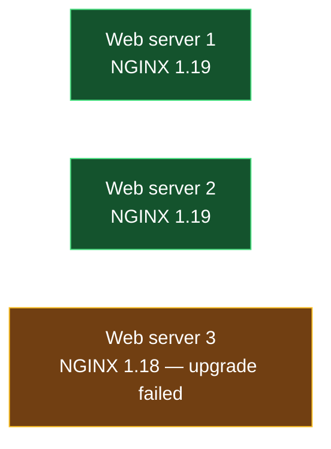
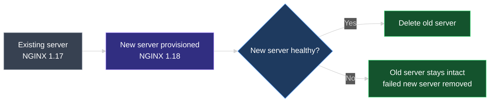

# Mutable vs. Immutable Infrastructure

This document explains **why** Terraform destroys a resource and recreates it instead of updating it in place for many kinds of changes — the reasoning traces back to two competing infrastructure-management models: **mutable** and **immutable** infrastructure.

---

## 1. Recap: Terraform Already Does This

Recall from `07_Resource_Attributes_and_References.md` that changing `local_file.pet`'s `content` forces Terraform to destroy the old file and create a new one, rather than editing it in place — because `local_file` has no update path at all. The same thing happens with a permissions change: updating `file_permission` from `777` to `700` destroys the original file and creates a new one with the updated permission, instead of running the equivalent of `chmod` on the existing file.

This lesson explains the reasoning behind that default: destroy-then-create isn't a `local_file` quirk, it's Terraform's general philosophy as a provisioning tool, rooted in the **immutable infrastructure** model.

---

## 2. Mutable Infrastructure — Updating Servers in Place

**Mutable infrastructure** means the underlying resource stays the same across an update; only the software and configuration running on it changes.

Consider an application server running NGINX 1.17. When NGINX 1.18 is released, the server is upgraded in place — the same server, same identity, just newer software. Later, when 1.19 ships, the same server is upgraded again, from 1.18 to 1.19. This can be done by manually downloading and installing the new version during a maintenance window, with ad-hoc scripts, or with a configuration management tool like Ansible.

For high availability, a single server becomes a **pool** of servers running identical software — and each one goes through the same in-place upgrade process.

| Characteristic | Mutable infrastructure |
| --- | --- |
| Underlying server | Same server, same identity, across every update |
| What changes | Software and configuration only |
| Update mechanism | In-place upgrade — manual, scripted, or via a config management tool |

---

## 3. The Problem: Partial Failures Cause Configuration Drift

Upgrading software has dependencies, and dependencies aren't always met. Suppose a pool of three web servers is upgraded from NGINX 1.18 to 1.19. Web servers 1 and 2 upgrade cleanly. Web server 3 fails — maybe a network issue blocked the software repository, the filesystem was full, or it's running a different OS version than the other two — and it stays on 1.18.

The pool now has one server running different software than the rest. Over time, repeated updates compound this: servers can end up varying in software version, configuration, or even OS version from one another. This divergence within a pool of supposedly-identical servers is called **configuration drift** — a related but distinct idea from the state-vs-configuration **drift** covered in `01_Terraform_State.md`; here, it's *servers drifting from each other*, not a resource drifting from its Terraform configuration.

Configuration drift leaves infrastructure in a complex, inconsistent state. Planning the next update gets harder, since servers no longer share a common starting point, and troubleshooting gets harder too, since each server can behave slightly differently from its peers.

---

## 4. Immutable Infrastructure — Replace, Don't Update

**Immutable infrastructure** takes the opposite approach: instead of updating an existing server, provision a brand-new server with the desired new version, and only remove the old one once the new one is confirmed working. "Immutable" means unchanged — something not meant to be modified after it's created.

Upgrading NGINX from 1.17 to 1.18 the immutable way: provision a new server already running 1.18. If it comes up successfully, delete the old 1.17 server. There is no in-place update step at all under this model.

Immutable infrastructure doesn't prevent upgrade failures — it changes what happens when one occurs. If provisioning the new server fails for any reason, the **old server is left untouched**, and only the failed new server is discarded. Compare that to the mutable model, where a failed in-place upgrade can leave the *existing* server in a broken, half-upgraded state. Immutable infrastructure fails safe; mutable infrastructure fails into drift.

Because the old resource is never touched until a replacement is proven, there's little room left for configuration drift to accumulate — infrastructure stays in a simpler, more predictable state.

Immutability also pairs naturally with **Infrastructure as Code**: each update becomes a complete new version of a resource rather than a diff applied to an existing one, which makes versioning infrastructure, and rolling back or forward between versions, straightforward.

---

## 5. Mutable vs. Immutable — Side by Side

| | Mutable | Immutable |
| --- | --- | --- |
| Underlying resource | Same resource, updated in place | New resource created; old one deleted after |
| Update mechanism | In-place upgrade (manual, script, config management tool) | Full replacement |
| Failure behavior | Failed server can be left in a broken, half-upgraded state | Old resource untouched; only the failed new resource is discarded |
| Drift risk across a pool | High — partial failures cause servers to diverge over time | Low — old resources are never partially modified |
| Fits versioning / rollback | Awkward — no clean "previous version" to return to | Natural — each version is a complete, distinct resource |

---

## 6. Why Terraform Defaults to Destroy-Then-Create

Terraform, as a provisioning tool, follows the immutable infrastructure model by default. That's the reasoning behind the behavior from `07_Resource_Attributes_and_References.md`: changing `local_file.pet`'s `file_permission` from `777` to `700` doesn't patch the existing file — Terraform deletes it and creates a new one with the updated permission. By default, Terraform **destroys the old resource first, then creates the new one** in its place.

That raises a question the destroy-first order doesn't answer on its own: what if the new resource should be created *before* the old one is destroyed, or the old resource shouldn't be destroyed at all? Those are configurable — through **lifecycle rules** in a resource block, covered in the next lesson.

---

### Topic Summary: Mutable vs. Immutable Infrastructure

**Mutable infrastructure** updates existing servers in place — the same server persists across updates, only its software and configuration change. This works until an update partially fails, at which point servers in a pool can diverge from one another, a problem called **configuration drift** that makes infrastructure harder to plan around and troubleshoot. **Immutable infrastructure** avoids this by never updating a resource in place: a new resource is provisioned with the desired change, and the old one is deleted only after the new one is confirmed working — so a failed update leaves the old resource untouched instead of half-upgraded. Immutability also fits Infrastructure as Code naturally, since each version is a complete, distinct resource rather than a diff applied to an existing one. Terraform follows this model by default, destroying a resource and creating its replacement rather than patching it in place — which is exactly what lifecycle rules, covered next, let you fine-tune.

---

## Knowledge Check

Answer each question on your own first, then read the explanation below it.

---

### 1 · Mutable infrastructure, defined

**What defines mutable infrastructure?**

> The underlying resource — the server itself — stays the same across an update. Only the software and configuration running on it change, typically via an in-place upgrade.

---

### 2 · What causes configuration drift

**In a pool of identical web servers, what causes configuration drift over time?**

> Partial upgrade failures. If one server in a pool fails to upgrade (due to unmet dependencies, network issues, a full filesystem, or a differing OS version) while others succeed, the pool ends up with servers running different software or configuration versions from each other.

---

### 3 · Immutable infrastructure, defined

**What defines immutable infrastructure?**

> A resource is never updated in place. To make a change, a new resource is provisioned with the desired state, and the old resource is deleted only once the new one is confirmed working.

---

### 4 · Failure behavior under each model

**If an upgrade fails, how does the outcome differ between mutable and immutable infrastructure?**

> Under mutable infrastructure, the existing server can be left in a broken, half-upgraded state. Under immutable infrastructure, the old resource is never touched until the new one succeeds, so a failure leaves the old resource intact and only discards the failed new one.

---

### 5 · Why immutability reduces drift

**Why does immutable infrastructure carry less risk of configuration drift than mutable infrastructure?**

> Because existing resources are never partially modified — they're either fully replaced by a working new resource or left completely untouched. There's no in-between state for a resource to get stuck in.

---

### 6 · Immutability and Infrastructure as Code

**Why does immutable infrastructure fit well with Infrastructure as Code?**

> Each update produces a complete, distinct version of a resource rather than a diff applied to an existing one, which makes versioning infrastructure, and rolling back or forward between versions, straightforward.

---

### 7 · Terraform's default model

**Which model does Terraform follow by default — mutable or immutable?**

> Immutable. By default, Terraform destroys the existing resource and creates its replacement, rather than modifying the existing resource in place — as seen with `local_file`'s `file_permission` or `content` changes.

---

### 8 · Destroy-then-create order

**By default, does Terraform create the replacement resource before or after destroying the old one?**

> After. Terraform destroys the old resource first, then creates the new one in its place — an order that can be changed using lifecycle rules, covered in the next lesson.

---
