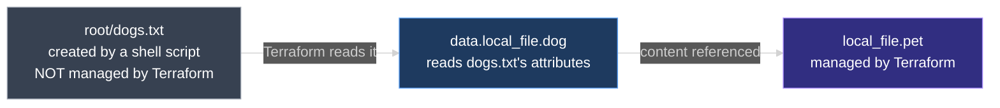

# Data Sources

Terraform isn't the only way infrastructure gets provisioned, and not every resource in the real world is one Terraform manages. This document explains **data sources** — the `data` block that lets Terraform read attributes from a resource it doesn't control, using a `local_file` example to work through the syntax.

---

## 1. Why Data Sources Exist

Terraform provisions infrastructure through configuration files and tracks what it created in state — but Terraform is only one of several **Infrastructure as Code** tools in use across the industry, alongside Puppet, AWS CloudFormation, SaltStack, and Ansible. Infrastructure also gets created outside any IaC tool entirely: ad-hoc scripts, manual provisioning through a console, or even resources created by a *separate* Terraform configuration directory that this one doesn't share state with.

None of that infrastructure is something the current Terraform configuration manages — but it can still be relevant to it. A database instance provisioned manually in AWS is a typical case: Terraform doesn't manage it, but it can still **read** attributes like the database name, host address, or DB user, and use those values to provision an application resource that Terraform *does* manage.

---

## 2. A Worked Example — Reading a File Terraform Doesn't Manage

Start with a familiar resource:

```hcl
resource "local_file" "pet" {
  filename = "root/pet.txt"
  content  = "We love pets."
}
```

Once applied, `pet.txt` exists on disk, and Terraform records it in state — this file is fully under Terraform's control.

Now, outside of Terraform entirely, a shell script creates a second file in the same directory:

```bash
echo "Dogs are awesome." > root/dogs.txt
```

`dogs.txt` has no relationship to `local_file.pet` as far as Terraform is concerned — it wasn't declared in any resource block, and Terraform has no record of it in state. The goal: use the *content* of `dogs.txt` as the content for the Terraform-managed `pet.txt`, without Terraform taking over management of `dogs.txt` itself.



---

## 3. The `data` Block

A **data source** reads attributes from a resource Terraform doesn't manage. It uses a block that looks almost identical to a `resource` block, with two differences: the keyword is `data` instead of `resource`, and the arguments inside it are whatever that specific data source expects — which resource attributes it exposes for reading. Just like a resource, the correct arguments for a given data source come from that provider's documentation on the Terraform Registry.

```hcl
data "local_file" "dog" {
  filename = "root/dogs.txt"
}
```

| Part | In this example | Rule |
| --- | --- | --- |
| Block keyword | `data` | Always `data`, never `resource` |
| Data source type | `local_file` | Any valid resource type from any provider Terraform supports |
| Logical name | `dog` | Your label — used to reference this data source elsewhere |
| Arguments | `filename` | Specific to the data source type — check the Registry's documentation |

For the `local_file` data source, `filename` is the only argument needed: the path to the file Terraform should read.

---

## 4. Referencing Data Source Values

The values a data source reads are available under a **`data` object**, addressed as:

```text
data.<type>.<name>.<attribute>
```

To use `dogs.txt`'s content as `pet.txt`'s content:

```hcl
resource "local_file" "pet" {
  filename = "root/pet.txt"
  content  = data.local_file.dog.content
}

data "local_file" "dog" {
  filename = "root/dogs.txt"
}
```

`content` isn't the only attribute the `local_file` data source exposes — its Registry documentation, under **Attributes Reference**, lists two: `content` and `content_base64` (the Base64-encoded version of the same content).


---

## 5. Resources vs. Data Sources

| | Resource (`resource` block) | Data source (`data` block) |
| --- | --- | --- |
| Purpose | Create, update, and destroy infrastructure | Read information from an existing resource |
| Who manages the underlying object | Terraform | Something else — another tool, a manual process, or a separate Terraform configuration |
| Also known as | **Managed resource** | **Data resource** |
| Appears in state as something Terraform created? | Yes | No — Terraform only reads it, never creates or destroys it |

---

## 6. Where the Data Behind a Data Source Can Come From

Anything outside the current Terraform configuration's control is a candidate for a data source, including:

- Resources provisioned by another IaC tool — Puppet, AWS CloudFormation, SaltStack, Ansible
- Resources created by ad-hoc scripts
- Resources provisioned manually
- Resources created by Terraform itself, but from a *different* configuration directory

---

### Topic Summary: Data Sources

A **data source**, declared with a `data` block, lets Terraform read attributes from a resource it doesn't manage — infrastructure provisioned by another tool, a script, manually, or by a separate Terraform configuration. Its syntax mirrors a `resource` block, but uses `data` instead of `resource`, and its arguments are whatever that specific data source type expects (documented on the Terraform Registry). Values read by a data source are addressed as `data.<type>.<name>.<attribute>` and can be referenced anywhere a normal value is expected, such as inside another resource's arguments. Unlike a **managed resource**, a **data resource** is never created, updated, or destroyed by Terraform — only read.

---

## Knowledge Check

Answer each question on your own first, then read the explanation below it.

---

### 1 · Why data sources exist

**Why would Terraform need to read a resource it doesn't manage?**

> Because not all infrastructure is provisioned by the current Terraform configuration — some of it comes from other IaC tools, ad-hoc scripts, manual provisioning, or a separate Terraform configuration directory. A data source lets Terraform read attributes from that infrastructure and use them, without taking over management of it.

---

### 2 · `data` vs. `resource` block

**How does a `data` block differ syntactically from a `resource` block?**

> The keyword is `data` instead of `resource`; everything else — type, logical name, and a block of arguments — follows the same structure. The arguments themselves are specific to whatever data source type is being read.

---

### 3 · Finding the right arguments

**How do you know which arguments a given data source expects?**

> Check that provider's documentation on the Terraform Registry, the same place resource arguments are documented.

---

### 4 · Referencing a data source's values

**How do you reference a value read by `data "local_file" "dog"`?**

> `data.local_file.dog.<attribute>` — for example, `data.local_file.dog.content`. The pattern is `data.<type>.<name>.<attribute>`.

---

### 5 · What `local_file`'s data source exposes

**What attributes does the `local_file` data source expose, according to its Registry documentation?**

> Two: `content` and `content_base64` (the Base64-encoded version of the same content).

---

### 6 · Managed resource vs. data resource

**What's the difference between a "managed resource" and a "data resource"?**

> A managed resource is created, updated, and destroyed by Terraform — it's what a `resource` block declares. A data resource is only read by Terraform — it's what a `data` block declares, and Terraform never creates, updates, or destroys it.

---

### 7 · Sources of data outside Terraform

**Name a few kinds of infrastructure a data source might read from.**

> Infrastructure provisioned by another IaC tool (Puppet, CloudFormation, SaltStack, Ansible), by ad-hoc scripts, manually, or by Terraform itself from a separate configuration directory.

---

### 8 · Does a data source ever get destroyed by Terraform?

**If you remove a `data` block from your configuration and run `terraform apply`, does the underlying resource it was reading get destroyed?**

> No. Terraform never created it in the first place, so there's nothing for Terraform to destroy — removing the `data` block just means Terraform stops reading that resource.

---
