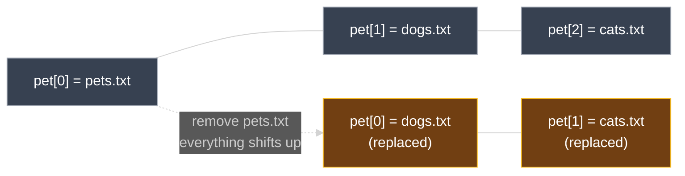

# Meta-Arguments: `count` and `for_each`

Every resource block seen so far creates exactly one resource. This document covers **`count`** and **`for_each`** — the meta-arguments that let a single resource block create *multiple* instances of the same resource type, and the tradeoffs between the two.

---

## 1. Recap: Meta-Arguments Seen So Far

A **meta-argument** is an argument that works inside any resource block to change how Terraform behaves toward that resource, rather than configuring the resource itself. Two have already come up in this course:

- `depends_on` — defines an explicit dependency between resources (see `04_Core_Terraform_Basics/08_Resource_Dependencies.md`).
- `lifecycle` — controls how a resource is created, updated, and destroyed (see `03_Lifecycle_Rules.md`).

This lesson covers two more: `count` and `for_each`, both used to create multiple instances of a resource from a single block.

---

## 2. The Problem: Creating Multiple Instances

A shell script can create several files with a simple loop:

```bash
#!/bin/bash
# create_files.sh
for i in {1..3}
do
  touch /root/pet$i.txt
done
```

A Terraform `resource` block can't embed a loop like this directly — but `count` and `for_each` achieve the same result declaratively.

---

## 3. The `count` Meta-Argument

### 3.1 Basic Usage

Adding `count` to a resource block creates that many instances:

```hcl
resource "local_file" "pet" {
  count    = 3
  filename = "/root/pet.txt"
  content  = "We love pets!"
}
```

`terraform apply` now creates three resources instead of one, each addressed by an index in square brackets: `local_file.pet[0]`, `local_file.pet[1]`, `local_file.pet[2]`. The resource is now a **list of resources**.

> There's a problem: every instance uses the identical, static `filename` value. Since `local_file`'s real-world identity is its path, Terraform ends up creating the same file three times rather than three distinct files — defeating the purpose.

### 3.2 Fix — a List Variable Plus `count.index`

To give each instance a unique filename, pair `count` with a list variable and `count.index`, which holds the current iteration's position (`0`, `1`, `2`, ...):

```hcl
variable "filename" {
  default = ["/root/pets.txt", "/root/dogs.txt", "/root/cats.txt"]
}

resource "local_file" "pet" {
  count    = 3
  filename = var.filename[count.index]
  content  = "We love pets!"
}
```

Iteration 0 picks up `var.filename[0]` (`pets.txt`), iteration 1 picks up `var.filename[1]` (`dogs.txt`), and iteration 2 picks up `var.filename[2]` (`cats.txt`) — three distinct files.

### 3.3 Fix the Static Count — the `length()` Function

Adding more elements to `var.filename` later — say, `cows.txt` and `ducks.txt` — doesn't change anything as long as `count = 3` is hardcoded; Terraform still creates only three files. `count` should track the list's actual size instead of a fixed number:

```hcl
resource "local_file" "pet" {
  count    = length(var.filename)
  filename = var.filename[count.index]
  content  = "We love pets!"
}
```

`length()` is one of Terraform's built-in functions for manipulating values in expressions — here, it returns the number of elements in `var.filename`, so `count` automatically grows or shrinks with the list.

### 3.4 The Drawback — Removing an Element Shifts Every Index

Because `count` produces a **list**, each instance's identity is its numeric index — not anything about its own configuration. Removing the first element, `/root/pets.txt`, from `var.filename`:

```hcl
variable "filename" {
  default = ["/root/dogs.txt", "/root/cats.txt"]
}
```

shifts every remaining element up one position: `dogs.txt` becomes index `0`, `cats.txt` becomes index `1`, and index `2` no longer exists. `terraform plan` shows this as far more churn than "delete one file":

```diff
  # local_file.pet[0] must be replaced
-/+ resource "local_file" "pet" {
      ~ filename = "/root/pets.txt" -> "/root/dogs.txt" # forces replacement
    }

  # local_file.pet[1] must be replaced
-/+ resource "local_file" "pet" {
      ~ filename = "/root/dogs.txt" -> "/root/cats.txt" # forces replacement
    }

  # local_file.pet[2] will be destroyed
  - resource "local_file" "pet" {
      - filename = "/root/cats.txt" -> null
    }

Plan: 2 to add, 0 to change, 3 to destroy.
```

Only `/root/pets.txt` was actually removed from intent, but Terraform replaces `pet[0]` and `pet[1]` (their `filename` values shifted) and destroys `pet[2]` outright (its index no longer exists). The end state is correct, but two resources were destroyed and recreated for no real reason — an unwanted side effect of indexing by position.



`count` is fixed in a later lesson using `for_each` instead.

---

## 4. The `for_each` Meta-Argument

### 4.1 Basic Usage

`for_each` replaces `count`, and `each.value` replaces `count.index`:

```hcl
resource "local_file" "pet" {
  for_each = var.filename
  filename = each.value
  content  = "We love pets!"
}
```

### 4.2 The Catch — `for_each` Needs a Map or a Set

Running `terraform plan` against the block above, with `var.filename` still declared as a `list`, fails:

```text
Error: Invalid for_each argument

  on main.tf line 9, in resource "local_file" "pet":
   9:   for_each = var.filename

The given "for_each" argument value is unsuitable: the "for_each" argument
must be a map, or set of strings, and you have provided a value of type
list of string.
```

`for_each` only works with a **map** or a **set** — never a list. Two ways to fix it:

**Option A — change the variable's type to `set`:**

```hcl
variable "filename" {
  type    = set(string)
  default = ["/root/pets.txt", "/root/dogs.txt", "/root/cats.txt"]
}
```

A set behaves like a list but cannot contain duplicate elements.

**Option B — keep the variable a `list`, convert it with `toset()`:**

```hcl
variable "filename" {
  default = ["/root/pets.txt", "/root/dogs.txt", "/root/cats.txt"]
}

resource "local_file" "pet" {
  for_each = toset(var.filename)
  filename = each.value
  content  = "We love pets!"
}
```

`toset()` is another built-in function — it converts a list into a set at the point `for_each` needs it, without changing the variable's declared type.

### 4.3 Why `for_each` Avoids the Index-Shift Problem

With `for_each`, resource instances form a **map**, keyed by each element's own value — not a numeric position. Removing `/root/pets.txt` from the same set:

```diff
  # local_file.pet["/root/pets.txt"] will be destroyed
  - resource "local_file" "pet" {
      - filename = "/root/pets.txt" -> null
    }

Plan: 0 to add, 0 to change, 1 to destroy.
```

`local_file.pet["/root/dogs.txt"]` and `local_file.pet["/root/cats.txt"]` are untouched — their keys never depended on where `pets.txt` sat in a list, so removing it doesn't shift anything.

```mermaid
%%{init: {'theme': 'dark', 'flowchart': {'htmlLabels': true}}}%%
flowchart LR
    M0["pet[\"pets.txt\"]"] --- M1["pet[\"dogs.txt\"]"] --- M2["pet[\"cats.txt\"]"]
    N1["pet[\"dogs.txt\"]<br>(untouched)"] --- N2["pet[\"cats.txt\"]<br>(untouched)"]
    M0 -.->|"remove pets.txt<br>only its own key is destroyed"| N1

    style M0 fill:#713f12,stroke:#fbbf24,color:#ffffff
    style M1 fill:#374151,stroke:#9ca3af,color:#ffffff
    style M2 fill:#374151,stroke:#9ca3af,color:#ffffff
    style N1 fill:#14532d,stroke:#4ade80,color:#ffffff
    style N2 fill:#14532d,stroke:#4ade80,color:#ffffff
```

---

## 5. `count` vs. `for_each`

| | `count` | `for_each` |
| --- | --- | --- |
| Accepts | A number | A `map` or a `set` |
| Instances form a | **List**, indexed `[0]`, `[1]`, `[2]`... | **Map**, keyed by each element's own value |
| Per-instance reference | `count.index` | `each.key` / `each.value` |
| Effect of removing one element | Every element after it shifts index — can force unrelated replacements | Only the removed element's own resource is destroyed — everything else is untouched |
| Works with a plain `list` variable directly | Yes | No — requires `set(string)`, a `map`, or `toset()` on a list |

---

## 6. Other Meta-Arguments

`count` and `for_each` aren't the only meta-arguments beyond `depends_on` and `lifecycle`. Terraform also has `provider`, `provisioner`, and others tied to backend configuration — covered later in the course once more real-world resources are in use.

---

### Topic Summary: Meta-Arguments (`count` and `for_each`)

`count` and `for_each` are meta-arguments that let a single `resource` block create multiple instances instead of one. `count` takes a number and produces a **list** of instances indexed by position (`count.index`); this makes any change to the underlying list's order or length shift indexes around, potentially forcing unrelated instances to be replaced or destroyed. `for_each` takes a **map** or a **set** — never a plain list, though `toset()` converts one — and produces instances keyed by each element's own value (`each.key` / `each.value`), so removing one element only affects that element's resource, leaving every other instance untouched. Built-in functions like `length()` (list size) and `toset()` (list-to-set conversion) commonly appear alongside both meta-arguments.

---

## Knowledge Check

Answer each question on your own first, then read the explanation below it.

---

### 1 · What a meta-argument is

**What is a meta-argument, and which two had already appeared before `count` and `for_each`?**

> A meta-argument works inside any resource block to change Terraform's behavior toward that resource, rather than configuring the resource's own attributes. `depends_on` (explicit dependencies) and `lifecycle` (create/update/destroy behavior) had already appeared.

---

### 2 · `count` with a static filename

**Why does `count = 3` alone on `local_file.pet` fail to create three separate files?**

> Because `filename` is still a single static value shared by every instance. Since `local_file`'s real-world identity is its path, Terraform ends up recreating the same file three times rather than producing three distinct files.

---

### 3 · Fixing filenames with `count.index`

**How does `count.index` combine with a list variable to give each instance a unique filename?**

> `count.index` holds the current iteration's position (`0`, `1`, `2`, ...), so `var.filename[count.index]` picks a different element of the list on each iteration — giving each resource instance its own filename.

---

### 4 · Making `count` track the list automatically

**How do you make `count` automatically match the number of elements in a list variable, instead of hardcoding a number?**

> Set `count = length(var.filename)`. The built-in `length()` function returns the list's current size, so `count` grows or shrinks automatically as the list changes.

---

### 5 · The index-shift drawback

**If `var.filename` has three elements and the first one is removed, what does `terraform plan` show for a resource using `count`?**

> More than just one deletion: the remaining elements shift up an index, so `pet[0]` and `pet[1]` are shown as replaced (their filenames changed) and `pet[2]` is destroyed outright (its index no longer exists) — even though only one element was actually removed from the list.

---

### 6 · `for_each` type requirement

**What value types does `for_each` accept, and what happens if you pass it a plain `list`?**

> Only a `map` or a `set` of strings. Passing a `list` produces an error: `"for_each" argument must be a map, or set of strings"`.

---

### 7 · Fixing the `for_each` type error

**Name two ways to fix a `for_each` type error without changing the resource's logic.**

> Change the variable's declared type to `set(string)`, or keep it a `list` and wrap it with the built-in `toset()` function when passing it to `for_each`.

---

### 8 · Why `for_each` avoids the index-shift problem

**Why doesn't removing an element from a set cause other `for_each` instances to be replaced, the way it does with `count`?**

> `for_each` instances are keyed by each element's own value in a map, not by numeric position. Removing one element only removes its own key — the other instances' keys never depended on list order, so they're untouched.

---

### 9 · Reading `for_each` output

**How is a `for_each`-created resource addressed, compared to a `count`-created one?**

> By its map key in square brackets — e.g. `local_file.pet["/root/dogs.txt"]` — instead of a numeric index like `local_file.pet[1]`.

---
