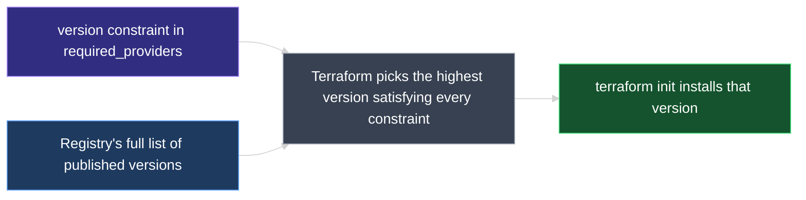

# Provider Version Constraints

Providers ship many versions over time, and a configuration written against one version isn't guaranteed to behave the same way on another. This document covers the **`terraform`** block's `required_providers` argument — how to pin a provider to an exact version, and the full syntax for version constraint operators.

---

## 1. Why Pin a Provider Version

Providers use a plugin-based architecture, and most popular ones are published on the public Terraform Registry (the full download mechanics are covered in `04_Core_Terraform_Basics/01_Terraform_Provider.md`). Without any extra configuration, `terraform init` downloads the **latest** available version of every provider plugin a configuration needs.

That default isn't always desirable. A provider's functionality can change meaningfully between versions, and a configuration written against one version may not work correctly — or at all — against a different one. Terraform lets a configuration pin the exact version (or range of versions) it should be installed with, so `terraform init` never silently picks up a version the configuration wasn't written for.

---

## 2. Finding Version Info on the Registry

Every provider's Registry page lists a default version (normally the latest) alongside a version dropdown showing every older release. Selecting an older version and opening its **Use Provider** tab generates the exact code block needed to pin that version — ready to copy into a configuration file.

For example, the `local` provider's Registry page currently defaults to version `2.0.0`. Selecting `1.4.0` from the dropdown and opening **Use Provider** produces the block covered next.

---

## 3. The `terraform` Block and `required_providers`

Pinning a version requires two nested blocks:

```hcl
terraform {
  required_providers {
    local = {
      source  = "hashicorp/local"
      version = "1.4.0"
    }
  }
}
```

| Part | In this example | Rule |
| --- | --- | --- |
| `terraform` block | — | Configures settings related to Terraform itself, not any single resource |
| `required_providers` block | — | Goes inside the `terraform` block; lists version requirements per provider |
| Argument key | `local` | The provider's short name — matches the prefix used in that provider's resource types (`local_file`) |
| `source` | `hashicorp/local` | The provider's full Registry address |
| `version` | `1.4.0` | The version constraint to apply — an exact version here, but see the operators below |

With this in place, running `terraform init` installs the pinned version instead of the latest one:

```text
$ terraform init

Initializing the backend...

Initializing provider plugins...
- Finding hashicorp/local versions matching "1.4.0"...
- Installing hashicorp/local v1.4.0...
- Installed hashicorp/local v1.4.0 (signed by HashiCorp)

Terraform has been successfully initialized!
```

---

## 4. Version Constraint Operators

`version` isn't limited to a single exact value — Terraform supports several operators for expressing a range or exclusion.

| Operator | Meaning | Example |
| --- | --- | --- |
| *(none)* or `=` | Exact version match | `version = "1.4.0"` |
| `!=` | Excludes a specific version | `version = "!= 2.0.0"` |
| `<`, `<=` | Any version below (or at) the given value | `version = "< 2.0.0"` |
| `>`, `>=` | Any version above (or at) the given value | `version = "> 1.2.0"` |
| Comma-separated list | Combines multiple constraints — Terraform picks the highest version satisfying all of them | `version = ">= 1.2.0, < 2.0.0, != 1.4.0"` |
| `~>` (pessimistic constraint) | Allows the version, or any incremental release that only increments the **rightmost** component shown | `version = "~> 1.2"` |

A bare version string with no operator, like `version = "1.4.0"`, is shorthand for `version = "= 1.4.0"` — Terraform installs that exact version and no other.

### Worked Walkthrough

Assume the `local` provider's published versions, oldest to newest, are: `1.2.0`, `1.2.1`, `1.2.2`, `1.3.0`, `1.4.0`, `2.0.0`.

```hcl
version = "!= 2.0.0"
```
Excludes only `2.0.0` — Terraform installs the next-highest available version, `1.4.0`.

```hcl
version = "< 2.0.0"
```
Installs the highest version below `2.0.0` — again `1.4.0`.

```hcl
version = "> 1.2.0"
```
Installs the highest version satisfying >= 1.2.0 and < 2.0.0 that is 1.3.0, since 2.0.0 is excluded by the upper bound and 1.4.0 is excluded by != 1.4.0

```hcl
version = ">= 1.2.0, < 2.0.0, != 1.4.0"
```
Three constraints combined: at least `1.2.0`, below `2.0.0`, and not `1.4.0`. The highest version satisfying all three is `1.3.0`.

```hcl
version = "~> 1.2"
```
The pessimistic operator with two version components shown (`1.2`) fixes the **first** component (`1`) and allows the second to increment freely — equivalent to `>= 1.2.0, < 2.0.0`. Among `1.2.0` through `1.4.0`, the highest available is `1.4.0`.

```hcl
version = "~> 1.2.0"
```
With three components shown, `~>` fixes the first **two** (`1.2`) and only allows the third to increment — equivalent to `>= 1.2.0, < 1.3.0`. Among `1.2.0`, `1.2.1`, `1.2.2`, the highest available is `1.2.2`.



---

### Topic Summary: Provider Version Constraints

By default, `terraform init` downloads the latest available version of every provider a configuration needs — which risks breaking a configuration written against an older version's behavior. Adding a `required_providers` block inside a `terraform` block pins a provider to a specific version, using `source` for the provider's Registry address and `version` for the constraint. Version constraints support exact match (`=`, or a bare version string), exclusion (`!=`), comparison operators (`<`, `<=`, `>`, `>=`), comma-separated combinations of these, and the pessimistic constraint operator (`~>`), which allows incremental releases of only the rightmost version component shown. Whichever constraint is used, Terraform installs the highest available version that satisfies it.

---

## Knowledge Check

Answer each question on your own first, then read the explanation below it.

---

### 1 · Default provider version behavior

**Without any version configuration, which version of a provider does `terraform init` install?**

> The latest version available on the Terraform Registry.

---

### 2 · Why pin a version at all

**Why would a configuration want to pin a provider to a specific version instead of always using the latest?**

> A provider's functionality can change meaningfully between versions, and a configuration written against one version may not behave correctly on a different one. Pinning ensures `terraform init` always installs the version the configuration was written for.

---

### 3 · Where version pinning is configured

**Which two nested blocks are used to pin a provider's version?**

> A `terraform` block (for settings related to Terraform itself), containing a `required_providers` block (which lists version requirements per provider).

---

### 4 · `required_providers` argument structure

**Inside `required_providers`, what does each provider's argument value contain?**

> An object with two keys: `source` (the provider's full Registry address, e.g. `hashicorp/local`) and `version` (the version constraint to apply).

---

### 5 · Exact version syntax

**What does `version = "1.4.0"` mean, with no operator specified?**

> It's shorthand for `version = "= 1.4.0"` — Terraform installs that exact version only.

---

### 6 · The `!=` operator

**What does `version = "!= 2.0.0"` do?**

> Excludes version `2.0.0` specifically. Terraform installs the highest remaining available version instead.

---

### 7 · Combining constraints

**What does `version = ">= 1.2.0, < 2.0.0, != 1.4.0"` mean, and which version does it resolve to if available versions are `1.2.0`–`1.4.0` and `2.0.0`?**

> All three constraints must hold at once: at least `1.2.0`, below `2.0.0`, and not `1.4.0`. Given those available versions, it resolves to `1.3.0` — the highest version satisfying every constraint.

---

### 8 · Pessimistic constraint operator, two components

**What does `version = "~> 1.2"` allow, and how does that differ from `version = "~> 1.2.0"`?**

> `~> 1.2` fixes the major version (`1`) and allows the minor version to increment freely — equivalent to `>= 1.2.0, < 2.0.0`. `~> 1.2.0` fixes both the major and minor version (`1.2`) and only allows the patch version to increment — equivalent to `>= 1.2.0, < 1.3.0`. Adding a version component to `~>` narrows which part of the version is allowed to change.

---

### 9 · What `~>` actually picks

**Given available versions `1.2.0`, `1.2.1`, `1.2.2`, `1.3.0`, `1.4.0`, which version does `version = "~> 1.2.0"` resolve to?**

> `1.2.2` — the highest version matching `1.2.x`, since `~> 1.2.0` only allows the patch component to increment and excludes `1.3.0` and above.

---
