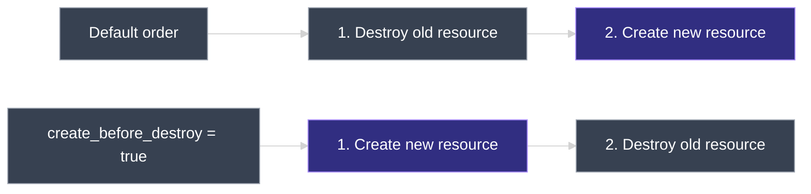

# Lifecycle Rules

`07_Mutable_And_Immutable_Infrastructure/01_Mutable_vs_Immutable_Infrastructure.md` established that Terraform defaults to destroying a resource and creating its replacement rather than updating it in place. This document covers the **`lifecycle`** block — the three arguments that let a resource override that default behavior: `create_before_destroy`, `prevent_destroy`, and `ignore_changes`.

---

## 1. Recap: Destroy-Then-Create Is the Default

Changing `local_file.pet`'s `file_permission` from `777` to `700` and running `terraform apply` destroys the original file first, then creates a new one with the updated permission — the immutable-infrastructure behavior covered in the previous chapter.

That default order isn't always what's wanted. Sometimes the updated resource should be created **before** the old one is deleted. Sometimes a resource shouldn't be deleted at all, even if configuration changes in a way that would normally force it. Both are controlled with lifecycle rules.

---

## 2. The `lifecycle` Block — Syntax

Lifecycle rules use the same `{ }` block syntax as every other Terraform construct, placed directly inside the resource block whose behavior they modify:

```hcl
resource "<resource_type>" "<resource_name>" {
  # regular arguments...

  lifecycle {
    # one or more lifecycle rules
  }
}
```

| Argument | Type | Controls |
| --- | --- | --- |
| `create_before_destroy` | `bool` | Whether the replacement is created before or after the old resource is destroyed |
| `prevent_destroy` | `bool` | Whether `apply` is allowed to destroy this resource at all |
| `ignore_changes` | list of attribute names, or `all` | Which attributes Terraform stops trying to correct back to their configured value |

---

## 3. `create_before_destroy`

```hcl
resource "local_file" "pet" {
  filename = "root/pet.txt"
  content  = "I love pets!"

  lifecycle {
    create_before_destroy = true
  }
}
```

When a configuration change forces this resource to be recreated, setting `create_before_destroy = true` reverses the default order: Terraform creates the new resource **first**, and only deletes the old one once the new one exists.



---

## 4. `prevent_destroy`

```hcl
resource "local_file" "pet" {
  filename = "root/pet.txt"
  content  = "I love pets!"

  lifecycle {
    prevent_destroy = true
  }
}
```

With `prevent_destroy = true`, Terraform rejects any `apply` that would destroy this resource and shows an error instead. This is useful for resources that should never be deleted by accident — a database like MySQL or PostgreSQL is a typical example, where losing the resource means losing data.

`prevent_destroy` only blocks destruction caused by a **configuration change followed by `apply`**. It does **not** block `terraform destroy` — running that command against the resource still destroys it. The rule guards against accidental deletion through normal configuration changes, not against an explicit, deliberate destroy.

---

## 5. `ignore_changes`

`ignore_changes` stops Terraform from correcting drift on specific attributes — instead of reasserting the configured value, Terraform leaves whatever value is actually there alone.

Consider a simple EC2 instance used as a web server (covered in full detail later, in the EC2 section of the course — for now, just note that `ami` and `instance_type` deploy a specific virtual machine, here a small Ubuntu server, and `tags` attaches a `Name` tag):

```hcl
resource "aws_instance" "webserver" {
  ami           = "ami-0c101f26f147fa7fd"
  instance_type = "t2.micro"

  tags = {
    Name = "ProjectA-Webserver"
  }
}
```

By default, if the `Name` tag is changed outside Terraform — manually, or by another tool — from `ProjectA-Webserver` to `ProjectB-Webserver`, the next `terraform apply` detects the drift and reverts it back to `ProjectA-Webserver`, since that's what the configuration declares.

To let that kind of external change stand instead of being reverted, add `ignore_changes` to the resource's `lifecycle` block:

```hcl
resource "aws_instance" "webserver" {
  ami           = "ami-0c101f26f147fa7fd"
  instance_type = "t2.micro"

  tags = {
    Name = "ProjectA-Webserver"
  }

  lifecycle {
    ignore_changes = [tags]
  }
}
```

`ignore_changes` takes a **list** of resource attributes — here, just `tags`. With this in place, a change made to `tags` outside Terraform is no longer detected as something to fix: the next `apply` reports no changes, even though the tag no longer matches configuration. More attributes can be added to the list, and the list can be replaced entirely with the **`all`** keyword to ignore changes to every attribute on the resource:

```hcl
  lifecycle {
    ignore_changes = all
  }
```

Lifecycle rules are covered in more depth later in the course, once real AWS resources are in regular use.

---

## 6. Summary Table

| Argument | Type | Effect | Still bypassable by |
| --- | --- | --- | --- |
| `create_before_destroy` | `bool` | On a forced replacement, creates the new resource before destroying the old one | — (changes the order, not whether replacement happens) |
| `prevent_destroy` | `bool` | Rejects any `apply` that would destroy the resource | `terraform destroy`, which still works |
| `ignore_changes` | list of attributes, or `all` | Stops Terraform from correcting drift on the listed attributes | Removing the argument from `lifecycle` restores normal tracking |

---

### Topic Summary: Lifecycle Rules

The `lifecycle` block, placed inside a resource block, overrides Terraform's default destroy-then-create behavior for that resource. `create_before_destroy = true` creates the replacement before destroying the old resource, instead of after. `prevent_destroy = true` blocks `apply` from destroying the resource at all — useful for databases and other resources that shouldn't be deleted by accident — though `terraform destroy` still works regardless. `ignore_changes` takes a list of attribute names (or the `all` keyword) and stops Terraform from reverting drift on those specific attributes, letting external changes to them stand instead of being corrected on the next `apply`.

---

## Knowledge Check

Answer each question on your own first, then read the explanation below it.

---

### 1 · Where the `lifecycle` block goes

**Where does a `lifecycle` block go in a Terraform configuration?**

> Directly inside the `resource` block whose behavior it should change — it's not a separate top-level block.

---

### 2 · `create_before_destroy`

**What does setting `create_before_destroy = true` change about a forced replacement?**

> It reverses the default order: Terraform creates the new resource first, and only destroys the old resource once the new one exists — instead of destroying first and creating second.

---

### 3 · `prevent_destroy` scope

**Does `prevent_destroy = true` stop a resource from ever being destroyed?**

> No. It only blocks destruction caused by a configuration change followed by `apply`. Running `terraform destroy` directly still destroys the resource regardless of `prevent_destroy`.

---

### 4 · Why use `prevent_destroy`

**What kind of resource is `prevent_destroy` especially useful for?**

> Resources that shouldn't be deleted by accident — a database like MySQL or PostgreSQL is a typical example, since losing the resource means losing its data.

---

### 5 · What `ignore_changes` actually does

**What does adding an attribute to `ignore_changes` change about Terraform's behavior?**

> Terraform stops trying to correct drift on that attribute. Instead of reverting a change made outside Terraform back to the configured value on the next `apply`, it leaves the actual value alone and reports no changes for it.

---

### 6 · `ignore_changes` syntax

**What does `ignore_changes` accept as a value?**

> A list of resource attribute names, e.g. `ignore_changes = [tags]`, which can include more than one attribute. It can also be set to the `all` keyword to ignore changes to every attribute on the resource.

---

### 7 · Default drift behavior without `ignore_changes`

**Without `ignore_changes`, what happens if a resource's tag is changed manually outside Terraform?**

> The next `terraform apply` detects the drift and reverts the tag back to whatever the configuration declares — Terraform treats the configuration as the source of truth unless told to ignore that specific attribute.

---

### 8 · Three rules, three different jobs

**In one sentence each, how do `create_before_destroy`, `prevent_destroy`, and `ignore_changes` differ?**

> `create_before_destroy` changes the *order* of a replacement that's already going to happen. `prevent_destroy` blocks a destroy from happening via `apply` at all. `ignore_changes` stops Terraform from *detecting* drift on specific attributes in the first place, so no correction is ever planned for them.

---
